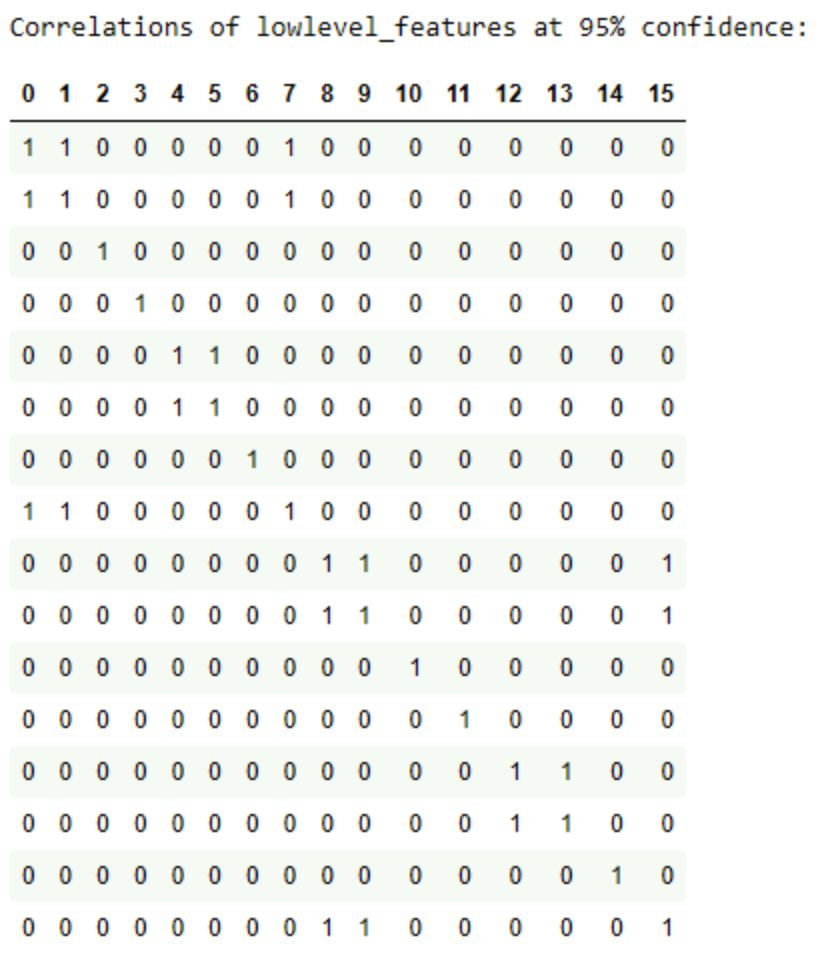
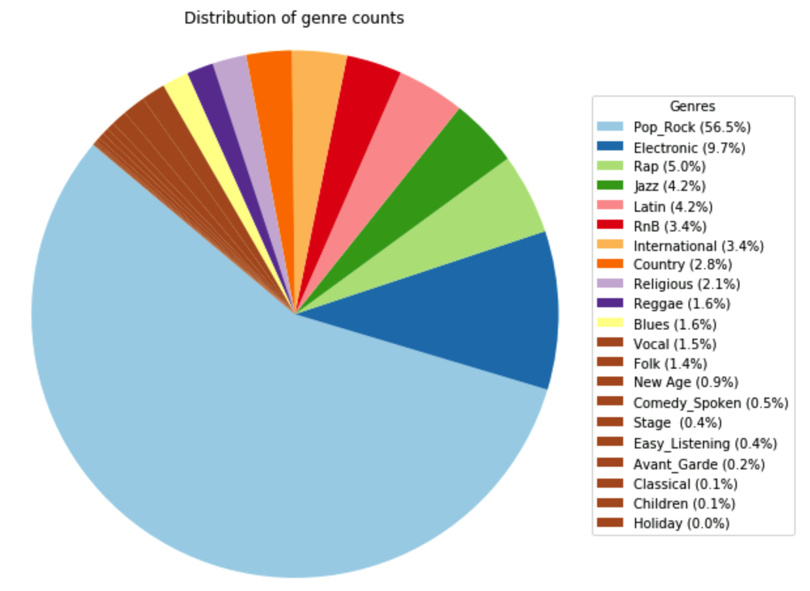
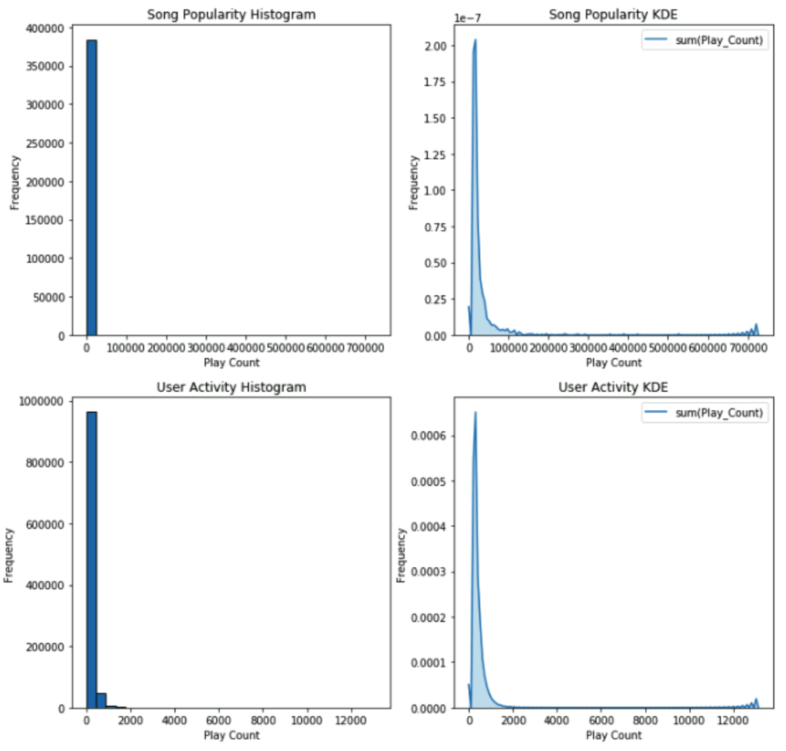

# DATA420 Assignment 2

**Author:** Sam Love, 84107034

---

## Background

This is a report for Assignment 2 of DATA420, a course at the University of Canterbury.

The purpose of this assignment is to study contemporary popular music track data contained in the Million Song Dataset (MSD), a collaborative project between The Echo Nest and LabROSA.

We start with some data preprocessing.
Then we predict the genre of tracks based on a subselection of their features by training three machine learning models.
Finally we develop a song recommendation service based on collaborative filtering.

There were some difficulties encountered with data wrangling and UDF's but nothing major.

## Data Processing

Before training any model we need to explore how the data is stored and perform any required processing to prepare it for modeling.

There are four datasets we will explore:

The Audio dataset contains datasets of 13 features provided by the Music Information Retrieval research group at the Vienna University of Technology.
These features represent measurable mathematical components of songs, for example rhythm patterns.
There is additional metadata of column names and types provided in the attributes subset, and track statistics in the statistics subset.

The Genre dataset contains genre categories for many songs in the million song dataset, also provided by the Music Information Retrieval research group at the Vienna University of Technology.

The Main dataset contains the data for the million songs, covering 54 fields.

The Taste Profile dataset contains real user-song play counts from undisclosed organisations.

Machine learning is applicable to a wide range of human activities and professions.
Any data we collect can be analysed and optimised depending on our needs.
With the increase in big data, machine learning is especially potent as it works on datasets that are far too big for humans to analyse.

Netflix is a pioneering streaming service that is known for its sophisticated recommendation system.
This is partly due to the "Netflix Prize" which began in 2006 and offered $1 000 000 reward for creating the best collaborative filtering algorithm to predict user ratings for films, based on previous ratings.

In this assignment, we touch on the mechanics of machine learning for predicting a categorical variable and developing a recommendation service, but are constrained in resources and scope to fully explore optimisation.

### Question 1

The directory is organised as follows:

```text
data/
└── msd/
    ├── audio/
    │   ├── attributes/
    │   │   ├── msd-jmir-area-of-moments-all-v1.0.attributes.csv (1.0 KB)
    │   │   ├── msd-jmir-1pc-all-v1.0.attributes.csv (671 B)
    │   │   ├── msd-jmir-methods-of-moments-all-v1.0.attributes.csv (484 B)
    │   │   ├── msd-jmir-mfcc-all-v1.0.attributes.csv (898 B)
    │   │   ├── msd-jmir-spectral-all-all-v1.0.attributes.csv (777 B)
    │   │   ├── msd-jmir-spectral-derivatives-all-all-v1.0.attributes.csv (777 B)
    │   │   ├── msd-marsyas-timbral-v1.0.attributes.csv (12.0 KB)
    │   │   ├── msd-mvd-v1.0.attributes.csv (9.8 KB)
    │   │   ├── msd-rh-v1.0.attributes.csv (1.4 KB)
    │   │   ├── msd-rp-v1.0.attributes.csv (34.1 KB)
    │   │   ├── msd-ssd-vl.0.attributes.csv (3.8 KB)
    │   │   ├── msd-trh-v1.0.attributes.csv (9.8 KB)
    │   │   └── msd-tssd-v1.0.attributes.csv (27.6 KB)
    │   └── features/
    │       ├── msd-jmir-area-of-moments-al1-v1.0.csv/
    │       │   ├── part-00000.cvs.gz (8.2 MB)
    │       │   ├── ... (part-00001 to part-00006, 8.2 MB)
    │       │   └── part-00007.cvs.gz (7.9 MB)
    │       ├── msd-jmir-1pc-all-v1.0.csv/
    │       │   ├── part-00000.cvs.gz (6.7 MB)
    │       │   ├── ... (part-00001 to part-00006, 6.7 MB)
    │       │   └── part-00007.cvs.gz (6.4 MB)
    │       ├── msd-jmir-methods-of-moments-al1-v1.0.csv/
    │       │   ├── part-00000.cvs.gz (4.5 MB)
    │       │   ├── ... (part-00001 to part-00006, 4.5 MB)
    │       │   └── part-00007.cvs.gz (4.3 MB)
    │       ├── msd-jmir-mfcc-all-v1.0.csv/
    │       │   ├── part-00000.cvs.gz (8.9 MB)
    │       │   ├── ... (part-00001 to part-00006, 8.9 MB)
    │       │   └── part-00007.cvs.gz (8.5 MB)
    │       ├── msd-jmir-spectral-all-al1-v1.0.csv/
    │       │   ├── part-00000.cvs.gz (6.4 MB)
    │       │   ├── ... (part-00001 to part-00006, 6.4 MB)
    │       │   └── part-00007.cvs.gz (6.1 MB)
    │       ├── msd-jmir-spectral-derivatives-all-al1-v1.0.csv/
    │       │   ├── part-00000.cvs.gz (6.4 MB)
    │       │   ├── ... (part-00001 to part-00006, 6.4 MB)
    │       │   └── part-00007.cvs.gz (6.1 MB)
    │       ├── msd-marsyas-timbral-v1.0.csv/
    │       │   ├── part-00000.cvs.gz (51.8 MB)
    │       │   ├── ... (part-00001 to part-00006, 51.8 MB)
    │       │   └── part-00007.cvs.gz (49.7 MB)
    │       ├── msd-mvd-v1.0.csv/
    │       │   ├── part-00000.cvs.gz (165.9 MB)
    │       │   ├── ... (part-00001 to part-00006, ~166.0 MB)
    │       │   └── part-00007.cvs.gz (158.3 MB)
    │       ├── msd-rh-v1.0.csv/
    │       │   ├── part-00000.cvs.gz (30.2 MB)
    │       │   ├── ... (part-00001 to part-00006, 30.2 MB)
    │       │   └── part-00007.cvs.gz (28.8 MB)
    │       ├── msd-rp-v1.0.csv/
    │       │   ├── part-00000.cvs.gz (518.9 MB)
    │       │   ├── ... (part-00001 to part-00006, ~519.0 MB)
    │       │   └── part-00007.cvs.gz (495.0 MB)
    │       └── msd-ssd-v1.0.csv/
    │           ├── part-00000.cvs.gz (80.5 MB)
    │           ├── ... (part-00001 to part-00006, ~80.5 MB)
    │           └── part-00007.cvs.gz (76.8 MB)
    ├── statistics/
    │   └── sample_properties.csv.gz (40.3 MB)
    ├── genre/
    │   ├── msd-MAGD-genreAssignment.tsv (11.1 MB)
    │   ├── msd-MASD-styleAssignment.tsv (8.4 MB)
    │   └── msd-topMAGD-genreAssignment.tsv (10.6 MB)
    ├── main/
    │   └── summary/
    │       ├── analysis.csv.gz (55.9 MB)
    │       └── metadata.csv.gz (118.5 MB)
    └── tasteprofile/
        ├── mismatches/
        │   ├── sid_matches_manually_accepted.txt (89.2 KB)
        │   └── sid_mismatches.txt (1.9 MB)
        └── triplets.tsv/
            ├── part-00000.tsv.gz (61.1 MB)
            ├── ... (part-00001 to part-00006, ~61.1 MB)
            └── part-00007.tsv.gz (60.8 MB)
```

There are 1 000 000 unique songs in the Million Song Dataset (MSD).

The main dataset has all 1 000 000 rows, representing metadata for every song in the MSD.

The audio features datasets have rows for nearly all million songs:

- There are 994 623 rows in the area of moments, linear predictive coding, method of moments, MFCC features, low-level features, and low-level features derivatives datasets.
- There are 995 001 rows in the MARSYAS timbral features dataset.
- There are 994 188 rows in the MVD, rhythm histograms, rhythm patterns, statistical spectrum descriptors, temporal rhythm histograms, and temporal statistical spectrum descriptors datasets.

The genre dataset only has 422 714 rows in the genre dataset, meaning less than half of the songs have genre metadata.

The taste profile dataset has 48 373 586 rows which represent play counts for 1 019 318 users across 384 546 songs, meaning just over a third of the songs have user interaction data.

### Question 2

A quirk of working with many datasets is that song_id and track_id are related but separate concepts.
This caused some of the tracks in the Million Song Dataset to be matched to the wrong songs in the Taste Profile dataset.
Around 5 000 songs are incorrectly matched and 13 000 are unverified.

There is no need to action this for our use case since we do not use the main Million Song Dataset.
We do use the Taste Profile Dataset to develop a song recommendation service based on collaborative filtering.
However this dataset only contains columns for user ID, song ID, and play count.
As such, the mismatches are important to note but irrelevant unless we wanted to combine the Taste Profile Dataset with the Million Song Dataset.

Relevant preprocessing includes matching the Audio datasets attributes to the features.
This will create a set of features data that has accurate column names and data types.
This process can be automated with the following steps:

- First find the possible types.
- Then map these types to equivalent pyspark.sql. types.
- Then use a nested 'for' loop to create a list of schemas corresponding to each feature.
- Finally apply the relevant schema to each feature when loading the dataset.

## Audio Similarity

We now explore mathematical components of a song's audio waveform to predict its genre.
The audio features are continuous values, obtained using methods such as digital signal processing and psycho-acoustic modeling.
A successful model could be applied by an online music streaming service to provide song recommendations based on similar characteristics and sound.
This would not be based on a typical collaborative filtering relationship and does not require user data to train a model.

### Question 1

We will explore the low-level features dataset (msd-jmir-spectral-all-al1) as it is one of the smaller datasets that can train models faster.
Additionally, the genre dataset will provide a target variable for the models.

The features (with indexes) are:

- 0: Spectral_Centroid_Overall_Standard_Deviation_1
- 1: Spectral_Rolloff_Point_Overall_Standard_Deviation_1
- 2: Spectral_Flux_Overall_Standard_Deviation_1
- 3: Compactness_Overall_Standard_Deviation_1
- 4: Spectral_Variability_Overall_Standard_Deviation_1
- 5: Root_Mean_Square_Overall_Standard_Deviation_1
- 6: Fraction_Of_Low_Energy_Windows_Overa11_Standard_Deviation_1
- 7: Zero_Crossings_Overall_Standard_Deviation_1
- 8: Spectral_Centroid_Overall_Average_1
- 9: Spectral_Rolloff_Point_Overall_Average_1
- 10: Spectral_Flux_Overall_Average_1
- 11: Compactness_Overall_Average_1
- 12: Spectral_Variability_Overall_Average_1
- 13: Root_Mean_Square_Overall_Average_1
- 14: Fraction_Of_Low_Energy_Windows_Overall_Average_1
- 15: Zero_Crossings_Overall_Average_1

They all share the same count and do not contain negative values.
Although there is a large range of mean and standard deviation amongst features, this will not affect the models.

| Index | Count   | Mean      | Stddev  | Min | Max      |
|-------|---------|-----------|---------|-----|----------|
| 0     | 994,623 | 6.9451    | 3.6318  | 0.0 | 73.31    |
| 1     | 994,623 | 0.0557    | 0.0265  | 0.0 | 0.3739   |
| 2     | 994,623 | 0.0039    | 0.0033  | 0.0 | 0.07164  |
| 3     | 994,623 | 222.5178  | 59.7262 | 0.0 | 10290.0  |
| 4     | 994,623 | 0.0022    | 0.0010  | 0.0 | 0.01256  |
| 5     | 994,623 | 0.0742    | 0.0318  | 0.0 | 0.3676   |
| 6     | 994,623 | 0.0602    | 0.0185  | 0.0 | 0.4938   |
| 7     | 994,623 | 16.8029   | 7.5301  | 0.0 | 141.6    |
| 8     | 994,623 | 9.1103    | 3.8436  | 0.0 | 133.0    |
| 9     | 994,623 | 0.0619    | 0.0290  | 0.0 | 0.7367   |
| 10    | 994,623 | 0.0029    | 0.0025  | 0.0 | 0.07549  |
| 11    | 994,623 | 1638.7321 | 106.1061| 0.0 | 24760.0  |
| 12    | 994,623 | 0.0044    | 0.0020  | 0.0 | 0.02366  |
| 13    | 994,623 | 0.1659    | 0.0743  | 0.0 | 0.8564   |
| 14    | 994,623 | 0.5563    | 0.0476  | 0.0 | 0.9538   |
| 15    | 994,623 | 26.6804   | 10.3947 | 0.0 | 280.5    |

A threshold level of 95% means any correlations above the threshold have at least 95% redundant information and only 5% unique information.



At this threshold there are some sets of features that are strongly correlated:

- 0,1,7
- 5,6
- 8,9,15
- 12,13

These features can be removed without losing significant information when training models but will reduce complexity and training time.

The genres are unequally distributed with the majority of applicable songs being the Pop Rock genre.



Note: ChatGPT provided code for plotting.

A difficulty encountered when joining the features and genre datasets was apostrophes surrounding the strings of track_id in the features dataset.
These needed removal before a successful join of the datasets.

### Question 2

We will now develop three binary classification models and compare their performance.

When choosing appropriate algorithms it is important to consider different aspects of the model which make it more or less suitable for the task at hand.

Important aspects include:

- **Explainability**: The ease at which a model's outcomes (predictions) can be understood.
- **Interpretability**: The ease at which a model's mechanics and decisions can be understood.
- **Predictive accuracy**: The ability of the model to correctly predict data. This can be measured with metrics such as precision, recall, accuracy, and AUROC.
- **Training speed**: The time it takes a model to train. Faster training enables more experimenting and hyperparameter tuning but can come at the risk of lower predictive accuracy.
- **Hyperparameter Tuning**: The ability to adjust a model's hyperparameters to find the optimal configuration. Grid-search is an easy technique but hyperparameter tuning can get expensive when comparing many models.
- **Dimensionality**: The amount of features in the dataset. Dimension reduction is a common practice to reduce the risk of overfitting the data and reduce the complexity of the model.
- **Issues with Scaling**: The ability of the model to maintain performance on larger datasets, specifically having reasonable training speed and predictive accuracy.

| Selected model | Positives | Limitations |
|----------------|-----------|-------------|
| **Logistic regression** | Ideal baseline<br>Easy to understand and explain<br>Fast to train<br>Good with larger datasets<br>Popular (well documented) | Assumes linearity of data<br>Struggles with multi-class<br>Struggles with class imbalance<br>Sensitive to outliers |
| **Random forest & Gradient boosted tree** | High accuracy<br>No assumptions about data<br>Robust to outliers<br>Less prone to overfit data | High complexity<br>Hard to interpret<br>Expensive to train<br>Struggles with class imbalance |

Logistic regression is a model primarily used for binary classification.
It is supervised meaning it requires labelled data to train.
It assumes a linear relationship between the independent and dependent variables.
A logistic function transforms a linear combination of independent variables into binary classes.

Random forest & gradient boosted tree are ensemble models meaning they combine multiple decision trees.
They are both supervised.

Random forest models uses bootstrap sampling to train each tree on a different subset of data.
A random subset of features is considered by each tree.
The trees each vote for a predicted class.
The results are aggregated to produce the final predictions.

Gradient boosted tree models start with a single tree and calculate residuals by comparing its predictions to the data.
It uses an iterative process to reduce these residuals.
Each tree reduces in contributions to the model, creating a gradient of importance.
The result is a model that adapts to its mistakes to produce the final predictions.

There is some processing we can apply to feature data before training.
The target genre is electronic which is binary encoded to 1 with all other genres encoded to 0.

40666 rows have electronic genre.
This is roughly 4% of the whole dataset meaning the class balance is heavily skewed.
We could upscale the electronic genre or downscale the not-electronic genre.
Alternatively, of note is that 574003 (57%) rows do not have an associated genre.
Imputing these missing values is tricky since we do not yet know the relationship between features and genre.
Removing these missing values is appropriate since it is highly probable that some would be categorised as electronic.
This results in the electronic genre representing 10% of the data and enables faster training of the models.

Considering the feature correlation above, we can use feature selection to remove redundant information.
This feature correlation matrix uses a correlation threshold of 0.95 to flag any pair of features that share above 95% information.
Removing these reduces model dimensionality and improves model training speed.
Choosing the features to remove is achieved by summing each feature's correlations to find the 'aggregate' correlation (with the other features).
Then we remove the feature that has the higher 'aggregate' correlation from a pair of features that have correlation above the threshold.
This is repeated until no feature pairs have correlation above the threshold.

The new reduced dataset means subsampling and oversampling are less valuable since the class balance is now close to 10%.
However, observation weighting may prove valuable by providing more weight to the electronic set.
A weight of 5:1 artificially creates balanced classes.

The class balance is now approximately 1:9.

| Electronic_Flag | count   |
|-----------------|---------|
| 1               | 40,666  |
| 0               | 379,954 |

We now split the data into training and testing sets.
Stratified random sampling preserves class balance.
The split is 80:20 train:test.
Additional models can be trained on the weighted training data.
3 levels of threshold (0.25, 0.5, 0.75) also gives a spread of models.

To understand how well any model performs we can calculate some performance metrics.
We have numbers for:

- **Data positives (nP actual)**: The total number of rows with the positive class (genre = electronic).
- **Data negatives (nN actual)**: The total number of rows with the negative class (genre != electronic).
- **Predicted positives (nP)**: The predicted number of rows with the positive class.
- **Predicted negatives (nN)**: The predicted number of rows with the negative class.
- **True positive (TP)**: The number of correctly predicted positive rows.
- **False positive (FP)**: The number of incorrectly predicted positive rows.
- **False negative (FN)**: The number of incorrectly predicted negative rows.
- **True negative (TN)**: The number of correctly predicted negative rows.

From these the following metrics can be calculated:

- **Precision** = TP/(TP+FP): How many predicted positives are actually positive. Improve if false positives are costly.
- **Recall** = TP/(TP+FN): How many actual positives are predicted. Improve if false negatives are costly.
- **Accuracy** = (TP+TN)/Total: How many predictions are correct. Misleading if classes are imbalanced.
- **AUROC**: The area under the Receiver Operating Characteristic Curve. The higher the better (0.5 represents random guessing).
- **F1** = 2×(precision×recall)/(precision+recall): The harmonic mean of precision and recall. Useful for optimising the trade-off between precision and recall.

Balancing the model between underfitting and overfitting the data is represented by the precision-recall tradeoff.
The choice of balance depends on real world applications and the costs involved with false positives and false negatives.

Threshold represents the level at which predictions are categorised into each class.
Higher threshold means more predictions will be categorised in the negative class (and vice versa).

The results are:

| Model | Precision | Recall | Accuracy | AUROC |
|-------|-----------|--------|----------|-------|
| **Logistic regression** |
| Threshold = 0.75 | 0.70802920 | 0.01192525 | 0.90398811 | 0.75840222 |
| Threshold = 0.50 (default) | 0.58146067 | 0.07634620 | 0.90537890 | 0.75839532 |
| Threshold = 0.25 | 0.40579204 | 0.28596017 | 0.89047251 | 0.75840204 |
| **Weighted logistic regression** |
| Threshold = 0.75 | 0.50567190 | 0.14248832 | 0.90361961 | 0.75775906 |
| Threshold = 0.50 (default) | 0.31971001 | 0.43373494 | 0.85601189 | 0.75776181 |
| Threshold = 0.25 | 0.15088992 | 0.81817064 | 0.53724814 | 0.75776118 |
| **Random forest** |
| Threshold = 0.75 | 0.00000000 | 0.00000000 | 0.90331055 | 0.73313759 |
| Threshold = 0.50 (default) | 0.77573529 | 0.02594050 | 0.90509361 | 0.73394624 |
| Threshold = 0.25 | 0.51673945 | 0.17457585 | 0.90440416 | 0.73408054 |
| **Weighted random forest** |
| Threshold = 0.75 | 0.74384236 | 0.01856405 | 0.90448737 | 0.77820967 |
| Threshold = 0.50 (default) | 0.30853859 | 0.46201131 | 0.84786924 | 0.77825051 |
| Threshold = 0.25 | 0.17520274 | 0.79948365 | 0.61670134 | 0.77824108 |
| **Gradient-boosted tree** |
| Threshold = 0.75 | 0.78618421 | 0.02938284 | 0.90537890 | 0.80824614 |
| Threshold = 0.50 (default) | 0.61910594 | 0.12429309 | 0.90793462 | 0.80823989 |
| Threshold = 0.25 | 0.42643172 | 0.35701992 | 0.89139970 | 0.80824662 |
| **Weighted gradient-boosted tree** |
| Threshold = 0.75 | 0.49264516 | 0.23469388 | 0.90263299 | 0.81253599 |
| Threshold = 0.50 (default) | 0.32693010 | 0.55028276 | 0.84697771 | 0.81253983 |
| Threshold = 0.25 | 0.19380608 | 0.82321121 | 0.65180386 | 0.81254101 |

The worst performing algorithm is random forest on the unweighted (and unbalanced) dataset.
The best performing algorithm is gradient-boosted tree on the weighted dataset.
This is determined by the AUROC metric which is the most standard metric to use for comparing models.

The default threshold of 0.5 tends to give the best balance between precision and recall.
However, it is interesting to note the large variations that changes to the threshold causes in precision and recall.
In practical applications, this can be used to adjust the trade-off to suit our needs.

By artificially making the class balance equal (via weighting), we see every model decrease in precision and increase in recall.
This benefits both the tree methods performance (increase in AUROC) but has no effect on the logistic regression model.
The accuracy or the models generally significantly decreases, which shows how it is a poor metric when dealing with significant class imbalance, as it overemphasises correct estimates of the larger class.

### Question 3

Hyperparameter tuning can further improve model performance.
It involves tuning a model's parameters (and combinations thereof) to find the most optimised model.
Each model comes with a set of parameters that have default values defined before training (are not learned from the data).
Performance is measured by the parameters discussed above.

We want to explore the parameter space efficiently whilst avoiding introducing data leakage to the model.
This can be achieved by splitting the training data into its own train/validate set.
However if we do this only once, we risk overfitting to the validate set leading to poor generalisation to test.
Cross-validation solves this by iterating through k-folds (subsplits) of the training data.
This gives us sampling distributions for each metric which we can use to estimate generalise-able metrics.

Grid search is a simple form of hyperparameter tuning.
We create a grid out of the hyperparameters we think will have the most effect on the model.
The grid represents all the different combinations the hyperparameters can create.
Cross-validation gives us estimated AUROC for these various combinations of hyperparameters.
The optimised model is the one with the highest AUROC value.

This process involves training many models: the number of hyperparameter combinations multiplied by the number of folds used in cross-validation.
This can be very computationally expensive.

Hyperparameter tuning typically gives minimal improvements in model performance and is most useful when optimising an already good model.
The main gains in model performance come from preprocessing the data and choosing the most appropriate model.
If we performed it on the models so far, we could likely expect a 5-10% increase in performance.

### Question 4

We now look at training a random forest classifier to predict across all genres.
Random forest is capable of multi-class classification in PySpark.
It assigns a probability score to each class, with the highest score being the predicted class.

To train the model we use the same dataset but convert the genre column into an integer index that encodes each genre consistently.

| Metric    | Result     |
|-----------|------------|
| Precision | 0.47040169 |
| Recall    | 0.10941726 |
| Accuracy  | 0.90199318 |
| F1-score  | 0.44146698 |

Comparing this model's results with the binary classification models is difficult due to binary having the AUROC metric (not F1-score).

However, this model has impressive precision, recall, and accuracy, considering all the extra included classes.
It has better recall than both the standard logistic regression and the standard random forest binary classifciation models.
It is slightly outperformed by the gradient boosted tree binary classification model.

The F1-score shows that this model has a fairly even precision-recall trade-off.
Again, this can be altered depending on application preference.

A difficulty here was translating the UDF "print_metrics" function to multi-class.
F1 score replaced AUROC but changing the threshold would not work.
This resulted in a single model's results, which makes comparisons difficult.

## Song Recommendations

We now use the Taste Profile dataset to develop a song recommendation service based on collaborative filtering.

### Question 1

First we examine the Taste Profile dataset.

The dataset contains 48,373,586 rows and 488.4 MB

Collaborative filtering algorithms, like Alternating Least Squares (ALS), often involve iterations and shuffling of data between users and items.
As such repartitioning and caching can be beneficial in improving model training speed.
Bigger datasets benefit more from these techniques, so they are more applicable for this model compared to the previous models.

There are 384,546 unique songs and 1,019,318 unique users in the taste profile dataset.
The most active user 093cb74eb3c517c5179ae24caf0ebec51b24d2a2 has 13,132 total song plays.
This corresponds to 202 unique songs which is 0.0525% of the total unique songs in the dataset.

Both distributions of song popularity and user activity are heavily skewed to the right.
The nuance of the skew can be better visualised with a Kernel Density Estimator (KDE).

There are a few possible outliers at the higher range of both distributions.
However, these are likely due to power users and mainstream songs, therefore should be included in the model.
Further domain knowledge could reveal the nature of the outliers.



### Question 2

Next we train the ALS model and evaluate its performance.

The dataset can be further refined by removing songs and users that do not contribute significant information and are therefore unlikely to improve the model.
Considering the size of the data, we can remove any songs or users that have fewer than 20 play counts.
This improves model train speed and reduces data noise without losing significant information.

We randomly split the dataset into train/test sets.
The ratio is 70:30 since collaborative filtering models benefit from larger test sets.

There is potential for the cold-start problem to occur if any users are present in only the test set.
The model struggles to make accurate predictions for new users who do not historical data.
Since we have a large dataset, we can afford to simply omit the subset of 32,002 users present only in test.
This will slightly alter the ratio of train/test.

Collaborative filtering model metrics include Precision @ k, NDCG @ k, and Mean Average Precision (MAP).

**Precision @ k** measures the proportion of relevant recommended items in
# Recommendation System Evaluation Metrics

**Limitations:**
- Precision @ k does not account for ranking of items
- Sensitive to changes of k

**Formula:**
$$p(K)=\frac{1}{M}\sum_{i=0}^{M-1} \left[\frac{1}{K} \sum_{j=0}^{K-1} rel_{D_i}(r_j)\right]$$

## NDCG @ k

NDCG @ k takes the sum of relevant items among the top k results and discounts the value of each of the relevant items based on its rank. It then normalizes the result by the algorithm where every relevant item is ranked at the start of the list.

**Limitations:**
- NDCG @ k assumes diminishing relevance of rankings
- Sensitive to changes of k

**Formula:**
$$NDCG = \frac{1}{M}\sum_{i=0}^{M-1} \left[\frac{1}{IDCC_{D_i}}\sum_{j=0}^{K-1} \frac{rel_{D_i}(r_j)}{ln(j+2)}\right]$$

## Mean Average Precision (MAP)

Mean Average Precision (MAP) averages the precision @ k metric at each relevant item position in the recommendation list.

**Limitations:**
- MAP assumes diminishing relevance of rankings
- Sensitive to changes in rankings

**Formula:**
$$p(K)=\frac{1}{M}\sum_{i=0}^{M-1} \left[\frac{1}{K} \sum_{j=0}^{K-1} \left[\frac{1}{j+1} \sum_{\ell=0}^{J} rel_{D_i}(r_\ell)\right]\right]$$

## Alternative Approach: Pairwise Ranking

An alternative method is to create a pairwise ranking classification problem. We calculate relative rankings of pairs of items. This has a similar structure to the ELO ranking system meaning we only need pairwise rankings for a subset of the data.

**Advantage:** This model can take any user/item features as input, not just the fact that the user interacted with the items.

## Model Results

| Metric        | Value   |
|---------------|---------|
| precision @ 10| 0.01104 |
| MAP @ 10      | 0.00526 |
| NDCG @ 10     | 0.01352 |

## Future Feedback and Dynamic Improvement

With future feedback, our model can become much more dynamic and iteratively improve. Useful metrics in this case include:

- **Click-through-rate:** measures the percentage of users who clicked on recommended songs out of the total number of recommendations shown.
- **User Engagement:** measures a range of user actions such as sharing and commenting.
- **Churn Reduction:** measures the impact of recommendations on user retention. Churn means stop using the service. Reducing churn is a common business goal.

## Conclusion

In this assignment we developed models to predict the genre of tracks based on a subselection of their features, and to provide a song recommendation service based on collaborative filtering.

There are many different machine learning algorithms that have tweakable hyperparameters and performance metrics. Finding the best model depends on the context of the data we are modeling and what we hope to achieve.

The high variation we can generate simply by adjusting the training data and hyperparameters of models gives us many options to explore in pursuit of a useful model.

This assignment was a comprehensive introduction to how we can utilise machine learning on big data.

---

## References

Amazon Web Services. (n.d.). *Interpretability Versus Explainability.* AWS Whitepapers. https://docs.aws.amazon.com/whitepapers/latest/model-explainability-aws-ai-ml/interpretability-versus-explainability.html

Analytics Vidhya. (n.d.). *Precision and Recall in Machine Learning.* Analytics Vidhya. https://www.analyticsvidhya.com/blog/2020/09/precision-recall-machine-learning/#:~:text=Precision%20and%20Recall%20Trade%2Doff,-For%20any%20machine&text=This%20involves%20achieving%20the%20balance,bias%2Dvariance%20trade%2Doff.

Apache Spark. (n.d.). *Classification and Regression - Spark 3.2.1 Documentation.* Apache Spark. https://spark.apache.org/docs/latest/ml-classification-regression.html

Apache Spark. (n.d.). *Python API - Spark 3.2.1 Documentation.* Apache Spark. https://spark.apache.org/docs/latest/api/python/index.html#

Baeldung. (n.d.). *Gradient Boosting Trees vs. Random Forests.* Baeldung. https://www.baeldung.com/cs/gradient-boosting-trees-vs-random-forests#

Breiman, L. Random Forests. *Machine Learning* 45, 5–32 (2001). https://doi.org/10.1023/A:1010933404324

ChatGPT by OpenAI. https://chat.openai.com/auth/login

*Fixing Matching Errors. Million Song Dataset.* http://millionsongdataset.com/blog/12-2-12-fixing-matching-errors/

Postma, E., van der Maaten, L., & van den Herik, J (2009). *TR_Dimensionreduction.pdf* [PDF]. https://members.loria.fr/moberger/Enseignement/AVR/Exposes/TR_Dimensiereductie.pdf

Rashidi, P., & Jakkula, V. (2007). *CptS 570 Machine Learning Project: Netflix Competition Team: MLSurvivors.* https://citeseerx.ist.psu.edu/document?repid=rep1&type=pdf&doi=a69fb52d91ef6acf841bbcef8eef8eea47ad640b

ScienceDirect. (n.d.). *Predictive Accuracy.* ScienceDirect Topics. https://www.sciencedirect.com/topics/mathematics/predictive-accuracy

Shaped AI. (n.d.). *Evaluating Recommendation Systems - Part 1.* Shaped AI. https://www.shaped.ai/blog/evaluating-recommendation-systems-part-1

Shaped AI. (n.d.). *Evaluating Recommendation Systems: MAP, MMR, and nDCG.* Shaped AI. https://www.shaped.ai/blog/evaluating-recommendation-systems-map-mmr-ndcg/
