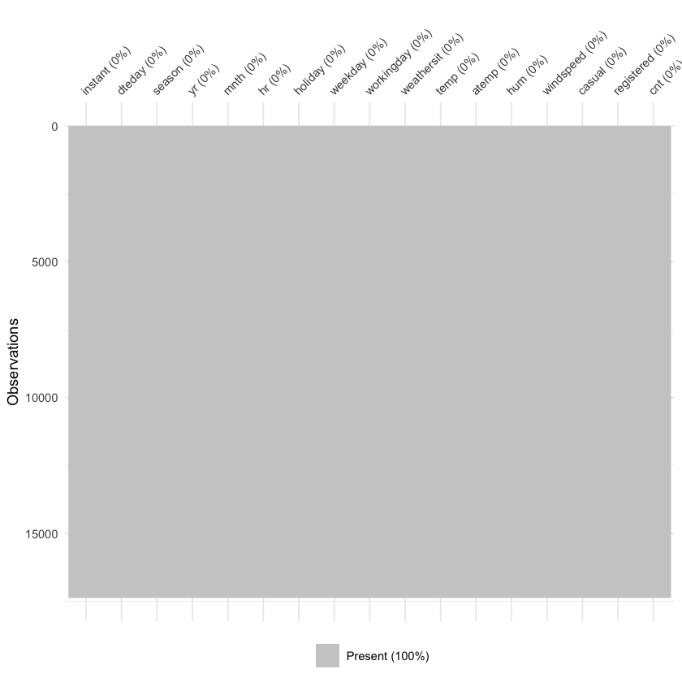
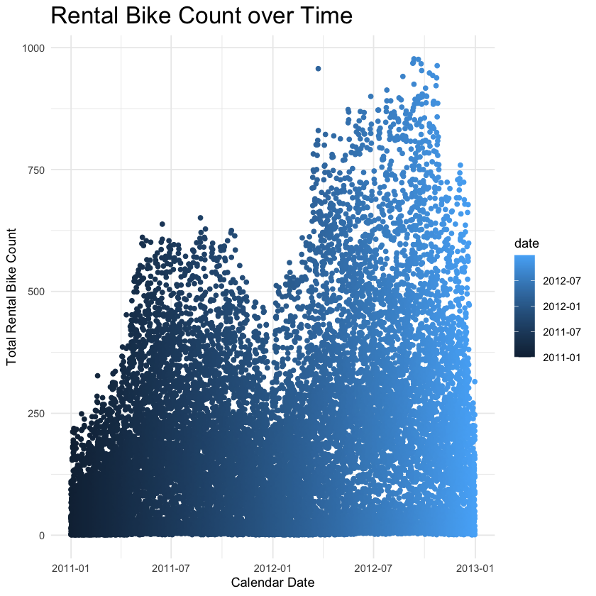
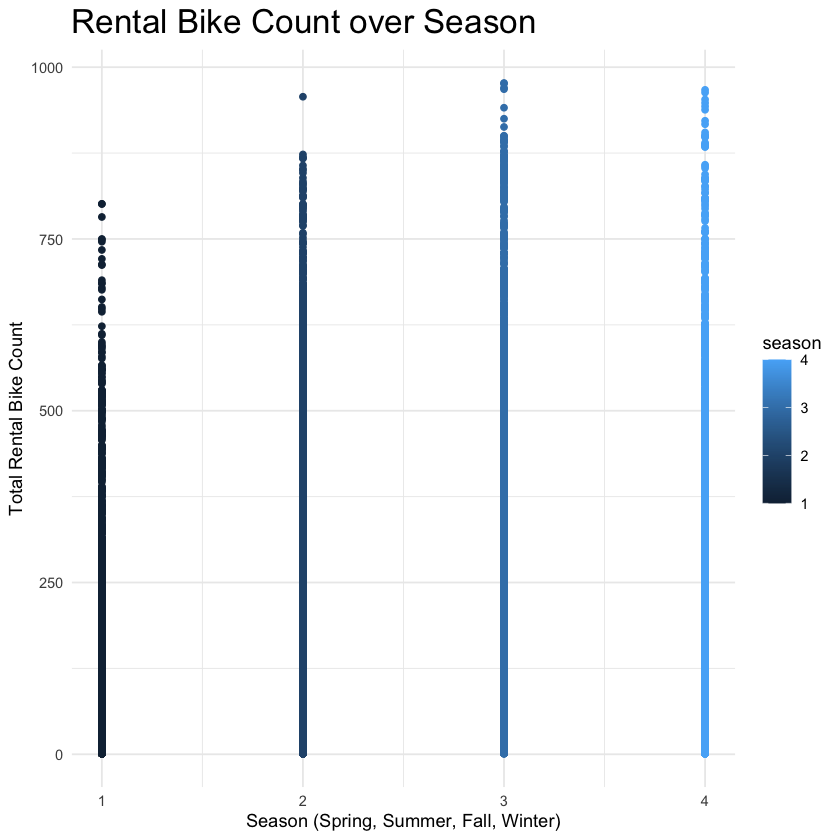
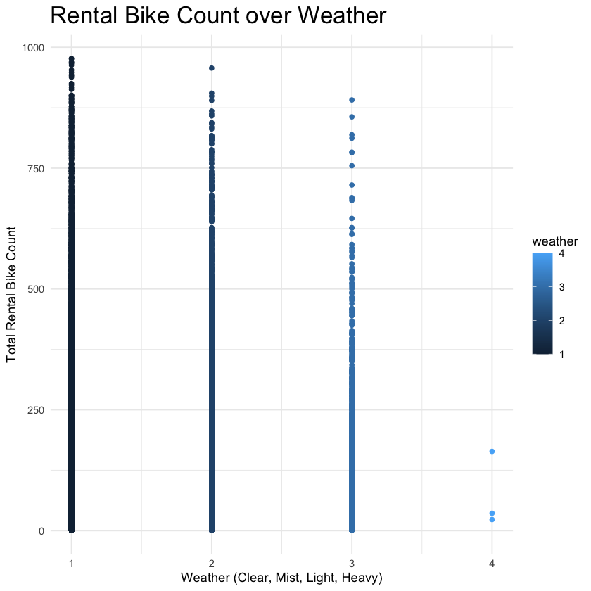
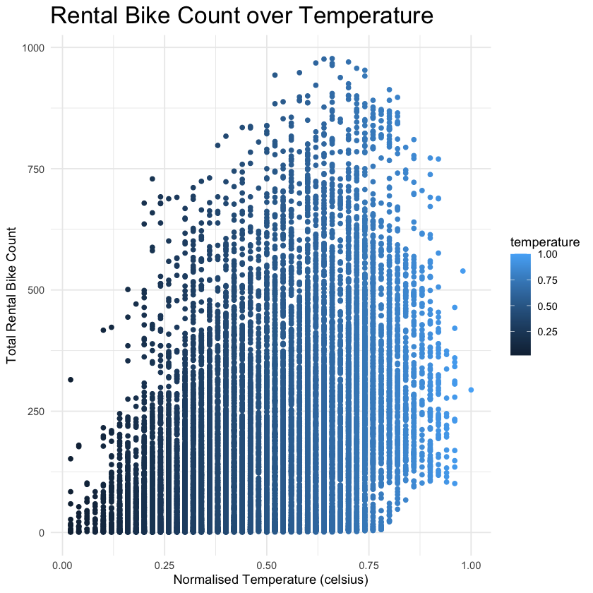
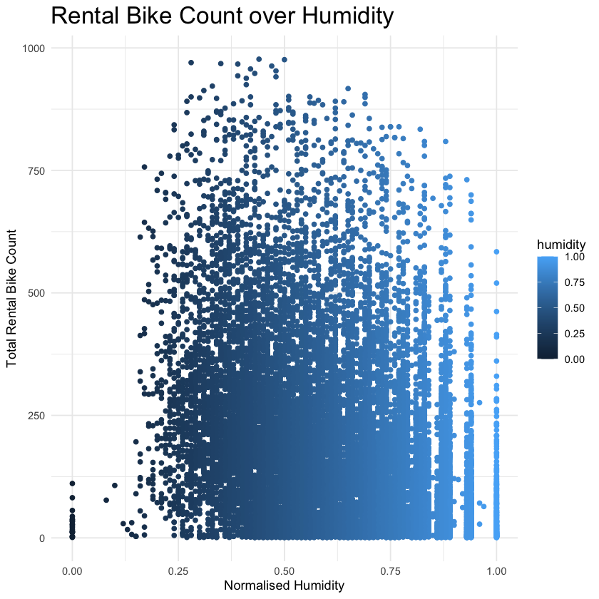
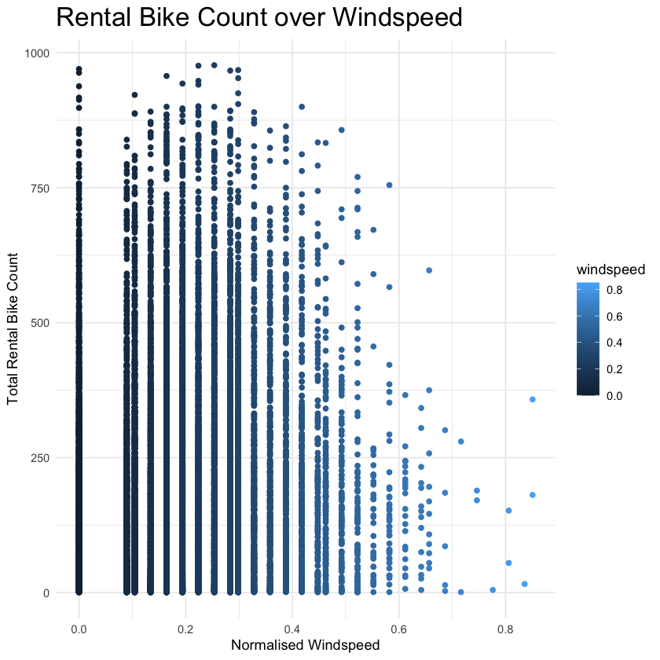
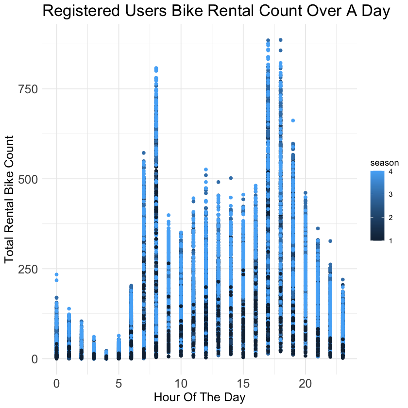

# Data 422

### Data Wrangling

## Assignment 1

**20% of final grade** Total marks is **100 marks** (70 for R, 30 for Julia).

## Due date: 5pm Wednesday 24 August 2021

The assignment must be submitted on the DATA 201 and 422 Learn page and should be **your own work, or done in pairs**.

### Avoid plagiarism (see this [video on academic plagiarism](https://www.youtube.com/embed/reGGPUrEsC0) ). If you are not sure what may constitute code plagiarism, read this [explanation on source code plagiarism](http://web.science.mq.edu.au/~mtaylor/ponline/index.php?id=source-code-plagiarism). Remember, when in doubt **declare your sources**. 

If you have any issues that affects your ability to work during the time allocated for the assignment, please DO CONTACT ME. We will find a suitable solution. In general this WON'T be an extension to the deadline (so that in the rest of the semester you are free from preoccupations). Most probably, I will ask you to submit what you have ready by the time the assignment is due, even if it is not everything we required, and I'll take into account special considerations. For any particular problem, please contact [Thomas Li](thomas.li@canterbury.ac.nz) or the TAs.

## Instruction

For this assignment you will work with a _.csv_ data-set. Your goal is to read it in, wrangle it, produce some plotting, in order to demonstrate that you are able to use the functions, plotting, and markdown format we have been learning.  
You shall hand in your work as a jupyter-lab R notebook (for the R part, and jupyter-lab Julia notebook for the Julia part) comprehending the code, the plots and, **very important**, enough comments and explanations for us to understand what you did, how you did it, and why you did it. Remember: no comments, no marks.  
You can either modify this notebook or write a new one from scratch: in that case, clearly indicate which question you are asking at each step. Notice that you may well want to **use more than one cell** per answer (using some cell for the code, some for the text, and so forth).

## Comment, explain, present your work in a clear way (we may remove marks for messy notebooks)

## R part (overall 70 marks)

Do use the tidyverse syntax I introduced in class and labs. If in doubt, refresh the lab material 1 to 4.

The first thing you may want to do is to load **tidyverse**:


```R
library(tidyverse)
```

    ── Attaching packages ─────────────────────────────────────── tidyverse 1.3.2 ──
    ✔ ggplot2 3.3.6     ✔ purrr   0.3.4
    ✔ tibble  3.1.8     ✔ dplyr   1.0.9
    ✔ tidyr   1.2.0     ✔ stringr 1.4.0
    ✔ readr   2.1.2     ✔ forcats 0.5.1
    ── Conflicts ────────────────────────────────────────── tidyverse_conflicts() ──
    ✖ dplyr::filter() masks stats::filter()
    ✖ dplyr::lag()    masks stats::lag()


### Task (a): import (5 marks)

Import the **hour.csv** dataset into R as a dataframe (we'll call it `bike_df`, but you can call it what you want). You can read about the dataset in the file `DataSet_Dictionary.txt`. (Alternatively, you might use your own .csv dataset of choice, but talk with me about it before doing it). 

Then perform the routine checks about the types of the columns, the missing values, and output a quick summary of the dataset.

_hint_ useful functions: `read_csv()`, `glimpse()`  
_hint_ useful libraries: `tidyverse`, `readr`, `skimr`, `vis_dat`


```R
bike_df <- read_csv("hour.csv")
```

    Rows: 17379 Columns: 17
    ── Column specification ────────────────────────────────────────────────────────
    Delimiter: ","
    dbl  (16): instant, season, yr, mnth, hr, holiday, weekday, workingday, weat...
    date  (1): dteday
    
    ℹ Use `spec()` to retrieve the full column specification for this data.
    ℹ Specify the column types or set `show_col_types = FALSE` to quiet this message.


```R
bike_df %>%
    visdat::vis_miss()
    # There are no missing values.
bike_df %>%
    visdat::vis_dat()
    # There are two types of variable: date and numeric.
```


    

    


    

    


```R
bike_df %>%
    glimpse()
    # There are 17379 rows which represent observations.
    # There are 17 columns of which 16 are type dbl and 1 is type date.
```

    Rows: 17,379
    Columns: 17
    $ instant    <dbl> 1, 2, 3, 4, 5, 6, 7, 8, 9, 10, 11, 12, 13, 14, 15, 16, 17, …
    $ dteday     <date> 2011-01-01, 2011-01-01, 2011-01-01, 2011-01-01, 2011-01-01…
    $ season     <dbl> 1, 1, 1, 1, 1, 1, 1, 1, 1, 1, 1, 1, 1, 1, 1, 1, 1, 1, 1, 1,…
    $ yr         <dbl> 0, 0, 0, 0, 0, 0, 0, 0, 0, 0, 0, 0, 0, 0, 0, 0, 0, 0, 0, 0,…
    $ mnth       <dbl> 1, 1, 1, 1, 1, 1, 1, 1, 1, 1, 1, 1, 1, 1, 1, 1, 1, 1, 1, 1,…
    $ hr         <dbl> 0, 1, 2, 3, 4, 5, 6, 7, 8, 9, 10, 11, 12, 13, 14, 15, 16, 1…
    $ holiday    <dbl> 0, 0, 0, 0, 0, 0, 0, 0, 0, 0, 0, 0, 0, 0, 0, 0, 0, 0, 0, 0,…
    $ weekday    <dbl> 6, 6, 6, 6, 6, 6, 6, 6, 6, 6, 6, 6, 6, 6, 6, 6, 6, 6, 6, 6,…
    $ workingday <dbl> 0, 0, 0, 0, 0, 0, 0, 0, 0, 0, 0, 0, 0, 0, 0, 0, 0, 0, 0, 0,…
    $ weathersit <dbl> 1, 1, 1, 1, 1, 2, 1, 1, 1, 1, 1, 1, 1, 2, 2, 2, 2, 2, 3, 3,…
    $ temp       <dbl> 0.24, 0.22, 0.22, 0.24, 0.24, 0.24, 0.22, 0.20, 0.24, 0.32,…
    $ atemp      <dbl> 0.2879, 0.2727, 0.2727, 0.2879, 0.2879, 0.2576, 0.2727, 0.2…
    $ hum        <dbl> 0.81, 0.80, 0.80, 0.75, 0.75, 0.75, 0.80, 0.86, 0.75, 0.76,…
    $ windspeed  <dbl> 0.0000, 0.0000, 0.0000, 0.0000, 0.0000, 0.0896, 0.0000, 0.0…
    $ casual     <dbl> 3, 8, 5, 3, 0, 0, 2, 1, 1, 8, 12, 26, 29, 47, 35, 40, 41, 1…
    $ registered <dbl> 13, 32, 27, 10, 1, 1, 0, 2, 7, 6, 24, 30, 55, 47, 71, 70, 5…
    $ cnt        <dbl> 16, 40, 32, 13, 1, 1, 2, 3, 8, 14, 36, 56, 84, 94, 106, 110…


```R
bike_df %>%
    skimr::skim()
    # Reiterates above comments more succinctly.
```


<table class="dataframe">
<caption>A skim_df: 17 × 16</caption>
<thead>
	<tr><th></th><th scope=col>skim_type</th><th scope=col>skim_variable</th><th scope=col>n_missing</th><th scope=col>complete_rate</th><th scope=col>Date.min</th><th scope=col>Date.max</th><th scope=col>Date.median</th><th scope=col>Date.n_unique</th><th scope=col>numeric.mean</th><th scope=col>numeric.sd</th><th scope=col>numeric.p0</th><th scope=col>numeric.p25</th><th scope=col>numeric.p50</th><th scope=col>numeric.p75</th><th scope=col>numeric.p100</th><th scope=col>numeric.hist</th></tr>
	<tr><th></th><th scope=col>&lt;chr&gt;</th><th scope=col>&lt;chr&gt;</th><th scope=col>&lt;int&gt;</th><th scope=col>&lt;dbl&gt;</th><th scope=col>&lt;date&gt;</th><th scope=col>&lt;date&gt;</th><th scope=col>&lt;date&gt;</th><th scope=col>&lt;int&gt;</th><th scope=col>&lt;dbl&gt;</th><th scope=col>&lt;dbl&gt;</th><th scope=col>&lt;dbl&gt;</th><th scope=col>&lt;dbl&gt;</th><th scope=col>&lt;dbl&gt;</th><th scope=col>&lt;dbl&gt;</th><th scope=col>&lt;dbl&gt;</th><th scope=col>&lt;chr&gt;</th></tr>
</thead>
<tbody>
	<tr><th scope=row>1</th><td>Date   </td><td>dteday    </td><td>0</td><td>1</td><td>2011-01-01</td><td>2012-12-31</td><td>2012-01-02</td><td>731</td><td>          NA</td><td>          NA</td><td>  NA</td><td>       NA</td><td>       NA</td><td>        NA</td><td>        NA</td><td>NA   </td></tr>
	<tr><th scope=row>2</th><td>numeric</td><td>instant   </td><td>0</td><td>1</td><td>NA</td><td>NA</td><td>NA</td><td> NA</td><td>8.690000e+03</td><td>5017.0294996</td><td>1.00</td><td>4345.5000</td><td>8690.0000</td><td>13034.5000</td><td>17379.0000</td><td>▇▇▇▇▇</td></tr>
	<tr><th scope=row>3</th><td>numeric</td><td>season    </td><td>0</td><td>1</td><td>NA</td><td>NA</td><td>NA</td><td> NA</td><td>2.501640e+00</td><td>   1.1069181</td><td>1.00</td><td>   2.0000</td><td>   3.0000</td><td>    3.0000</td><td>    4.0000</td><td>▇▇▁▇▇</td></tr>
	<tr><th scope=row>4</th><td>numeric</td><td>yr        </td><td>0</td><td>1</td><td>NA</td><td>NA</td><td>NA</td><td> NA</td><td>5.025606e-01</td><td>   0.5000078</td><td>0.00</td><td>   0.0000</td><td>   1.0000</td><td>    1.0000</td><td>    1.0000</td><td>▇▁▁▁▇</td></tr>
	<tr><th scope=row>5</th><td>numeric</td><td>mnth      </td><td>0</td><td>1</td><td>NA</td><td>NA</td><td>NA</td><td> NA</td><td>6.537775e+00</td><td>   3.4387757</td><td>1.00</td><td>   4.0000</td><td>   7.0000</td><td>   10.0000</td><td>   12.0000</td><td>▇▆▆▅▇</td></tr>
	<tr><th scope=row>6</th><td>numeric</td><td>hr        </td><td>0</td><td>1</td><td>NA</td><td>NA</td><td>NA</td><td> NA</td><td>1.154675e+01</td><td>   6.9144051</td><td>0.00</td><td>   6.0000</td><td>  12.0000</td><td>   18.0000</td><td>   23.0000</td><td>▇▇▆▇▇</td></tr>
	<tr><th scope=row>7</th><td>numeric</td><td>holiday   </td><td>0</td><td>1</td><td>NA</td><td>NA</td><td>NA</td><td> NA</td><td>2.877036e-02</td><td>   0.1671653</td><td>0.00</td><td>   0.0000</td><td>   0.0000</td><td>    0.0000</td><td>    1.0000</td><td>▇▁▁▁▁</td></tr>
	<tr><th scope=row>8</th><td>numeric</td><td>weekday   </td><td>0</td><td>1</td><td>NA</td><td>NA</td><td>NA</td><td> NA</td><td>3.003683e+00</td><td>   2.0057715</td><td>0.00</td><td>   1.0000</td><td>   3.0000</td><td>    5.0000</td><td>    6.0000</td><td>▇▃▃▃▇</td></tr>
	<tr><th scope=row>9</th><td>numeric</td><td>workingday</td><td>0</td><td>1</td><td>NA</td><td>NA</td><td>NA</td><td> NA</td><td>6.827205e-01</td><td>   0.4654306</td><td>0.00</td><td>   0.0000</td><td>   1.0000</td><td>    1.0000</td><td>    1.0000</td><td>▃▁▁▁▇</td></tr>
	<tr><th scope=row>10</th><td>numeric</td><td>weathersit</td><td>0</td><td>1</td><td>NA</td><td>NA</td><td>NA</td><td> NA</td><td>1.425283e+00</td><td>   0.6393569</td><td>1.00</td><td>   1.0000</td><td>   1.0000</td><td>    2.0000</td><td>    4.0000</td><td>▇▃▁▁▁</td></tr>
	<tr><th scope=row>11</th><td>numeric</td><td>temp      </td><td>0</td><td>1</td><td>NA</td><td>NA</td><td>NA</td><td> NA</td><td>4.969872e-01</td><td>   0.1925561</td><td>0.02</td><td>   0.3400</td><td>   0.5000</td><td>    0.6600</td><td>    1.0000</td><td>▂▇▇▇▁</td></tr>
	<tr><th scope=row>12</th><td>numeric</td><td>atemp     </td><td>0</td><td>1</td><td>NA</td><td>NA</td><td>NA</td><td> NA</td><td>4.757751e-01</td><td>   0.1718502</td><td>0.00</td><td>   0.3333</td><td>   0.4848</td><td>    0.6212</td><td>    1.0000</td><td>▁▆▇▆▁</td></tr>
	<tr><th scope=row>13</th><td>numeric</td><td>hum       </td><td>0</td><td>1</td><td>NA</td><td>NA</td><td>NA</td><td> NA</td><td>6.272288e-01</td><td>   0.1929298</td><td>0.00</td><td>   0.4800</td><td>   0.6300</td><td>    0.7800</td><td>    1.0000</td><td>▁▃▇▇▆</td></tr>
	<tr><th scope=row>14</th><td>numeric</td><td>windspeed </td><td>0</td><td>1</td><td>NA</td><td>NA</td><td>NA</td><td> NA</td><td>1.900976e-01</td><td>   0.1223402</td><td>0.00</td><td>   0.1045</td><td>   0.1940</td><td>    0.2537</td><td>    0.8507</td><td>▇▆▂▁▁</td></tr>
	<tr><th scope=row>15</th><td>numeric</td><td>casual    </td><td>0</td><td>1</td><td>NA</td><td>NA</td><td>NA</td><td> NA</td><td>3.567622e+01</td><td>  49.3050304</td><td>0.00</td><td>   4.0000</td><td>  17.0000</td><td>   48.0000</td><td>  367.0000</td><td>▇▁▁▁▁</td></tr>
	<tr><th scope=row>16</th><td>numeric</td><td>registered</td><td>0</td><td>1</td><td>NA</td><td>NA</td><td>NA</td><td> NA</td><td>1.537869e+02</td><td> 151.3572859</td><td>0.00</td><td>  34.0000</td><td> 115.0000</td><td>  220.0000</td><td>  886.0000</td><td>▇▃▁▁▁</td></tr>
	<tr><th scope=row>17</th><td>numeric</td><td>cnt       </td><td>0</td><td>1</td><td>NA</td><td>NA</td><td>NA</td><td> NA</td><td>1.894631e+02</td><td> 181.3875991</td><td>1.00</td><td>  40.0000</td><td> 142.0000</td><td>  281.0000</td><td>  977.0000</td><td>▇▃▁▁▁</td></tr>
</tbody>
</table>


    ── Data Summary ────────────────────────
                               Values    
    Name                       Piped data
    Number of rows             17379     
    Number of columns          17        
    _______________________              
    Column type frequency:               
      Date                     1         
      numeric                  16        
    ________________________             
    Group variables            None      
    
    ── Variable type: Date ─────────────────────────────────────────────────────────
      skim_variable n_missing complete_rate min        max        median    
    1 dteday                0             1 2011-01-01 2012-12-31 2012-01-02
      n_unique
    1      731
    
    ── Variable type: numeric ──────────────────────────────────────────────────────
       skim_variable n_missing complete_rate      mean       sd   p0      p25
     1 instant               0             1 8690      5017.    1    4346.   
     2 season                0             1    2.50      1.11  1       2    
     3 yr                    0             1    0.503     0.500 0       0    
     4 mnth                  0             1    6.54      3.44  1       4    
     5 hr                    0             1   11.5       6.91  0       6    
     6 holiday               0             1    0.0288    0.167 0       0    
     7 weekday               0             1    3.00      2.01  0       1    
     8 workingday            0             1    0.683     0.465 0       0    
     9 weathersit            0             1    1.43      0.639 1       1    
    10 temp                  0             1    0.497     0.193 0.02    0.34 
    11 atemp                 0             1    0.476     0.172 0       0.333
    12 hum                   0             1    0.627     0.193 0       0.48 
    13 windspeed             0             1    0.190     0.122 0       0.104
    14 casual                0             1   35.7      49.3   0       4    
    15 registered            0             1  154.      151.    0      34    
    16 cnt                   0             1  189.      181.    1      40    
            p50       p75      p100 hist 
     1 8690     13034.    17379     ▇▇▇▇▇
     2    3         3         4     ▇▇▁▇▇
     3    1         1         1     ▇▁▁▁▇
     4    7        10        12     ▇▆▆▅▇
     5   12        18        23     ▇▇▆▇▇
     6    0         0         1     ▇▁▁▁▁
     7    3         5         6     ▇▃▃▃▇
     8    1         1         1     ▃▁▁▁▇
     9    1         2         4     ▇▃▁▁▁
    10    0.5       0.66      1     ▂▇▇▇▁
    11    0.485     0.621     1     ▁▆▇▆▁
    12    0.63      0.78      1     ▁▃▇▇▆
    13    0.194     0.254     0.851 ▇▆▂▁▁
    14   17        48       367     ▇▁▁▁▁
    15  115       220       886     ▇▃▁▁▁
    16  142       281       977     ▇▃▁▁▁


### Task (b): working on rows (10 marks)


Working on `bike_df`, show that you can operate on rows: arranging them, getting the top _n_ according to some variable of your choice, filtering them (eventually using your own functions).

_hint_ useful functions: `arrange()`, `top_n()`, `filter()`  
_hint_ to define a function: `myfunction <- function(myargument,anotherargument) { bodyofthefunction }`


```R
bike_df %>%
    arrange()
    # Returns by default the dataframe ordered by the first variable ascending, in this case 'instant'.
```


<table class="dataframe">
<caption>A spec_tbl_df: 17379 × 17</caption>
<thead>
	<tr><th scope=col>instant</th><th scope=col>dteday</th><th scope=col>season</th><th scope=col>yr</th><th scope=col>mnth</th><th scope=col>hr</th><th scope=col>holiday</th><th scope=col>weekday</th><th scope=col>workingday</th><th scope=col>weathersit</th><th scope=col>temp</th><th scope=col>atemp</th><th scope=col>hum</th><th scope=col>windspeed</th><th scope=col>casual</th><th scope=col>registered</th><th scope=col>cnt</th></tr>
	<tr><th scope=col>&lt;dbl&gt;</th><th scope=col>&lt;date&gt;</th><th scope=col>&lt;dbl&gt;</th><th scope=col>&lt;dbl&gt;</th><th scope=col>&lt;dbl&gt;</th><th scope=col>&lt;dbl&gt;</th><th scope=col>&lt;dbl&gt;</th><th scope=col>&lt;dbl&gt;</th><th scope=col>&lt;dbl&gt;</th><th scope=col>&lt;dbl&gt;</th><th scope=col>&lt;dbl&gt;</th><th scope=col>&lt;dbl&gt;</th><th scope=col>&lt;dbl&gt;</th><th scope=col>&lt;dbl&gt;</th><th scope=col>&lt;dbl&gt;</th><th scope=col>&lt;dbl&gt;</th><th scope=col>&lt;dbl&gt;</th></tr>
</thead>
<tbody>
	<tr><td> 1</td><td>2011-01-01</td><td>1</td><td>0</td><td>1</td><td> 0</td><td>0</td><td>6</td><td>0</td><td>1</td><td>0.24</td><td>0.2879</td><td>0.81</td><td>0.0000</td><td> 3</td><td>13</td><td> 16</td></tr>
	<tr><td> 2</td><td>2011-01-01</td><td>1</td><td>0</td><td>1</td><td> 1</td><td>0</td><td>6</td><td>0</td><td>1</td><td>0.22</td><td>0.2727</td><td>0.80</td><td>0.0000</td><td> 8</td><td>32</td><td> 40</td></tr>
	<tr><td> 3</td><td>2011-01-01</td><td>1</td><td>0</td><td>1</td><td> 2</td><td>0</td><td>6</td><td>0</td><td>1</td><td>0.22</td><td>0.2727</td><td>0.80</td><td>0.0000</td><td> 5</td><td>27</td><td> 32</td></tr>
	<tr><td> 4</td><td>2011-01-01</td><td>1</td><td>0</td><td>1</td><td> 3</td><td>0</td><td>6</td><td>0</td><td>1</td><td>0.24</td><td>0.2879</td><td>0.75</td><td>0.0000</td><td> 3</td><td>10</td><td> 13</td></tr>
	<tr><td> 5</td><td>2011-01-01</td><td>1</td><td>0</td><td>1</td><td> 4</td><td>0</td><td>6</td><td>0</td><td>1</td><td>0.24</td><td>0.2879</td><td>0.75</td><td>0.0000</td><td> 0</td><td> 1</td><td>  1</td></tr>
	<tr><td> 6</td><td>2011-01-01</td><td>1</td><td>0</td><td>1</td><td> 5</td><td>0</td><td>6</td><td>0</td><td>2</td><td>0.24</td><td>0.2576</td><td>0.75</td><td>0.0896</td><td> 0</td><td> 1</td><td>  1</td></tr>
	<tr><td> 7</td><td>2011-01-01</td><td>1</td><td>0</td><td>1</td><td> 6</td><td>0</td><td>6</td><td>0</td><td>1</td><td>0.22</td><td>0.2727</td><td>0.80</td><td>0.0000</td><td> 2</td><td> 0</td><td>  2</td></tr>
	<tr><td> 8</td><td>2011-01-01</td><td>1</td><td>0</td><td>1</td><td> 7</td><td>0</td><td>6</td><td>0</td><td>1</td><td>0.20</td><td>0.2576</td><td>0.86</td><td>0.0000</td><td> 1</td><td> 2</td><td>  3</td></tr>
	<tr><td> 9</td><td>2011-01-01</td><td>1</td><td>0</td><td>1</td><td> 8</td><td>0</td><td>6</td><td>0</td><td>1</td><td>0.24</td><td>0.2879</td><td>0.75</td><td>0.0000</td><td> 1</td><td> 7</td><td>  8</td></tr>
	<tr><td>10</td><td>2011-01-01</td><td>1</td><td>0</td><td>1</td><td> 9</td><td>0</td><td>6</td><td>0</td><td>1</td><td>0.32</td><td>0.3485</td><td>0.76</td><td>0.0000</td><td> 8</td><td> 6</td><td> 14</td></tr>
	<tr><td>11</td><td>2011-01-01</td><td>1</td><td>0</td><td>1</td><td>10</td><td>0</td><td>6</td><td>0</td><td>1</td><td>0.38</td><td>0.3939</td><td>0.76</td><td>0.2537</td><td>12</td><td>24</td><td> 36</td></tr>
	<tr><td>12</td><td>2011-01-01</td><td>1</td><td>0</td><td>1</td><td>11</td><td>0</td><td>6</td><td>0</td><td>1</td><td>0.36</td><td>0.3333</td><td>0.81</td><td>0.2836</td><td>26</td><td>30</td><td> 56</td></tr>
	<tr><td>13</td><td>2011-01-01</td><td>1</td><td>0</td><td>1</td><td>12</td><td>0</td><td>6</td><td>0</td><td>1</td><td>0.42</td><td>0.4242</td><td>0.77</td><td>0.2836</td><td>29</td><td>55</td><td> 84</td></tr>
	<tr><td>14</td><td>2011-01-01</td><td>1</td><td>0</td><td>1</td><td>13</td><td>0</td><td>6</td><td>0</td><td>2</td><td>0.46</td><td>0.4545</td><td>0.72</td><td>0.2985</td><td>47</td><td>47</td><td> 94</td></tr>
	<tr><td>15</td><td>2011-01-01</td><td>1</td><td>0</td><td>1</td><td>14</td><td>0</td><td>6</td><td>0</td><td>2</td><td>0.46</td><td>0.4545</td><td>0.72</td><td>0.2836</td><td>35</td><td>71</td><td>106</td></tr>
	<tr><td>16</td><td>2011-01-01</td><td>1</td><td>0</td><td>1</td><td>15</td><td>0</td><td>6</td><td>0</td><td>2</td><td>0.44</td><td>0.4394</td><td>0.77</td><td>0.2985</td><td>40</td><td>70</td><td>110</td></tr>
	<tr><td>17</td><td>2011-01-01</td><td>1</td><td>0</td><td>1</td><td>16</td><td>0</td><td>6</td><td>0</td><td>2</td><td>0.42</td><td>0.4242</td><td>0.82</td><td>0.2985</td><td>41</td><td>52</td><td> 93</td></tr>
	<tr><td>18</td><td>2011-01-01</td><td>1</td><td>0</td><td>1</td><td>17</td><td>0</td><td>6</td><td>0</td><td>2</td><td>0.44</td><td>0.4394</td><td>0.82</td><td>0.2836</td><td>15</td><td>52</td><td> 67</td></tr>
	<tr><td>19</td><td>2011-01-01</td><td>1</td><td>0</td><td>1</td><td>18</td><td>0</td><td>6</td><td>0</td><td>3</td><td>0.42</td><td>0.4242</td><td>0.88</td><td>0.2537</td><td> 9</td><td>26</td><td> 35</td></tr>
	<tr><td>20</td><td>2011-01-01</td><td>1</td><td>0</td><td>1</td><td>19</td><td>0</td><td>6</td><td>0</td><td>3</td><td>0.42</td><td>0.4242</td><td>0.88</td><td>0.2537</td><td> 6</td><td>31</td><td> 37</td></tr>
	<tr><td>21</td><td>2011-01-01</td><td>1</td><td>0</td><td>1</td><td>20</td><td>0</td><td>6</td><td>0</td><td>2</td><td>0.40</td><td>0.4091</td><td>0.87</td><td>0.2537</td><td>11</td><td>25</td><td> 36</td></tr>
	<tr><td>22</td><td>2011-01-01</td><td>1</td><td>0</td><td>1</td><td>21</td><td>0</td><td>6</td><td>0</td><td>2</td><td>0.40</td><td>0.4091</td><td>0.87</td><td>0.1940</td><td> 3</td><td>31</td><td> 34</td></tr>
	<tr><td>23</td><td>2011-01-01</td><td>1</td><td>0</td><td>1</td><td>22</td><td>0</td><td>6</td><td>0</td><td>2</td><td>0.40</td><td>0.4091</td><td>0.94</td><td>0.2239</td><td>11</td><td>17</td><td> 28</td></tr>
	<tr><td>24</td><td>2011-01-01</td><td>1</td><td>0</td><td>1</td><td>23</td><td>0</td><td>6</td><td>0</td><td>2</td><td>0.46</td><td>0.4545</td><td>0.88</td><td>0.2985</td><td>15</td><td>24</td><td> 39</td></tr>
	<tr><td>25</td><td>2011-01-02</td><td>1</td><td>0</td><td>1</td><td> 0</td><td>0</td><td>0</td><td>0</td><td>2</td><td>0.46</td><td>0.4545</td><td>0.88</td><td>0.2985</td><td> 4</td><td>13</td><td> 17</td></tr>
	<tr><td>26</td><td>2011-01-02</td><td>1</td><td>0</td><td>1</td><td> 1</td><td>0</td><td>0</td><td>0</td><td>2</td><td>0.44</td><td>0.4394</td><td>0.94</td><td>0.2537</td><td> 1</td><td>16</td><td> 17</td></tr>
	<tr><td>27</td><td>2011-01-02</td><td>1</td><td>0</td><td>1</td><td> 2</td><td>0</td><td>0</td><td>0</td><td>2</td><td>0.42</td><td>0.4242</td><td>1.00</td><td>0.2836</td><td> 1</td><td> 8</td><td>  9</td></tr>
	<tr><td>28</td><td>2011-01-02</td><td>1</td><td>0</td><td>1</td><td> 3</td><td>0</td><td>0</td><td>0</td><td>2</td><td>0.46</td><td>0.4545</td><td>0.94</td><td>0.1940</td><td> 2</td><td> 4</td><td>  6</td></tr>
	<tr><td>29</td><td>2011-01-02</td><td>1</td><td>0</td><td>1</td><td> 4</td><td>0</td><td>0</td><td>0</td><td>2</td><td>0.46</td><td>0.4545</td><td>0.94</td><td>0.1940</td><td> 2</td><td> 1</td><td>  3</td></tr>
	<tr><td>30</td><td>2011-01-02</td><td>1</td><td>0</td><td>1</td><td> 6</td><td>0</td><td>0</td><td>0</td><td>3</td><td>0.42</td><td>0.4242</td><td>0.77</td><td>0.2985</td><td> 0</td><td> 2</td><td>  2</td></tr>
	<tr><td>⋮</td><td>⋮</td><td>⋮</td><td>⋮</td><td>⋮</td><td>⋮</td><td>⋮</td><td>⋮</td><td>⋮</td><td>⋮</td><td>⋮</td><td>⋮</td><td>⋮</td><td>⋮</td><td>⋮</td><td>⋮</td><td>⋮</td></tr>
	<tr><td>17350</td><td>2012-12-30</td><td>1</td><td>1</td><td>12</td><td>18</td><td>0</td><td>0</td><td>0</td><td>2</td><td>0.24</td><td>0.2121</td><td>0.44</td><td>0.2985</td><td>12</td><td>113</td><td>125</td></tr>
	<tr><td>17351</td><td>2012-12-30</td><td>1</td><td>1</td><td>12</td><td>19</td><td>0</td><td>0</td><td>0</td><td>1</td><td>0.34</td><td>0.3636</td><td>0.61</td><td>0.0000</td><td>16</td><td> 86</td><td>102</td></tr>
	<tr><td>17352</td><td>2012-12-30</td><td>1</td><td>1</td><td>12</td><td>20</td><td>0</td><td>0</td><td>0</td><td>1</td><td>0.22</td><td>0.1970</td><td>0.47</td><td>0.3284</td><td> 9</td><td> 63</td><td> 72</td></tr>
	<tr><td>17353</td><td>2012-12-30</td><td>1</td><td>1</td><td>12</td><td>21</td><td>0</td><td>0</td><td>0</td><td>1</td><td>0.20</td><td>0.2121</td><td>0.51</td><td>0.1642</td><td> 5</td><td> 42</td><td> 47</td></tr>
	<tr><td>17354</td><td>2012-12-30</td><td>1</td><td>1</td><td>12</td><td>22</td><td>0</td><td>0</td><td>0</td><td>1</td><td>0.20</td><td>0.1970</td><td>0.55</td><td>0.1940</td><td> 6</td><td> 30</td><td> 36</td></tr>
	<tr><td>17355</td><td>2012-12-30</td><td>1</td><td>1</td><td>12</td><td>23</td><td>0</td><td>0</td><td>0</td><td>1</td><td>0.20</td><td>0.1970</td><td>0.51</td><td>0.2239</td><td>10</td><td> 39</td><td> 49</td></tr>
	<tr><td>17356</td><td>2012-12-31</td><td>1</td><td>1</td><td>12</td><td> 0</td><td>0</td><td>1</td><td>1</td><td>1</td><td>0.18</td><td>0.1818</td><td>0.55</td><td>0.1940</td><td> 4</td><td> 30</td><td> 34</td></tr>
	<tr><td>17357</td><td>2012-12-31</td><td>1</td><td>1</td><td>12</td><td> 1</td><td>0</td><td>1</td><td>1</td><td>1</td><td>0.18</td><td>0.1818</td><td>0.55</td><td>0.1940</td><td> 6</td><td> 13</td><td> 19</td></tr>
	<tr><td>17358</td><td>2012-12-31</td><td>1</td><td>1</td><td>12</td><td> 2</td><td>0</td><td>1</td><td>1</td><td>1</td><td>0.16</td><td>0.1667</td><td>0.59</td><td>0.1642</td><td> 3</td><td>  8</td><td> 11</td></tr>
	<tr><td>17359</td><td>2012-12-31</td><td>1</td><td>1</td><td>12</td><td> 3</td><td>0</td><td>1</td><td>1</td><td>1</td><td>0.16</td><td>0.1818</td><td>0.59</td><td>0.1045</td><td> 0</td><td>  1</td><td>  1</td></tr>
	<tr><td>17360</td><td>2012-12-31</td><td>1</td><td>1</td><td>12</td><td> 4</td><td>0</td><td>1</td><td>1</td><td>1</td><td>0.14</td><td>0.1667</td><td>0.69</td><td>0.1045</td><td> 0</td><td>  3</td><td>  3</td></tr>
	<tr><td>17361</td><td>2012-12-31</td><td>1</td><td>1</td><td>12</td><td> 5</td><td>0</td><td>1</td><td>1</td><td>1</td><td>0.16</td><td>0.1515</td><td>0.64</td><td>0.1940</td><td> 0</td><td>  9</td><td>  9</td></tr>
	<tr><td>17362</td><td>2012-12-31</td><td>1</td><td>1</td><td>12</td><td> 6</td><td>0</td><td>1</td><td>1</td><td>1</td><td>0.16</td><td>0.1667</td><td>0.64</td><td>0.1642</td><td> 0</td><td> 40</td><td> 40</td></tr>
	<tr><td>17363</td><td>2012-12-31</td><td>1</td><td>1</td><td>12</td><td> 7</td><td>0</td><td>1</td><td>1</td><td>1</td><td>0.16</td><td>0.1818</td><td>0.64</td><td>0.1343</td><td> 2</td><td> 83</td><td> 85</td></tr>
	<tr><td>17364</td><td>2012-12-31</td><td>1</td><td>1</td><td>12</td><td> 8</td><td>0</td><td>1</td><td>1</td><td>1</td><td>0.14</td><td>0.1515</td><td>0.69</td><td>0.1343</td><td> 9</td><td>187</td><td>196</td></tr>
	<tr><td>17365</td><td>2012-12-31</td><td>1</td><td>1</td><td>12</td><td> 9</td><td>0</td><td>1</td><td>1</td><td>2</td><td>0.18</td><td>0.2121</td><td>0.64</td><td>0.1045</td><td>13</td><td>144</td><td>157</td></tr>
	<tr><td>17366</td><td>2012-12-31</td><td>1</td><td>1</td><td>12</td><td>10</td><td>0</td><td>1</td><td>1</td><td>2</td><td>0.20</td><td>0.2121</td><td>0.69</td><td>0.1343</td><td>33</td><td> 87</td><td>120</td></tr>
	<tr><td>17367</td><td>2012-12-31</td><td>1</td><td>1</td><td>12</td><td>11</td><td>0</td><td>1</td><td>1</td><td>2</td><td>0.22</td><td>0.2273</td><td>0.60</td><td>0.1940</td><td>43</td><td>114</td><td>157</td></tr>
	<tr><td>17368</td><td>2012-12-31</td><td>1</td><td>1</td><td>12</td><td>12</td><td>0</td><td>1</td><td>1</td><td>2</td><td>0.24</td><td>0.2273</td><td>0.56</td><td>0.1940</td><td>52</td><td>172</td><td>224</td></tr>
	<tr><td>17369</td><td>2012-12-31</td><td>1</td><td>1</td><td>12</td><td>13</td><td>0</td><td>1</td><td>1</td><td>2</td><td>0.26</td><td>0.2576</td><td>0.44</td><td>0.1642</td><td>38</td><td>165</td><td>203</td></tr>
	<tr><td>17370</td><td>2012-12-31</td><td>1</td><td>1</td><td>12</td><td>14</td><td>0</td><td>1</td><td>1</td><td>2</td><td>0.28</td><td>0.2727</td><td>0.45</td><td>0.2239</td><td>62</td><td>185</td><td>247</td></tr>
	<tr><td>17371</td><td>2012-12-31</td><td>1</td><td>1</td><td>12</td><td>15</td><td>0</td><td>1</td><td>1</td><td>2</td><td>0.28</td><td>0.2879</td><td>0.45</td><td>0.1343</td><td>69</td><td>246</td><td>315</td></tr>
	<tr><td>17372</td><td>2012-12-31</td><td>1</td><td>1</td><td>12</td><td>16</td><td>0</td><td>1</td><td>1</td><td>2</td><td>0.26</td><td>0.2576</td><td>0.48</td><td>0.1940</td><td>30</td><td>184</td><td>214</td></tr>
	<tr><td>17373</td><td>2012-12-31</td><td>1</td><td>1</td><td>12</td><td>17</td><td>0</td><td>1</td><td>1</td><td>2</td><td>0.26</td><td>0.2879</td><td>0.48</td><td>0.0896</td><td>14</td><td>150</td><td>164</td></tr>
	<tr><td>17374</td><td>2012-12-31</td><td>1</td><td>1</td><td>12</td><td>18</td><td>0</td><td>1</td><td>1</td><td>2</td><td>0.26</td><td>0.2727</td><td>0.48</td><td>0.1343</td><td>10</td><td>112</td><td>122</td></tr>
	<tr><td>17375</td><td>2012-12-31</td><td>1</td><td>1</td><td>12</td><td>19</td><td>0</td><td>1</td><td>1</td><td>2</td><td>0.26</td><td>0.2576</td><td>0.60</td><td>0.1642</td><td>11</td><td>108</td><td>119</td></tr>
	<tr><td>17376</td><td>2012-12-31</td><td>1</td><td>1</td><td>12</td><td>20</td><td>0</td><td>1</td><td>1</td><td>2</td><td>0.26</td><td>0.2576</td><td>0.60</td><td>0.1642</td><td> 8</td><td> 81</td><td> 89</td></tr>
	<tr><td>17377</td><td>2012-12-31</td><td>1</td><td>1</td><td>12</td><td>21</td><td>0</td><td>1</td><td>1</td><td>1</td><td>0.26</td><td>0.2576</td><td>0.60</td><td>0.1642</td><td> 7</td><td> 83</td><td> 90</td></tr>
	<tr><td>17378</td><td>2012-12-31</td><td>1</td><td>1</td><td>12</td><td>22</td><td>0</td><td>1</td><td>1</td><td>1</td><td>0.26</td><td>0.2727</td><td>0.56</td><td>0.1343</td><td>13</td><td> 48</td><td> 61</td></tr>
	<tr><td>17379</td><td>2012-12-31</td><td>1</td><td>1</td><td>12</td><td>23</td><td>0</td><td>1</td><td>1</td><td>1</td><td>0.26</td><td>0.2727</td><td>0.65</td><td>0.1343</td><td>12</td><td> 37</td><td> 49</td></tr>
</tbody>
</table>


```R
bike_df %>%
    arrange(mnth)
    # Returns the dataframe ordered by the specified variable, in this case 'mnth'.
```


<table class="dataframe">
<caption>A spec_tbl_df: 17379 × 17</caption>
<thead>
	<tr><th scope=col>instant</th><th scope=col>dteday</th><th scope=col>season</th><th scope=col>yr</th><th scope=col>mnth</th><th scope=col>hr</th><th scope=col>holiday</th><th scope=col>weekday</th><th scope=col>workingday</th><th scope=col>weathersit</th><th scope=col>temp</th><th scope=col>atemp</th><th scope=col>hum</th><th scope=col>windspeed</th><th scope=col>casual</th><th scope=col>registered</th><th scope=col>cnt</th></tr>
	<tr><th scope=col>&lt;dbl&gt;</th><th scope=col>&lt;date&gt;</th><th scope=col>&lt;dbl&gt;</th><th scope=col>&lt;dbl&gt;</th><th scope=col>&lt;dbl&gt;</th><th scope=col>&lt;dbl&gt;</th><th scope=col>&lt;dbl&gt;</th><th scope=col>&lt;dbl&gt;</th><th scope=col>&lt;dbl&gt;</th><th scope=col>&lt;dbl&gt;</th><th scope=col>&lt;dbl&gt;</th><th scope=col>&lt;dbl&gt;</th><th scope=col>&lt;dbl&gt;</th><th scope=col>&lt;dbl&gt;</th><th scope=col>&lt;dbl&gt;</th><th scope=col>&lt;dbl&gt;</th><th scope=col>&lt;dbl&gt;</th></tr>
</thead>
<tbody>
	<tr><td> 1</td><td>2011-01-01</td><td>1</td><td>0</td><td>1</td><td> 0</td><td>0</td><td>6</td><td>0</td><td>1</td><td>0.24</td><td>0.2879</td><td>0.81</td><td>0.0000</td><td> 3</td><td>13</td><td> 16</td></tr>
	<tr><td> 2</td><td>2011-01-01</td><td>1</td><td>0</td><td>1</td><td> 1</td><td>0</td><td>6</td><td>0</td><td>1</td><td>0.22</td><td>0.2727</td><td>0.80</td><td>0.0000</td><td> 8</td><td>32</td><td> 40</td></tr>
	<tr><td> 3</td><td>2011-01-01</td><td>1</td><td>0</td><td>1</td><td> 2</td><td>0</td><td>6</td><td>0</td><td>1</td><td>0.22</td><td>0.2727</td><td>0.80</td><td>0.0000</td><td> 5</td><td>27</td><td> 32</td></tr>
	<tr><td> 4</td><td>2011-01-01</td><td>1</td><td>0</td><td>1</td><td> 3</td><td>0</td><td>6</td><td>0</td><td>1</td><td>0.24</td><td>0.2879</td><td>0.75</td><td>0.0000</td><td> 3</td><td>10</td><td> 13</td></tr>
	<tr><td> 5</td><td>2011-01-01</td><td>1</td><td>0</td><td>1</td><td> 4</td><td>0</td><td>6</td><td>0</td><td>1</td><td>0.24</td><td>0.2879</td><td>0.75</td><td>0.0000</td><td> 0</td><td> 1</td><td>  1</td></tr>
	<tr><td> 6</td><td>2011-01-01</td><td>1</td><td>0</td><td>1</td><td> 5</td><td>0</td><td>6</td><td>0</td><td>2</td><td>0.24</td><td>0.2576</td><td>0.75</td><td>0.0896</td><td> 0</td><td> 1</td><td>  1</td></tr>
	<tr><td> 7</td><td>2011-01-01</td><td>1</td><td>0</td><td>1</td><td> 6</td><td>0</td><td>6</td><td>0</td><td>1</td><td>0.22</td><td>0.2727</td><td>0.80</td><td>0.0000</td><td> 2</td><td> 0</td><td>  2</td></tr>
	<tr><td> 8</td><td>2011-01-01</td><td>1</td><td>0</td><td>1</td><td> 7</td><td>0</td><td>6</td><td>0</td><td>1</td><td>0.20</td><td>0.2576</td><td>0.86</td><td>0.0000</td><td> 1</td><td> 2</td><td>  3</td></tr>
	<tr><td> 9</td><td>2011-01-01</td><td>1</td><td>0</td><td>1</td><td> 8</td><td>0</td><td>6</td><td>0</td><td>1</td><td>0.24</td><td>0.2879</td><td>0.75</td><td>0.0000</td><td> 1</td><td> 7</td><td>  8</td></tr>
	<tr><td>10</td><td>2011-01-01</td><td>1</td><td>0</td><td>1</td><td> 9</td><td>0</td><td>6</td><td>0</td><td>1</td><td>0.32</td><td>0.3485</td><td>0.76</td><td>0.0000</td><td> 8</td><td> 6</td><td> 14</td></tr>
	<tr><td>11</td><td>2011-01-01</td><td>1</td><td>0</td><td>1</td><td>10</td><td>0</td><td>6</td><td>0</td><td>1</td><td>0.38</td><td>0.3939</td><td>0.76</td><td>0.2537</td><td>12</td><td>24</td><td> 36</td></tr>
	<tr><td>12</td><td>2011-01-01</td><td>1</td><td>0</td><td>1</td><td>11</td><td>0</td><td>6</td><td>0</td><td>1</td><td>0.36</td><td>0.3333</td><td>0.81</td><td>0.2836</td><td>26</td><td>30</td><td> 56</td></tr>
	<tr><td>13</td><td>2011-01-01</td><td>1</td><td>0</td><td>1</td><td>12</td><td>0</td><td>6</td><td>0</td><td>1</td><td>0.42</td><td>0.4242</td><td>0.77</td><td>0.2836</td><td>29</td><td>55</td><td> 84</td></tr>
	<tr><td>14</td><td>2011-01-01</td><td>1</td><td>0</td><td>1</td><td>13</td><td>0</td><td>6</td><td>0</td><td>2</td><td>0.46</td><td>0.4545</td><td>0.72</td><td>0.2985</td><td>47</td><td>47</td><td> 94</td></tr>
	<tr><td>15</td><td>2011-01-01</td><td>1</td><td>0</td><td>1</td><td>14</td><td>0</td><td>6</td><td>0</td><td>2</td><td>0.46</td><td>0.4545</td><td>0.72</td><td>0.2836</td><td>35</td><td>71</td><td>106</td></tr>
	<tr><td>16</td><td>2011-01-01</td><td>1</td><td>0</td><td>1</td><td>15</td><td>0</td><td>6</td><td>0</td><td>2</td><td>0.44</td><td>0.4394</td><td>0.77</td><td>0.2985</td><td>40</td><td>70</td><td>110</td></tr>
	<tr><td>17</td><td>2011-01-01</td><td>1</td><td>0</td><td>1</td><td>16</td><td>0</td><td>6</td><td>0</td><td>2</td><td>0.42</td><td>0.4242</td><td>0.82</td><td>0.2985</td><td>41</td><td>52</td><td> 93</td></tr>
	<tr><td>18</td><td>2011-01-01</td><td>1</td><td>0</td><td>1</td><td>17</td><td>0</td><td>6</td><td>0</td><td>2</td><td>0.44</td><td>0.4394</td><td>0.82</td><td>0.2836</td><td>15</td><td>52</td><td> 67</td></tr>
	<tr><td>19</td><td>2011-01-01</td><td>1</td><td>0</td><td>1</td><td>18</td><td>0</td><td>6</td><td>0</td><td>3</td><td>0.42</td><td>0.4242</td><td>0.88</td><td>0.2537</td><td> 9</td><td>26</td><td> 35</td></tr>
	<tr><td>20</td><td>2011-01-01</td><td>1</td><td>0</td><td>1</td><td>19</td><td>0</td><td>6</td><td>0</td><td>3</td><td>0.42</td><td>0.4242</td><td>0.88</td><td>0.2537</td><td> 6</td><td>31</td><td> 37</td></tr>
	<tr><td>21</td><td>2011-01-01</td><td>1</td><td>0</td><td>1</td><td>20</td><td>0</td><td>6</td><td>0</td><td>2</td><td>0.40</td><td>0.4091</td><td>0.87</td><td>0.2537</td><td>11</td><td>25</td><td> 36</td></tr>
	<tr><td>22</td><td>2011-01-01</td><td>1</td><td>0</td><td>1</td><td>21</td><td>0</td><td>6</td><td>0</td><td>2</td><td>0.40</td><td>0.4091</td><td>0.87</td><td>0.1940</td><td> 3</td><td>31</td><td> 34</td></tr>
	<tr><td>23</td><td>2011-01-01</td><td>1</td><td>0</td><td>1</td><td>22</td><td>0</td><td>6</td><td>0</td><td>2</td><td>0.40</td><td>0.4091</td><td>0.94</td><td>0.2239</td><td>11</td><td>17</td><td> 28</td></tr>
	<tr><td>24</td><td>2011-01-01</td><td>1</td><td>0</td><td>1</td><td>23</td><td>0</td><td>6</td><td>0</td><td>2</td><td>0.46</td><td>0.4545</td><td>0.88</td><td>0.2985</td><td>15</td><td>24</td><td> 39</td></tr>
	<tr><td>25</td><td>2011-01-02</td><td>1</td><td>0</td><td>1</td><td> 0</td><td>0</td><td>0</td><td>0</td><td>2</td><td>0.46</td><td>0.4545</td><td>0.88</td><td>0.2985</td><td> 4</td><td>13</td><td> 17</td></tr>
	<tr><td>26</td><td>2011-01-02</td><td>1</td><td>0</td><td>1</td><td> 1</td><td>0</td><td>0</td><td>0</td><td>2</td><td>0.44</td><td>0.4394</td><td>0.94</td><td>0.2537</td><td> 1</td><td>16</td><td> 17</td></tr>
	<tr><td>27</td><td>2011-01-02</td><td>1</td><td>0</td><td>1</td><td> 2</td><td>0</td><td>0</td><td>0</td><td>2</td><td>0.42</td><td>0.4242</td><td>1.00</td><td>0.2836</td><td> 1</td><td> 8</td><td>  9</td></tr>
	<tr><td>28</td><td>2011-01-02</td><td>1</td><td>0</td><td>1</td><td> 3</td><td>0</td><td>0</td><td>0</td><td>2</td><td>0.46</td><td>0.4545</td><td>0.94</td><td>0.1940</td><td> 2</td><td> 4</td><td>  6</td></tr>
	<tr><td>29</td><td>2011-01-02</td><td>1</td><td>0</td><td>1</td><td> 4</td><td>0</td><td>0</td><td>0</td><td>2</td><td>0.46</td><td>0.4545</td><td>0.94</td><td>0.1940</td><td> 2</td><td> 1</td><td>  3</td></tr>
	<tr><td>30</td><td>2011-01-02</td><td>1</td><td>0</td><td>1</td><td> 6</td><td>0</td><td>0</td><td>0</td><td>3</td><td>0.42</td><td>0.4242</td><td>0.77</td><td>0.2985</td><td> 0</td><td> 2</td><td>  2</td></tr>
	<tr><td>⋮</td><td>⋮</td><td>⋮</td><td>⋮</td><td>⋮</td><td>⋮</td><td>⋮</td><td>⋮</td><td>⋮</td><td>⋮</td><td>⋮</td><td>⋮</td><td>⋮</td><td>⋮</td><td>⋮</td><td>⋮</td><td>⋮</td></tr>
	<tr><td>17350</td><td>2012-12-30</td><td>1</td><td>1</td><td>12</td><td>18</td><td>0</td><td>0</td><td>0</td><td>2</td><td>0.24</td><td>0.2121</td><td>0.44</td><td>0.2985</td><td>12</td><td>113</td><td>125</td></tr>
	<tr><td>17351</td><td>2012-12-30</td><td>1</td><td>1</td><td>12</td><td>19</td><td>0</td><td>0</td><td>0</td><td>1</td><td>0.34</td><td>0.3636</td><td>0.61</td><td>0.0000</td><td>16</td><td> 86</td><td>102</td></tr>
	<tr><td>17352</td><td>2012-12-30</td><td>1</td><td>1</td><td>12</td><td>20</td><td>0</td><td>0</td><td>0</td><td>1</td><td>0.22</td><td>0.1970</td><td>0.47</td><td>0.3284</td><td> 9</td><td> 63</td><td> 72</td></tr>
	<tr><td>17353</td><td>2012-12-30</td><td>1</td><td>1</td><td>12</td><td>21</td><td>0</td><td>0</td><td>0</td><td>1</td><td>0.20</td><td>0.2121</td><td>0.51</td><td>0.1642</td><td> 5</td><td> 42</td><td> 47</td></tr>
	<tr><td>17354</td><td>2012-12-30</td><td>1</td><td>1</td><td>12</td><td>22</td><td>0</td><td>0</td><td>0</td><td>1</td><td>0.20</td><td>0.1970</td><td>0.55</td><td>0.1940</td><td> 6</td><td> 30</td><td> 36</td></tr>
	<tr><td>17355</td><td>2012-12-30</td><td>1</td><td>1</td><td>12</td><td>23</td><td>0</td><td>0</td><td>0</td><td>1</td><td>0.20</td><td>0.1970</td><td>0.51</td><td>0.2239</td><td>10</td><td> 39</td><td> 49</td></tr>
	<tr><td>17356</td><td>2012-12-31</td><td>1</td><td>1</td><td>12</td><td> 0</td><td>0</td><td>1</td><td>1</td><td>1</td><td>0.18</td><td>0.1818</td><td>0.55</td><td>0.1940</td><td> 4</td><td> 30</td><td> 34</td></tr>
	<tr><td>17357</td><td>2012-12-31</td><td>1</td><td>1</td><td>12</td><td> 1</td><td>0</td><td>1</td><td>1</td><td>1</td><td>0.18</td><td>0.1818</td><td>0.55</td><td>0.1940</td><td> 6</td><td> 13</td><td> 19</td></tr>
	<tr><td>17358</td><td>2012-12-31</td><td>1</td><td>1</td><td>12</td><td> 2</td><td>0</td><td>1</td><td>1</td><td>1</td><td>0.16</td><td>0.1667</td><td>0.59</td><td>0.1642</td><td> 3</td><td>  8</td><td> 11</td></tr>
	<tr><td>17359</td><td>2012-12-31</td><td>1</td><td>1</td><td>12</td><td> 3</td><td>0</td><td>1</td><td>1</td><td>1</td><td>0.16</td><td>0.1818</td><td>0.59</td><td>0.1045</td><td> 0</td><td>  1</td><td>  1</td></tr>
	<tr><td>17360</td><td>2012-12-31</td><td>1</td><td>1</td><td>12</td><td> 4</td><td>0</td><td>1</td><td>1</td><td>1</td><td>0.14</td><td>0.1667</td><td>0.69</td><td>0.1045</td><td> 0</td><td>  3</td><td>  3</td></tr>
	<tr><td>17361</td><td>2012-12-31</td><td>1</td><td>1</td><td>12</td><td> 5</td><td>0</td><td>1</td><td>1</td><td>1</td><td>0.16</td><td>0.1515</td><td>0.64</td><td>0.1940</td><td> 0</td><td>  9</td><td>  9</td></tr>
	<tr><td>17362</td><td>2012-12-31</td><td>1</td><td>1</td><td>12</td><td> 6</td><td>0</td><td>1</td><td>1</td><td>1</td><td>0.16</td><td>0.1667</td><td>0.64</td><td>0.1642</td><td> 0</td><td> 40</td><td> 40</td></tr>
	<tr><td>17363</td><td>2012-12-31</td><td>1</td><td>1</td><td>12</td><td> 7</td><td>0</td><td>1</td><td>1</td><td>1</td><td>0.16</td><td>0.1818</td><td>0.64</td><td>0.1343</td><td> 2</td><td> 83</td><td> 85</td></tr>
	<tr><td>17364</td><td>2012-12-31</td><td>1</td><td>1</td><td>12</td><td> 8</td><td>0</td><td>1</td><td>1</td><td>1</td><td>0.14</td><td>0.1515</td><td>0.69</td><td>0.1343</td><td> 9</td><td>187</td><td>196</td></tr>
	<tr><td>17365</td><td>2012-12-31</td><td>1</td><td>1</td><td>12</td><td> 9</td><td>0</td><td>1</td><td>1</td><td>2</td><td>0.18</td><td>0.2121</td><td>0.64</td><td>0.1045</td><td>13</td><td>144</td><td>157</td></tr>
	<tr><td>17366</td><td>2012-12-31</td><td>1</td><td>1</td><td>12</td><td>10</td><td>0</td><td>1</td><td>1</td><td>2</td><td>0.20</td><td>0.2121</td><td>0.69</td><td>0.1343</td><td>33</td><td> 87</td><td>120</td></tr>
	<tr><td>17367</td><td>2012-12-31</td><td>1</td><td>1</td><td>12</td><td>11</td><td>0</td><td>1</td><td>1</td><td>2</td><td>0.22</td><td>0.2273</td><td>0.60</td><td>0.1940</td><td>43</td><td>114</td><td>157</td></tr>
	<tr><td>17368</td><td>2012-12-31</td><td>1</td><td>1</td><td>12</td><td>12</td><td>0</td><td>1</td><td>1</td><td>2</td><td>0.24</td><td>0.2273</td><td>0.56</td><td>0.1940</td><td>52</td><td>172</td><td>224</td></tr>
	<tr><td>17369</td><td>2012-12-31</td><td>1</td><td>1</td><td>12</td><td>13</td><td>0</td><td>1</td><td>1</td><td>2</td><td>0.26</td><td>0.2576</td><td>0.44</td><td>0.1642</td><td>38</td><td>165</td><td>203</td></tr>
	<tr><td>17370</td><td>2012-12-31</td><td>1</td><td>1</td><td>12</td><td>14</td><td>0</td><td>1</td><td>1</td><td>2</td><td>0.28</td><td>0.2727</td><td>0.45</td><td>0.2239</td><td>62</td><td>185</td><td>247</td></tr>
	<tr><td>17371</td><td>2012-12-31</td><td>1</td><td>1</td><td>12</td><td>15</td><td>0</td><td>1</td><td>1</td><td>2</td><td>0.28</td><td>0.2879</td><td>0.45</td><td>0.1343</td><td>69</td><td>246</td><td>315</td></tr>
	<tr><td>17372</td><td>2012-12-31</td><td>1</td><td>1</td><td>12</td><td>16</td><td>0</td><td>1</td><td>1</td><td>2</td><td>0.26</td><td>0.2576</td><td>0.48</td><td>0.1940</td><td>30</td><td>184</td><td>214</td></tr>
	<tr><td>17373</td><td>2012-12-31</td><td>1</td><td>1</td><td>12</td><td>17</td><td>0</td><td>1</td><td>1</td><td>2</td><td>0.26</td><td>0.2879</td><td>0.48</td><td>0.0896</td><td>14</td><td>150</td><td>164</td></tr>
	<tr><td>17374</td><td>2012-12-31</td><td>1</td><td>1</td><td>12</td><td>18</td><td>0</td><td>1</td><td>1</td><td>2</td><td>0.26</td><td>0.2727</td><td>0.48</td><td>0.1343</td><td>10</td><td>112</td><td>122</td></tr>
	<tr><td>17375</td><td>2012-12-31</td><td>1</td><td>1</td><td>12</td><td>19</td><td>0</td><td>1</td><td>1</td><td>2</td><td>0.26</td><td>0.2576</td><td>0.60</td><td>0.1642</td><td>11</td><td>108</td><td>119</td></tr>
	<tr><td>17376</td><td>2012-12-31</td><td>1</td><td>1</td><td>12</td><td>20</td><td>0</td><td>1</td><td>1</td><td>2</td><td>0.26</td><td>0.2576</td><td>0.60</td><td>0.1642</td><td> 8</td><td> 81</td><td> 89</td></tr>
	<tr><td>17377</td><td>2012-12-31</td><td>1</td><td>1</td><td>12</td><td>21</td><td>0</td><td>1</td><td>1</td><td>1</td><td>0.26</td><td>0.2576</td><td>0.60</td><td>0.1642</td><td> 7</td><td> 83</td><td> 90</td></tr>
	<tr><td>17378</td><td>2012-12-31</td><td>1</td><td>1</td><td>12</td><td>22</td><td>0</td><td>1</td><td>1</td><td>1</td><td>0.26</td><td>0.2727</td><td>0.56</td><td>0.1343</td><td>13</td><td> 48</td><td> 61</td></tr>
	<tr><td>17379</td><td>2012-12-31</td><td>1</td><td>1</td><td>12</td><td>23</td><td>0</td><td>1</td><td>1</td><td>1</td><td>0.26</td><td>0.2727</td><td>0.65</td><td>0.1343</td><td>12</td><td> 37</td><td> 49</td></tr>
</tbody>
</table>


```R
bike_df %>%
    arrange(desc(temp))
    # Returns the dataframe ordered by the specified variable but descending, in this case descending 'temp'.
```


<table class="dataframe">
<caption>A spec_tbl_df: 17379 × 17</caption>
<thead>
	<tr><th scope=col>instant</th><th scope=col>dteday</th><th scope=col>season</th><th scope=col>yr</th><th scope=col>mnth</th><th scope=col>hr</th><th scope=col>holiday</th><th scope=col>weekday</th><th scope=col>workingday</th><th scope=col>weathersit</th><th scope=col>temp</th><th scope=col>atemp</th><th scope=col>hum</th><th scope=col>windspeed</th><th scope=col>casual</th><th scope=col>registered</th><th scope=col>cnt</th></tr>
	<tr><th scope=col>&lt;dbl&gt;</th><th scope=col>&lt;date&gt;</th><th scope=col>&lt;dbl&gt;</th><th scope=col>&lt;dbl&gt;</th><th scope=col>&lt;dbl&gt;</th><th scope=col>&lt;dbl&gt;</th><th scope=col>&lt;dbl&gt;</th><th scope=col>&lt;dbl&gt;</th><th scope=col>&lt;dbl&gt;</th><th scope=col>&lt;dbl&gt;</th><th scope=col>&lt;dbl&gt;</th><th scope=col>&lt;dbl&gt;</th><th scope=col>&lt;dbl&gt;</th><th scope=col>&lt;dbl&gt;</th><th scope=col>&lt;dbl&gt;</th><th scope=col>&lt;dbl&gt;</th><th scope=col>&lt;dbl&gt;</th></tr>
</thead>
<tbody>
	<tr><td>13164</td><td>2012-07-07</td><td>3</td><td>1</td><td>7</td><td>16</td><td>0</td><td>6</td><td>0</td><td>1</td><td>1.00</td><td>0.8636</td><td>0.19</td><td>0.1642</td><td>102</td><td>192</td><td>294</td></tr>
	<tr><td>12973</td><td>2012-06-29</td><td>3</td><td>1</td><td>6</td><td>17</td><td>0</td><td>5</td><td>1</td><td>1</td><td>0.98</td><td>0.9242</td><td>0.34</td><td>0.1940</td><td> 82</td><td>457</td><td>539</td></tr>
	<tr><td> 4769</td><td>2011-07-22</td><td>3</td><td>0</td><td>7</td><td>14</td><td>0</td><td>5</td><td>1</td><td>1</td><td>0.96</td><td>1.0000</td><td>0.48</td><td>0.2985</td><td> 24</td><td> 77</td><td>101</td></tr>
	<tr><td> 4935</td><td>2011-07-29</td><td>3</td><td>0</td><td>7</td><td>12</td><td>0</td><td>5</td><td>1</td><td>1</td><td>0.96</td><td>0.8636</td><td>0.31</td><td>0.2836</td><td> 40</td><td> 95</td><td>135</td></tr>
	<tr><td> 4937</td><td>2011-07-29</td><td>3</td><td>0</td><td>7</td><td>14</td><td>0</td><td>5</td><td>1</td><td>1</td><td>0.96</td><td>0.8636</td><td>0.30</td><td>0.2239</td><td> 34</td><td>114</td><td>148</td></tr>
	<tr><td> 4938</td><td>2011-07-29</td><td>3</td><td>0</td><td>7</td><td>15</td><td>0</td><td>5</td><td>1</td><td>1</td><td>0.96</td><td>0.8636</td><td>0.30</td><td>0.2537</td><td> 40</td><td>129</td><td>169</td></tr>
	<tr><td> 4939</td><td>2011-07-29</td><td>3</td><td>0</td><td>7</td><td>16</td><td>0</td><td>5</td><td>1</td><td>1</td><td>0.96</td><td>0.8636</td><td>0.30</td><td>0.3881</td><td> 35</td><td>198</td><td>233</td></tr>
	<tr><td> 4940</td><td>2011-07-29</td><td>3</td><td>0</td><td>7</td><td>17</td><td>0</td><td>5</td><td>1</td><td>1</td><td>0.96</td><td>0.8636</td><td>0.30</td><td>0.2985</td><td> 47</td><td>374</td><td>421</td></tr>
	<tr><td>12970</td><td>2012-06-29</td><td>3</td><td>1</td><td>6</td><td>14</td><td>0</td><td>5</td><td>1</td><td>1</td><td>0.96</td><td>0.9091</td><td>0.36</td><td>0.2239</td><td> 49</td><td>184</td><td>233</td></tr>
	<tr><td>12971</td><td>2012-06-29</td><td>3</td><td>1</td><td>6</td><td>15</td><td>0</td><td>5</td><td>1</td><td>1</td><td>0.96</td><td>0.9091</td><td>0.36</td><td>0.0000</td><td> 47</td><td>183</td><td>230</td></tr>
	<tr><td>12972</td><td>2012-06-29</td><td>3</td><td>1</td><td>6</td><td>16</td><td>0</td><td>5</td><td>1</td><td>1</td><td>0.96</td><td>0.9091</td><td>0.36</td><td>0.0000</td><td> 59</td><td>292</td><td>351</td></tr>
	<tr><td>12974</td><td>2012-06-29</td><td>3</td><td>1</td><td>6</td><td>18</td><td>0</td><td>5</td><td>1</td><td>1</td><td>0.96</td><td>0.8636</td><td>0.31</td><td>0.0000</td><td> 50</td><td>414</td><td>464</td></tr>
	<tr><td>13160</td><td>2012-07-07</td><td>3</td><td>1</td><td>7</td><td>12</td><td>0</td><td>6</td><td>0</td><td>1</td><td>0.96</td><td>0.8636</td><td>0.31</td><td>0.3582</td><td>124</td><td>218</td><td>342</td></tr>
	<tr><td>13161</td><td>2012-07-07</td><td>3</td><td>1</td><td>7</td><td>13</td><td>0</td><td>6</td><td>0</td><td>2</td><td>0.96</td><td>0.8636</td><td>0.31</td><td>0.2537</td><td>116</td><td>244</td><td>360</td></tr>
	<tr><td>13162</td><td>2012-07-07</td><td>3</td><td>1</td><td>7</td><td>14</td><td>0</td><td>6</td><td>0</td><td>2</td><td>0.96</td><td>0.8636</td><td>0.30</td><td>0.1343</td><td>105</td><td>203</td><td>308</td></tr>
	<tr><td>13163</td><td>2012-07-07</td><td>3</td><td>1</td><td>7</td><td>15</td><td>0</td><td>6</td><td>0</td><td>1</td><td>0.96</td><td>0.8485</td><td>0.26</td><td>0.0000</td><td>113</td><td>193</td><td>306</td></tr>
	<tr><td>13165</td><td>2012-07-07</td><td>3</td><td>1</td><td>7</td><td>17</td><td>0</td><td>6</td><td>0</td><td>1</td><td>0.96</td><td>0.8485</td><td>0.26</td><td>0.1343</td><td>103</td><td>176</td><td>279</td></tr>
	<tr><td>13186</td><td>2012-07-08</td><td>3</td><td>1</td><td>7</td><td>14</td><td>0</td><td>0</td><td>0</td><td>1</td><td>0.96</td><td>0.9091</td><td>0.36</td><td>0.1642</td><td> 77</td><td>235</td><td>312</td></tr>
	<tr><td> 3738</td><td>2011-06-09</td><td>2</td><td>0</td><td>6</td><td>15</td><td>0</td><td>4</td><td>1</td><td>1</td><td>0.94</td><td>0.8333</td><td>0.31</td><td>0.1642</td><td> 18</td><td> 86</td><td>104</td></tr>
	<tr><td> 4767</td><td>2011-07-22</td><td>3</td><td>0</td><td>7</td><td>12</td><td>0</td><td>5</td><td>1</td><td>1</td><td>0.94</td><td>0.9545</td><td>0.48</td><td>0.1642</td><td> 20</td><td> 95</td><td>115</td></tr>
	<tr><td> 4768</td><td>2011-07-22</td><td>3</td><td>0</td><td>7</td><td>13</td><td>0</td><td>5</td><td>1</td><td>1</td><td>0.94</td><td>0.9848</td><td>0.51</td><td>0.1642</td><td> 25</td><td> 98</td><td>123</td></tr>
	<tr><td> 4770</td><td>2011-07-22</td><td>3</td><td>0</td><td>7</td><td>15</td><td>0</td><td>5</td><td>1</td><td>1</td><td>0.94</td><td>0.9848</td><td>0.51</td><td>0.2985</td><td> 32</td><td>101</td><td>133</td></tr>
	<tr><td> 4792</td><td>2011-07-23</td><td>3</td><td>0</td><td>7</td><td>13</td><td>0</td><td>6</td><td>0</td><td>1</td><td>0.94</td><td>0.8788</td><td>0.38</td><td>0.1642</td><td> 78</td><td>167</td><td>245</td></tr>
	<tr><td> 4794</td><td>2011-07-23</td><td>3</td><td>0</td><td>7</td><td>15</td><td>0</td><td>6</td><td>0</td><td>1</td><td>0.94</td><td>0.8788</td><td>0.38</td><td>0.0000</td><td> 78</td><td>137</td><td>215</td></tr>
	<tr><td> 4795</td><td>2011-07-23</td><td>3</td><td>0</td><td>7</td><td>16</td><td>0</td><td>6</td><td>0</td><td>1</td><td>0.94</td><td>0.8788</td><td>0.38</td><td>0.1343</td><td> 70</td><td>151</td><td>221</td></tr>
	<tr><td> 4796</td><td>2011-07-23</td><td>3</td><td>0</td><td>7</td><td>17</td><td>0</td><td>6</td><td>0</td><td>1</td><td>0.94</td><td>0.8788</td><td>0.38</td><td>0.1343</td><td> 70</td><td>127</td><td>197</td></tr>
	<tr><td> 4936</td><td>2011-07-29</td><td>3</td><td>0</td><td>7</td><td>13</td><td>0</td><td>5</td><td>1</td><td>1</td><td>0.94</td><td>0.8333</td><td>0.31</td><td>0.0000</td><td> 42</td><td>114</td><td>156</td></tr>
	<tr><td>12969</td><td>2012-06-29</td><td>3</td><td>1</td><td>6</td><td>13</td><td>0</td><td>5</td><td>1</td><td>1</td><td>0.94</td><td>0.8788</td><td>0.38</td><td>0.1940</td><td> 45</td><td>194</td><td>239</td></tr>
	<tr><td>13159</td><td>2012-07-07</td><td>3</td><td>1</td><td>7</td><td>11</td><td>0</td><td>6</td><td>0</td><td>1</td><td>0.94</td><td>0.8788</td><td>0.38</td><td>0.1940</td><td>122</td><td>245</td><td>367</td></tr>
	<tr><td>13166</td><td>2012-07-07</td><td>3</td><td>1</td><td>7</td><td>18</td><td>0</td><td>6</td><td>0</td><td>1</td><td>0.94</td><td>0.8333</td><td>0.29</td><td>0.0896</td><td> 83</td><td>194</td><td>277</td></tr>
	<tr><td>⋮</td><td>⋮</td><td>⋮</td><td>⋮</td><td>⋮</td><td>⋮</td><td>⋮</td><td>⋮</td><td>⋮</td><td>⋮</td><td>⋮</td><td>⋮</td><td>⋮</td><td>⋮</td><td>⋮</td><td>⋮</td><td>⋮</td></tr>
	<tr><td> 483</td><td>2011-01-22</td><td>1</td><td>0</td><td>1</td><td> 3</td><td>0</td><td>6</td><td>0</td><td>2</td><td>0.04</td><td>0.0303</td><td>0.41</td><td>0.2836</td><td>1</td><td>  6</td><td>  7</td></tr>
	<tr><td> 488</td><td>2011-01-22</td><td>1</td><td>0</td><td>1</td><td> 9</td><td>0</td><td>6</td><td>0</td><td>1</td><td>0.04</td><td>0.0303</td><td>0.41</td><td>0.2537</td><td>3</td><td> 37</td><td> 40</td></tr>
	<tr><td> 489</td><td>2011-01-22</td><td>1</td><td>0</td><td>1</td><td>10</td><td>0</td><td>6</td><td>0</td><td>2</td><td>0.04</td><td>0.0606</td><td>0.41</td><td>0.1642</td><td>3</td><td> 50</td><td> 53</td></tr>
	<tr><td> 502</td><td>2011-01-22</td><td>1</td><td>0</td><td>1</td><td>23</td><td>0</td><td>6</td><td>0</td><td>1</td><td>0.04</td><td>0.0758</td><td>0.57</td><td>0.1045</td><td>2</td><td> 31</td><td> 33</td></tr>
	<tr><td> 503</td><td>2011-01-23</td><td>1</td><td>0</td><td>1</td><td> 0</td><td>0</td><td>0</td><td>0</td><td>1</td><td>0.04</td><td>0.0758</td><td>0.57</td><td>0.1045</td><td>2</td><td> 20</td><td> 22</td></tr>
	<tr><td> 504</td><td>2011-01-23</td><td>1</td><td>0</td><td>1</td><td> 1</td><td>0</td><td>0</td><td>0</td><td>1</td><td>0.04</td><td>0.0758</td><td>0.57</td><td>0.1045</td><td>1</td><td> 12</td><td> 13</td></tr>
	<tr><td> 507</td><td>2011-01-23</td><td>1</td><td>0</td><td>1</td><td> 5</td><td>0</td><td>0</td><td>0</td><td>2</td><td>0.04</td><td>0.0758</td><td>0.57</td><td>0.1045</td><td>0</td><td>  3</td><td>  3</td></tr>
	<tr><td> 508</td><td>2011-01-23</td><td>1</td><td>0</td><td>1</td><td> 6</td><td>0</td><td>0</td><td>0</td><td>2</td><td>0.04</td><td>0.0758</td><td>0.57</td><td>0.1045</td><td>0</td><td>  1</td><td>  1</td></tr>
	<tr><td> 527</td><td>2011-01-24</td><td>1</td><td>0</td><td>1</td><td> 1</td><td>0</td><td>1</td><td>1</td><td>1</td><td>0.04</td><td>0.0455</td><td>0.45</td><td>0.1940</td><td>0</td><td>  1</td><td>  1</td></tr>
	<tr><td> 528</td><td>2011-01-24</td><td>1</td><td>0</td><td>1</td><td> 3</td><td>0</td><td>1</td><td>1</td><td>1</td><td>0.04</td><td>0.0303</td><td>0.45</td><td>0.2537</td><td>0</td><td>  1</td><td>  1</td></tr>
	<tr><td> 533</td><td>2011-01-24</td><td>1</td><td>0</td><td>1</td><td> 8</td><td>0</td><td>1</td><td>1</td><td>1</td><td>0.04</td><td>0.1364</td><td>0.49</td><td>0.0000</td><td>6</td><td>171</td><td>177</td></tr>
	<tr><td>8718</td><td>2012-01-04</td><td>1</td><td>1</td><td>1</td><td> 1</td><td>0</td><td>3</td><td>1</td><td>1</td><td>0.04</td><td>0.0303</td><td>0.38</td><td>0.2985</td><td>0</td><td>  3</td><td>  3</td></tr>
	<tr><td>8726</td><td>2012-01-04</td><td>1</td><td>1</td><td>1</td><td> 9</td><td>0</td><td>3</td><td>1</td><td>1</td><td>0.04</td><td>0.0606</td><td>0.45</td><td>0.1343</td><td>7</td><td>173</td><td>180</td></tr>
	<tr><td> 484</td><td>2011-01-22</td><td>1</td><td>0</td><td>1</td><td> 4</td><td>0</td><td>6</td><td>0</td><td>2</td><td>0.02</td><td>0.0152</td><td>0.48</td><td>0.2985</td><td>0</td><td>  3</td><td>  3</td></tr>
	<tr><td> 485</td><td>2011-01-22</td><td>1</td><td>0</td><td>1</td><td> 6</td><td>0</td><td>6</td><td>0</td><td>2</td><td>0.02</td><td>0.0303</td><td>0.44</td><td>0.2239</td><td>0</td><td>  2</td><td>  2</td></tr>
	<tr><td> 486</td><td>2011-01-22</td><td>1</td><td>0</td><td>1</td><td> 7</td><td>0</td><td>6</td><td>0</td><td>1</td><td>0.02</td><td>0.0152</td><td>0.44</td><td>0.2836</td><td>0</td><td>  8</td><td>  8</td></tr>
	<tr><td> 487</td><td>2011-01-22</td><td>1</td><td>0</td><td>1</td><td> 8</td><td>0</td><td>6</td><td>0</td><td>1</td><td>0.02</td><td>0.0000</td><td>0.44</td><td>0.3284</td><td>1</td><td> 26</td><td> 27</td></tr>
	<tr><td> 505</td><td>2011-01-23</td><td>1</td><td>0</td><td>1</td><td> 2</td><td>0</td><td>0</td><td>0</td><td>1</td><td>0.02</td><td>0.0606</td><td>0.62</td><td>0.1343</td><td>3</td><td> 15</td><td> 18</td></tr>
	<tr><td> 506</td><td>2011-01-23</td><td>1</td><td>0</td><td>1</td><td> 3</td><td>0</td><td>0</td><td>0</td><td>1</td><td>0.02</td><td>0.0606</td><td>0.62</td><td>0.1343</td><td>1</td><td>  4</td><td>  5</td></tr>
	<tr><td> 529</td><td>2011-01-24</td><td>1</td><td>0</td><td>1</td><td> 4</td><td>0</td><td>1</td><td>1</td><td>1</td><td>0.02</td><td>0.0606</td><td>0.48</td><td>0.1343</td><td>0</td><td>  1</td><td>  1</td></tr>
	<tr><td> 530</td><td>2011-01-24</td><td>1</td><td>0</td><td>1</td><td> 5</td><td>0</td><td>1</td><td>1</td><td>1</td><td>0.02</td><td>0.0606</td><td>0.48</td><td>0.1343</td><td>0</td><td>  5</td><td>  5</td></tr>
	<tr><td> 531</td><td>2011-01-24</td><td>1</td><td>0</td><td>1</td><td> 6</td><td>0</td><td>1</td><td>1</td><td>1</td><td>0.02</td><td>0.0758</td><td>0.48</td><td>0.0896</td><td>0</td><td> 15</td><td> 15</td></tr>
	<tr><td> 532</td><td>2011-01-24</td><td>1</td><td>0</td><td>1</td><td> 7</td><td>0</td><td>1</td><td>1</td><td>1</td><td>0.02</td><td>0.1212</td><td>0.48</td><td>0.0000</td><td>5</td><td> 79</td><td> 84</td></tr>
	<tr><td>8719</td><td>2012-01-04</td><td>1</td><td>1</td><td>1</td><td> 2</td><td>0</td><td>3</td><td>1</td><td>1</td><td>0.02</td><td>0.0152</td><td>0.34</td><td>0.2836</td><td>0</td><td>  1</td><td>  1</td></tr>
	<tr><td>8720</td><td>2012-01-04</td><td>1</td><td>1</td><td>1</td><td> 3</td><td>0</td><td>3</td><td>1</td><td>1</td><td>0.02</td><td>0.0152</td><td>0.34</td><td>0.2836</td><td>0</td><td>  1</td><td>  1</td></tr>
	<tr><td>8721</td><td>2012-01-04</td><td>1</td><td>1</td><td>1</td><td> 4</td><td>0</td><td>3</td><td>1</td><td>1</td><td>0.02</td><td>0.0455</td><td>0.41</td><td>0.1940</td><td>0</td><td>  2</td><td>  2</td></tr>
	<tr><td>8722</td><td>2012-01-04</td><td>1</td><td>1</td><td>1</td><td> 5</td><td>0</td><td>3</td><td>1</td><td>1</td><td>0.02</td><td>0.0455</td><td>0.41</td><td>0.1940</td><td>0</td><td> 14</td><td> 14</td></tr>
	<tr><td>8723</td><td>2012-01-04</td><td>1</td><td>1</td><td>1</td><td> 6</td><td>0</td><td>3</td><td>1</td><td>1</td><td>0.02</td><td>0.0455</td><td>0.41</td><td>0.1642</td><td>0</td><td> 59</td><td> 59</td></tr>
	<tr><td>8724</td><td>2012-01-04</td><td>1</td><td>1</td><td>1</td><td> 7</td><td>0</td><td>3</td><td>1</td><td>1</td><td>0.02</td><td>0.0455</td><td>0.44</td><td>0.1940</td><td>1</td><td>151</td><td>152</td></tr>
	<tr><td>8725</td><td>2012-01-04</td><td>1</td><td>1</td><td>1</td><td> 8</td><td>0</td><td>3</td><td>1</td><td>1</td><td>0.02</td><td>0.0606</td><td>0.44</td><td>0.1343</td><td>5</td><td>310</td><td>315</td></tr>
</tbody>
</table>


```R
bike_df %>%
    top_n(5)
    # Returns the rows with the highest values, in this case 5, of by default the last columns variable, in this case 'cnt'
```

    Selecting by cnt


<table class="dataframe">
<caption>A spec_tbl_df: 5 × 17</caption>
<thead>
	<tr><th scope=col>instant</th><th scope=col>dteday</th><th scope=col>season</th><th scope=col>yr</th><th scope=col>mnth</th><th scope=col>hr</th><th scope=col>holiday</th><th scope=col>weekday</th><th scope=col>workingday</th><th scope=col>weathersit</th><th scope=col>temp</th><th scope=col>atemp</th><th scope=col>hum</th><th scope=col>windspeed</th><th scope=col>casual</th><th scope=col>registered</th><th scope=col>cnt</th></tr>
	<tr><th scope=col>&lt;dbl&gt;</th><th scope=col>&lt;date&gt;</th><th scope=col>&lt;dbl&gt;</th><th scope=col>&lt;dbl&gt;</th><th scope=col>&lt;dbl&gt;</th><th scope=col>&lt;dbl&gt;</th><th scope=col>&lt;dbl&gt;</th><th scope=col>&lt;dbl&gt;</th><th scope=col>&lt;dbl&gt;</th><th scope=col>&lt;dbl&gt;</th><th scope=col>&lt;dbl&gt;</th><th scope=col>&lt;dbl&gt;</th><th scope=col>&lt;dbl&gt;</th><th scope=col>&lt;dbl&gt;</th><th scope=col>&lt;dbl&gt;</th><th scope=col>&lt;dbl&gt;</th><th scope=col>&lt;dbl&gt;</th></tr>
</thead>
<tbody>
	<tr><td>14726</td><td>2012-09-10</td><td>3</td><td>1</td><td>9</td><td>18</td><td>0</td><td>1</td><td>1</td><td>1</td><td>0.62</td><td>0.6212</td><td>0.35</td><td>0.2985</td><td>111</td><td>857</td><td>968</td></tr>
	<tr><td>14749</td><td>2012-09-11</td><td>3</td><td>1</td><td>9</td><td>17</td><td>0</td><td>2</td><td>1</td><td>1</td><td>0.70</td><td>0.6364</td><td>0.28</td><td>0.0000</td><td>168</td><td>802</td><td>970</td></tr>
	<tr><td>14774</td><td>2012-09-12</td><td>3</td><td>1</td><td>9</td><td>18</td><td>0</td><td>3</td><td>1</td><td>1</td><td>0.66</td><td>0.6212</td><td>0.44</td><td>0.2537</td><td> 91</td><td>886</td><td>977</td></tr>
	<tr><td>14965</td><td>2012-09-20</td><td>3</td><td>1</td><td>9</td><td>17</td><td>0</td><td>4</td><td>1</td><td>1</td><td>0.64</td><td>0.6212</td><td>0.50</td><td>0.2239</td><td> 91</td><td>885</td><td>976</td></tr>
	<tr><td>15085</td><td>2012-09-25</td><td>4</td><td>1</td><td>9</td><td>17</td><td>0</td><td>2</td><td>1</td><td>1</td><td>0.66</td><td>0.6212</td><td>0.39</td><td>0.2836</td><td>107</td><td>860</td><td>967</td></tr>
</tbody>
</table>


```R
bike_df %>%
    top_n(-5, temp)
    # Returns the rows with the lowest values, in this case 17 due to ties, of the variable 'temp'.
```


<table class="dataframe">
<caption>A spec_tbl_df: 17 × 17</caption>
<thead>
	<tr><th scope=col>instant</th><th scope=col>dteday</th><th scope=col>season</th><th scope=col>yr</th><th scope=col>mnth</th><th scope=col>hr</th><th scope=col>holiday</th><th scope=col>weekday</th><th scope=col>workingday</th><th scope=col>weathersit</th><th scope=col>temp</th><th scope=col>atemp</th><th scope=col>hum</th><th scope=col>windspeed</th><th scope=col>casual</th><th scope=col>registered</th><th scope=col>cnt</th></tr>
	<tr><th scope=col>&lt;dbl&gt;</th><th scope=col>&lt;date&gt;</th><th scope=col>&lt;dbl&gt;</th><th scope=col>&lt;dbl&gt;</th><th scope=col>&lt;dbl&gt;</th><th scope=col>&lt;dbl&gt;</th><th scope=col>&lt;dbl&gt;</th><th scope=col>&lt;dbl&gt;</th><th scope=col>&lt;dbl&gt;</th><th scope=col>&lt;dbl&gt;</th><th scope=col>&lt;dbl&gt;</th><th scope=col>&lt;dbl&gt;</th><th scope=col>&lt;dbl&gt;</th><th scope=col>&lt;dbl&gt;</th><th scope=col>&lt;dbl&gt;</th><th scope=col>&lt;dbl&gt;</th><th scope=col>&lt;dbl&gt;</th></tr>
</thead>
<tbody>
	<tr><td> 484</td><td>2011-01-22</td><td>1</td><td>0</td><td>1</td><td>4</td><td>0</td><td>6</td><td>0</td><td>2</td><td>0.02</td><td>0.0152</td><td>0.48</td><td>0.2985</td><td>0</td><td>  3</td><td>  3</td></tr>
	<tr><td> 485</td><td>2011-01-22</td><td>1</td><td>0</td><td>1</td><td>6</td><td>0</td><td>6</td><td>0</td><td>2</td><td>0.02</td><td>0.0303</td><td>0.44</td><td>0.2239</td><td>0</td><td>  2</td><td>  2</td></tr>
	<tr><td> 486</td><td>2011-01-22</td><td>1</td><td>0</td><td>1</td><td>7</td><td>0</td><td>6</td><td>0</td><td>1</td><td>0.02</td><td>0.0152</td><td>0.44</td><td>0.2836</td><td>0</td><td>  8</td><td>  8</td></tr>
	<tr><td> 487</td><td>2011-01-22</td><td>1</td><td>0</td><td>1</td><td>8</td><td>0</td><td>6</td><td>0</td><td>1</td><td>0.02</td><td>0.0000</td><td>0.44</td><td>0.3284</td><td>1</td><td> 26</td><td> 27</td></tr>
	<tr><td> 505</td><td>2011-01-23</td><td>1</td><td>0</td><td>1</td><td>2</td><td>0</td><td>0</td><td>0</td><td>1</td><td>0.02</td><td>0.0606</td><td>0.62</td><td>0.1343</td><td>3</td><td> 15</td><td> 18</td></tr>
	<tr><td> 506</td><td>2011-01-23</td><td>1</td><td>0</td><td>1</td><td>3</td><td>0</td><td>0</td><td>0</td><td>1</td><td>0.02</td><td>0.0606</td><td>0.62</td><td>0.1343</td><td>1</td><td>  4</td><td>  5</td></tr>
	<tr><td> 529</td><td>2011-01-24</td><td>1</td><td>0</td><td>1</td><td>4</td><td>0</td><td>1</td><td>1</td><td>1</td><td>0.02</td><td>0.0606</td><td>0.48</td><td>0.1343</td><td>0</td><td>  1</td><td>  1</td></tr>
	<tr><td> 530</td><td>2011-01-24</td><td>1</td><td>0</td><td>1</td><td>5</td><td>0</td><td>1</td><td>1</td><td>1</td><td>0.02</td><td>0.0606</td><td>0.48</td><td>0.1343</td><td>0</td><td>  5</td><td>  5</td></tr>
	<tr><td> 531</td><td>2011-01-24</td><td>1</td><td>0</td><td>1</td><td>6</td><td>0</td><td>1</td><td>1</td><td>1</td><td>0.02</td><td>0.0758</td><td>0.48</td><td>0.0896</td><td>0</td><td> 15</td><td> 15</td></tr>
	<tr><td> 532</td><td>2011-01-24</td><td>1</td><td>0</td><td>1</td><td>7</td><td>0</td><td>1</td><td>1</td><td>1</td><td>0.02</td><td>0.1212</td><td>0.48</td><td>0.0000</td><td>5</td><td> 79</td><td> 84</td></tr>
	<tr><td>8719</td><td>2012-01-04</td><td>1</td><td>1</td><td>1</td><td>2</td><td>0</td><td>3</td><td>1</td><td>1</td><td>0.02</td><td>0.0152</td><td>0.34</td><td>0.2836</td><td>0</td><td>  1</td><td>  1</td></tr>
	<tr><td>8720</td><td>2012-01-04</td><td>1</td><td>1</td><td>1</td><td>3</td><td>0</td><td>3</td><td>1</td><td>1</td><td>0.02</td><td>0.0152</td><td>0.34</td><td>0.2836</td><td>0</td><td>  1</td><td>  1</td></tr>
	<tr><td>8721</td><td>2012-01-04</td><td>1</td><td>1</td><td>1</td><td>4</td><td>0</td><td>3</td><td>1</td><td>1</td><td>0.02</td><td>0.0455</td><td>0.41</td><td>0.1940</td><td>0</td><td>  2</td><td>  2</td></tr>
	<tr><td>8722</td><td>2012-01-04</td><td>1</td><td>1</td><td>1</td><td>5</td><td>0</td><td>3</td><td>1</td><td>1</td><td>0.02</td><td>0.0455</td><td>0.41</td><td>0.1940</td><td>0</td><td> 14</td><td> 14</td></tr>
	<tr><td>8723</td><td>2012-01-04</td><td>1</td><td>1</td><td>1</td><td>6</td><td>0</td><td>3</td><td>1</td><td>1</td><td>0.02</td><td>0.0455</td><td>0.41</td><td>0.1642</td><td>0</td><td> 59</td><td> 59</td></tr>
	<tr><td>8724</td><td>2012-01-04</td><td>1</td><td>1</td><td>1</td><td>7</td><td>0</td><td>3</td><td>1</td><td>1</td><td>0.02</td><td>0.0455</td><td>0.44</td><td>0.1940</td><td>1</td><td>151</td><td>152</td></tr>
	<tr><td>8725</td><td>2012-01-04</td><td>1</td><td>1</td><td>1</td><td>8</td><td>0</td><td>3</td><td>1</td><td>1</td><td>0.02</td><td>0.0606</td><td>0.44</td><td>0.1343</td><td>5</td><td>310</td><td>315</td></tr>
</tbody>
</table>


```R
bike_df %>%
    filter(mnth == 4)
    # Returns all the rows of which the filter is true, in this case where mnth is 4.
```


<table class="dataframe">
<caption>A spec_tbl_df: 1437 × 17</caption>
<thead>
	<tr><th scope=col>instant</th><th scope=col>dteday</th><th scope=col>season</th><th scope=col>yr</th><th scope=col>mnth</th><th scope=col>hr</th><th scope=col>holiday</th><th scope=col>weekday</th><th scope=col>workingday</th><th scope=col>weathersit</th><th scope=col>temp</th><th scope=col>atemp</th><th scope=col>hum</th><th scope=col>windspeed</th><th scope=col>casual</th><th scope=col>registered</th><th scope=col>cnt</th></tr>
	<tr><th scope=col>&lt;dbl&gt;</th><th scope=col>&lt;date&gt;</th><th scope=col>&lt;dbl&gt;</th><th scope=col>&lt;dbl&gt;</th><th scope=col>&lt;dbl&gt;</th><th scope=col>&lt;dbl&gt;</th><th scope=col>&lt;dbl&gt;</th><th scope=col>&lt;dbl&gt;</th><th scope=col>&lt;dbl&gt;</th><th scope=col>&lt;dbl&gt;</th><th scope=col>&lt;dbl&gt;</th><th scope=col>&lt;dbl&gt;</th><th scope=col>&lt;dbl&gt;</th><th scope=col>&lt;dbl&gt;</th><th scope=col>&lt;dbl&gt;</th><th scope=col>&lt;dbl&gt;</th><th scope=col>&lt;dbl&gt;</th></tr>
</thead>
<tbody>
	<tr><td>2068</td><td>2011-04-01</td><td>2</td><td>0</td><td>4</td><td> 0</td><td>0</td><td>5</td><td>1</td><td>3</td><td>0.26</td><td>0.2576</td><td>1.00</td><td>0.1642</td><td> 0</td><td>  6</td><td>  6</td></tr>
	<tr><td>2069</td><td>2011-04-01</td><td>2</td><td>0</td><td>4</td><td> 1</td><td>0</td><td>5</td><td>1</td><td>3</td><td>0.26</td><td>0.2576</td><td>1.00</td><td>0.1642</td><td> 0</td><td>  4</td><td>  4</td></tr>
	<tr><td>2070</td><td>2011-04-01</td><td>2</td><td>0</td><td>4</td><td> 2</td><td>0</td><td>5</td><td>1</td><td>3</td><td>0.26</td><td>0.2576</td><td>0.93</td><td>0.1940</td><td> 0</td><td>  7</td><td>  7</td></tr>
	<tr><td>2071</td><td>2011-04-01</td><td>2</td><td>0</td><td>4</td><td> 3</td><td>0</td><td>5</td><td>1</td><td>2</td><td>0.24</td><td>0.2273</td><td>0.93</td><td>0.2537</td><td> 0</td><td>  4</td><td>  4</td></tr>
	<tr><td>2072</td><td>2011-04-01</td><td>2</td><td>0</td><td>4</td><td> 4</td><td>0</td><td>5</td><td>1</td><td>2</td><td>0.24</td><td>0.2273</td><td>0.93</td><td>0.2537</td><td> 0</td><td>  3</td><td>  3</td></tr>
	<tr><td>2073</td><td>2011-04-01</td><td>2</td><td>0</td><td>4</td><td> 5</td><td>0</td><td>5</td><td>1</td><td>3</td><td>0.24</td><td>0.2273</td><td>0.93</td><td>0.2239</td><td> 1</td><td> 11</td><td> 12</td></tr>
	<tr><td>2074</td><td>2011-04-01</td><td>2</td><td>0</td><td>4</td><td> 6</td><td>0</td><td>5</td><td>1</td><td>3</td><td>0.24</td><td>0.2273</td><td>0.93</td><td>0.2239</td><td> 2</td><td> 26</td><td> 28</td></tr>
	<tr><td>2075</td><td>2011-04-01</td><td>2</td><td>0</td><td>4</td><td> 7</td><td>0</td><td>5</td><td>1</td><td>3</td><td>0.24</td><td>0.2424</td><td>0.93</td><td>0.0000</td><td> 4</td><td> 91</td><td> 95</td></tr>
	<tr><td>2076</td><td>2011-04-01</td><td>2</td><td>0</td><td>4</td><td> 8</td><td>0</td><td>5</td><td>1</td><td>2</td><td>0.26</td><td>0.2424</td><td>0.87</td><td>0.2537</td><td> 8</td><td>198</td><td>206</td></tr>
	<tr><td>2077</td><td>2011-04-01</td><td>2</td><td>0</td><td>4</td><td> 9</td><td>0</td><td>5</td><td>1</td><td>1</td><td>0.32</td><td>0.2879</td><td>0.70</td><td>0.3582</td><td>11</td><td>162</td><td>173</td></tr>
	<tr><td>2078</td><td>2011-04-01</td><td>2</td><td>0</td><td>4</td><td>10</td><td>0</td><td>5</td><td>1</td><td>1</td><td>0.32</td><td>0.3030</td><td>0.66</td><td>0.2836</td><td>12</td><td> 63</td><td> 75</td></tr>
	<tr><td>2079</td><td>2011-04-01</td><td>2</td><td>0</td><td>4</td><td>11</td><td>0</td><td>5</td><td>1</td><td>1</td><td>0.32</td><td>0.2879</td><td>0.61</td><td>0.3582</td><td>17</td><td> 72</td><td> 89</td></tr>
	<tr><td>2080</td><td>2011-04-01</td><td>2</td><td>0</td><td>4</td><td>12</td><td>0</td><td>5</td><td>1</td><td>1</td><td>0.34</td><td>0.3030</td><td>0.53</td><td>0.3582</td><td>15</td><td> 80</td><td> 95</td></tr>
	<tr><td>2081</td><td>2011-04-01</td><td>2</td><td>0</td><td>4</td><td>13</td><td>0</td><td>5</td><td>1</td><td>1</td><td>0.36</td><td>0.3333</td><td>0.50</td><td>0.3582</td><td>18</td><td> 92</td><td>110</td></tr>
	<tr><td>2082</td><td>2011-04-01</td><td>2</td><td>0</td><td>4</td><td>14</td><td>0</td><td>5</td><td>1</td><td>2</td><td>0.36</td><td>0.3333</td><td>0.46</td><td>0.3582</td><td>26</td><td> 61</td><td> 87</td></tr>
	<tr><td>2083</td><td>2011-04-01</td><td>2</td><td>0</td><td>4</td><td>15</td><td>0</td><td>5</td><td>1</td><td>1</td><td>0.34</td><td>0.3030</td><td>0.46</td><td>0.4179</td><td>30</td><td> 81</td><td>111</td></tr>
	<tr><td>2084</td><td>2011-04-01</td><td>2</td><td>0</td><td>4</td><td>16</td><td>0</td><td>5</td><td>1</td><td>1</td><td>0.34</td><td>0.3030</td><td>0.46</td><td>0.4179</td><td>42</td><td>125</td><td>167</td></tr>
	<tr><td>2085</td><td>2011-04-01</td><td>2</td><td>0</td><td>4</td><td>17</td><td>0</td><td>5</td><td>1</td><td>1</td><td>0.34</td><td>0.3030</td><td>0.46</td><td>0.3284</td><td>36</td><td>245</td><td>281</td></tr>
	<tr><td>2086</td><td>2011-04-01</td><td>2</td><td>0</td><td>4</td><td>18</td><td>0</td><td>5</td><td>1</td><td>1</td><td>0.34</td><td>0.3030</td><td>0.46</td><td>0.3284</td><td>36</td><td>205</td><td>241</td></tr>
	<tr><td>2087</td><td>2011-04-01</td><td>2</td><td>0</td><td>4</td><td>19</td><td>0</td><td>5</td><td>1</td><td>1</td><td>0.34</td><td>0.3030</td><td>0.49</td><td>0.3284</td><td>16</td><td>120</td><td>136</td></tr>
	<tr><td>2088</td><td>2011-04-01</td><td>2</td><td>0</td><td>4</td><td>20</td><td>0</td><td>5</td><td>1</td><td>1</td><td>0.32</td><td>0.3182</td><td>0.53</td><td>0.1940</td><td> 2</td><td> 75</td><td> 77</td></tr>
	<tr><td>2089</td><td>2011-04-01</td><td>2</td><td>0</td><td>4</td><td>21</td><td>0</td><td>5</td><td>1</td><td>1</td><td>0.32</td><td>0.3333</td><td>0.53</td><td>0.1343</td><td> 9</td><td> 84</td><td> 93</td></tr>
	<tr><td>2090</td><td>2011-04-01</td><td>2</td><td>0</td><td>4</td><td>22</td><td>0</td><td>5</td><td>1</td><td>1</td><td>0.30</td><td>0.3030</td><td>0.56</td><td>0.1642</td><td>10</td><td> 64</td><td> 74</td></tr>
	<tr><td>2091</td><td>2011-04-01</td><td>2</td><td>0</td><td>4</td><td>23</td><td>0</td><td>5</td><td>1</td><td>1</td><td>0.30</td><td>0.3182</td><td>0.61</td><td>0.0896</td><td>12</td><td> 41</td><td> 53</td></tr>
	<tr><td>2092</td><td>2011-04-02</td><td>2</td><td>0</td><td>4</td><td> 0</td><td>0</td><td>6</td><td>0</td><td>2</td><td>0.30</td><td>0.3333</td><td>0.61</td><td>0.0000</td><td> 3</td><td> 29</td><td> 32</td></tr>
	<tr><td>2093</td><td>2011-04-02</td><td>2</td><td>0</td><td>4</td><td> 1</td><td>0</td><td>6</td><td>0</td><td>1</td><td>0.26</td><td>0.2727</td><td>0.65</td><td>0.1343</td><td> 4</td><td> 28</td><td> 32</td></tr>
	<tr><td>2094</td><td>2011-04-02</td><td>2</td><td>0</td><td>4</td><td> 2</td><td>0</td><td>6</td><td>0</td><td>1</td><td>0.24</td><td>0.2424</td><td>0.75</td><td>0.1343</td><td> 1</td><td> 20</td><td> 21</td></tr>
	<tr><td>2095</td><td>2011-04-02</td><td>2</td><td>0</td><td>4</td><td> 3</td><td>0</td><td>6</td><td>0</td><td>1</td><td>0.24</td><td>0.2424</td><td>0.70</td><td>0.1642</td><td> 1</td><td>  8</td><td>  9</td></tr>
	<tr><td>2096</td><td>2011-04-02</td><td>2</td><td>0</td><td>4</td><td> 4</td><td>0</td><td>6</td><td>0</td><td>1</td><td>0.24</td><td>0.2424</td><td>0.70</td><td>0.1642</td><td> 0</td><td>  5</td><td>  5</td></tr>
	<tr><td>2097</td><td>2011-04-02</td><td>2</td><td>0</td><td>4</td><td> 5</td><td>0</td><td>6</td><td>0</td><td>2</td><td>0.24</td><td>0.2424</td><td>0.75</td><td>0.1642</td><td> 1</td><td>  4</td><td>  5</td></tr>
	<tr><td>⋮</td><td>⋮</td><td>⋮</td><td>⋮</td><td>⋮</td><td>⋮</td><td>⋮</td><td>⋮</td><td>⋮</td><td>⋮</td><td>⋮</td><td>⋮</td><td>⋮</td><td>⋮</td><td>⋮</td><td>⋮</td><td>⋮</td></tr>
	<tr><td>11510</td><td>2012-04-29</td><td>2</td><td>1</td><td>4</td><td>18</td><td>0</td><td>0</td><td>0</td><td>1</td><td>0.60</td><td>0.6061</td><td>0.26</td><td>0.2836</td><td>164</td><td>323</td><td>487</td></tr>
	<tr><td>11511</td><td>2012-04-29</td><td>2</td><td>1</td><td>4</td><td>19</td><td>0</td><td>0</td><td>0</td><td>1</td><td>0.56</td><td>0.5303</td><td>0.35</td><td>0.1343</td><td>128</td><td>247</td><td>375</td></tr>
	<tr><td>11512</td><td>2012-04-29</td><td>2</td><td>1</td><td>4</td><td>20</td><td>0</td><td>0</td><td>0</td><td>1</td><td>0.56</td><td>0.5303</td><td>0.32</td><td>0.0896</td><td> 45</td><td>198</td><td>243</td></tr>
	<tr><td>11513</td><td>2012-04-29</td><td>2</td><td>1</td><td>4</td><td>21</td><td>0</td><td>0</td><td>0</td><td>1</td><td>0.52</td><td>0.5000</td><td>0.48</td><td>0.1343</td><td> 65</td><td>139</td><td>204</td></tr>
	<tr><td>11514</td><td>2012-04-29</td><td>2</td><td>1</td><td>4</td><td>22</td><td>0</td><td>0</td><td>0</td><td>1</td><td>0.50</td><td>0.4848</td><td>0.45</td><td>0.0000</td><td> 23</td><td> 85</td><td>108</td></tr>
	<tr><td>11515</td><td>2012-04-29</td><td>2</td><td>1</td><td>4</td><td>23</td><td>0</td><td>0</td><td>0</td><td>1</td><td>0.48</td><td>0.4697</td><td>0.59</td><td>0.0000</td><td> 15</td><td> 67</td><td> 82</td></tr>
	<tr><td>11516</td><td>2012-04-30</td><td>2</td><td>1</td><td>4</td><td> 0</td><td>0</td><td>1</td><td>1</td><td>1</td><td>0.44</td><td>0.4394</td><td>0.72</td><td>0.1045</td><td> 12</td><td> 36</td><td> 48</td></tr>
	<tr><td>11517</td><td>2012-04-30</td><td>2</td><td>1</td><td>4</td><td> 1</td><td>0</td><td>1</td><td>1</td><td>1</td><td>0.42</td><td>0.4242</td><td>0.77</td><td>0.0896</td><td>  9</td><td> 15</td><td> 24</td></tr>
	<tr><td>11518</td><td>2012-04-30</td><td>2</td><td>1</td><td>4</td><td> 2</td><td>0</td><td>1</td><td>1</td><td>1</td><td>0.42</td><td>0.4242</td><td>0.71</td><td>0.1343</td><td>  3</td><td>  5</td><td>  8</td></tr>
	<tr><td>11519</td><td>2012-04-30</td><td>2</td><td>1</td><td>4</td><td> 3</td><td>0</td><td>1</td><td>1</td><td>1</td><td>0.40</td><td>0.4091</td><td>0.76</td><td>0.1642</td><td>  0</td><td>  4</td><td>  4</td></tr>
	<tr><td>11520</td><td>2012-04-30</td><td>2</td><td>1</td><td>4</td><td> 4</td><td>0</td><td>1</td><td>1</td><td>1</td><td>0.38</td><td>0.3939</td><td>0.62</td><td>0.2537</td><td>  0</td><td>  2</td><td>  2</td></tr>
	<tr><td>11521</td><td>2012-04-30</td><td>2</td><td>1</td><td>4</td><td> 5</td><td>0</td><td>1</td><td>1</td><td>1</td><td>0.38</td><td>0.3939</td><td>0.62</td><td>0.2537</td><td>  1</td><td> 19</td><td> 20</td></tr>
	<tr><td>11522</td><td>2012-04-30</td><td>2</td><td>1</td><td>4</td><td> 6</td><td>0</td><td>1</td><td>1</td><td>1</td><td>0.40</td><td>0.4091</td><td>0.47</td><td>0.1940</td><td>  2</td><td>121</td><td>123</td></tr>
	<tr><td>11523</td><td>2012-04-30</td><td>2</td><td>1</td><td>4</td><td> 7</td><td>0</td><td>1</td><td>1</td><td>1</td><td>0.40</td><td>0.4091</td><td>0.50</td><td>0.1940</td><td>  6</td><td>343</td><td>349</td></tr>
	<tr><td>11524</td><td>2012-04-30</td><td>2</td><td>1</td><td>4</td><td> 8</td><td>0</td><td>1</td><td>1</td><td>1</td><td>0.40</td><td>0.4091</td><td>0.43</td><td>0.1940</td><td> 17</td><td>579</td><td>596</td></tr>
	<tr><td>11525</td><td>2012-04-30</td><td>2</td><td>1</td><td>4</td><td> 9</td><td>0</td><td>1</td><td>1</td><td>2</td><td>0.40</td><td>0.4091</td><td>0.43</td><td>0.1940</td><td> 29</td><td>239</td><td>268</td></tr>
	<tr><td>11526</td><td>2012-04-30</td><td>2</td><td>1</td><td>4</td><td>10</td><td>0</td><td>1</td><td>1</td><td>2</td><td>0.42</td><td>0.4242</td><td>0.41</td><td>0.1642</td><td> 41</td><td>116</td><td>157</td></tr>
	<tr><td>11527</td><td>2012-04-30</td><td>2</td><td>1</td><td>4</td><td>11</td><td>0</td><td>1</td><td>1</td><td>2</td><td>0.44</td><td>0.4394</td><td>0.44</td><td>0.1045</td><td> 52</td><td>111</td><td>163</td></tr>
	<tr><td>11528</td><td>2012-04-30</td><td>2</td><td>1</td><td>4</td><td>12</td><td>0</td><td>1</td><td>1</td><td>2</td><td>0.44</td><td>0.4394</td><td>0.47</td><td>0.1343</td><td> 45</td><td>180</td><td>225</td></tr>
	<tr><td>11529</td><td>2012-04-30</td><td>2</td><td>1</td><td>4</td><td>13</td><td>0</td><td>1</td><td>1</td><td>2</td><td>0.48</td><td>0.4697</td><td>0.51</td><td>0.0896</td><td> 48</td><td>199</td><td>247</td></tr>
	<tr><td>11530</td><td>2012-04-30</td><td>2</td><td>1</td><td>4</td><td>14</td><td>0</td><td>1</td><td>1</td><td>2</td><td>0.50</td><td>0.4848</td><td>0.55</td><td>0.1343</td><td> 56</td><td>162</td><td>218</td></tr>
	<tr><td>11531</td><td>2012-04-30</td><td>2</td><td>1</td><td>4</td><td>15</td><td>0</td><td>1</td><td>1</td><td>2</td><td>0.52</td><td>0.5000</td><td>0.55</td><td>0.1045</td><td> 55</td><td>176</td><td>231</td></tr>
	<tr><td>11532</td><td>2012-04-30</td><td>2</td><td>1</td><td>4</td><td>16</td><td>0</td><td>1</td><td>1</td><td>1</td><td>0.56</td><td>0.5303</td><td>0.60</td><td>0.1940</td><td> 44</td><td>303</td><td>347</td></tr>
	<tr><td>11533</td><td>2012-04-30</td><td>2</td><td>1</td><td>4</td><td>17</td><td>0</td><td>1</td><td>1</td><td>1</td><td>0.56</td><td>0.5303</td><td>0.60</td><td>0.1642</td><td> 66</td><td>617</td><td>683</td></tr>
	<tr><td>11534</td><td>2012-04-30</td><td>2</td><td>1</td><td>4</td><td>18</td><td>0</td><td>1</td><td>1</td><td>2</td><td>0.56</td><td>0.5303</td><td>0.60</td><td>0.2239</td><td> 53</td><td>611</td><td>664</td></tr>
	<tr><td>11535</td><td>2012-04-30</td><td>2</td><td>1</td><td>4</td><td>19</td><td>0</td><td>1</td><td>1</td><td>2</td><td>0.54</td><td>0.5152</td><td>0.64</td><td>0.2537</td><td> 51</td><td>420</td><td>471</td></tr>
	<tr><td>11536</td><td>2012-04-30</td><td>2</td><td>1</td><td>4</td><td>20</td><td>0</td><td>1</td><td>1</td><td>2</td><td>0.52</td><td>0.5000</td><td>0.59</td><td>0.1940</td><td> 28</td><td>281</td><td>309</td></tr>
	<tr><td>11537</td><td>2012-04-30</td><td>2</td><td>1</td><td>4</td><td>21</td><td>0</td><td>1</td><td>1</td><td>2</td><td>0.52</td><td>0.5000</td><td>0.59</td><td>0.1940</td><td> 26</td><td>195</td><td>221</td></tr>
	<tr><td>11538</td><td>2012-04-30</td><td>2</td><td>1</td><td>4</td><td>22</td><td>0</td><td>1</td><td>1</td><td>2</td><td>0.52</td><td>0.5000</td><td>0.55</td><td>0.1642</td><td> 11</td><td>123</td><td>134</td></tr>
	<tr><td>11539</td><td>2012-04-30</td><td>2</td><td>1</td><td>4</td><td>23</td><td>0</td><td>1</td><td>1</td><td>2</td><td>0.52</td><td>0.5000</td><td>0.55</td><td>0.2239</td><td> 10</td><td> 50</td><td> 60</td></tr>
</tbody>
</table>


```R
bike_df %>%
    filter(season != 1)
    # Returns all the rows of which the filter is true, in this case where season is not 1.
```


<table class="dataframe">
<caption>A spec_tbl_df: 13137 × 17</caption>
<thead>
	<tr><th scope=col>instant</th><th scope=col>dteday</th><th scope=col>season</th><th scope=col>yr</th><th scope=col>mnth</th><th scope=col>hr</th><th scope=col>holiday</th><th scope=col>weekday</th><th scope=col>workingday</th><th scope=col>weathersit</th><th scope=col>temp</th><th scope=col>atemp</th><th scope=col>hum</th><th scope=col>windspeed</th><th scope=col>casual</th><th scope=col>registered</th><th scope=col>cnt</th></tr>
	<tr><th scope=col>&lt;dbl&gt;</th><th scope=col>&lt;date&gt;</th><th scope=col>&lt;dbl&gt;</th><th scope=col>&lt;dbl&gt;</th><th scope=col>&lt;dbl&gt;</th><th scope=col>&lt;dbl&gt;</th><th scope=col>&lt;dbl&gt;</th><th scope=col>&lt;dbl&gt;</th><th scope=col>&lt;dbl&gt;</th><th scope=col>&lt;dbl&gt;</th><th scope=col>&lt;dbl&gt;</th><th scope=col>&lt;dbl&gt;</th><th scope=col>&lt;dbl&gt;</th><th scope=col>&lt;dbl&gt;</th><th scope=col>&lt;dbl&gt;</th><th scope=col>&lt;dbl&gt;</th><th scope=col>&lt;dbl&gt;</th></tr>
</thead>
<tbody>
	<tr><td>1808</td><td>2011-03-21</td><td>2</td><td>0</td><td>3</td><td> 0</td><td>0</td><td>1</td><td>1</td><td>3</td><td>0.34</td><td>0.3030</td><td>0.66</td><td>0.3881</td><td> 2</td><td> 11</td><td> 13</td></tr>
	<tr><td>1809</td><td>2011-03-21</td><td>2</td><td>0</td><td>3</td><td> 1</td><td>0</td><td>1</td><td>1</td><td>2</td><td>0.34</td><td>0.3030</td><td>0.71</td><td>0.3881</td><td> 1</td><td>  6</td><td>  7</td></tr>
	<tr><td>1810</td><td>2011-03-21</td><td>2</td><td>0</td><td>3</td><td> 2</td><td>0</td><td>1</td><td>1</td><td>2</td><td>0.34</td><td>0.3030</td><td>0.71</td><td>0.3284</td><td> 1</td><td>  5</td><td>  6</td></tr>
	<tr><td>1811</td><td>2011-03-21</td><td>2</td><td>0</td><td>3</td><td> 3</td><td>0</td><td>1</td><td>1</td><td>2</td><td>0.34</td><td>0.3030</td><td>0.71</td><td>0.3284</td><td> 0</td><td>  1</td><td>  1</td></tr>
	<tr><td>1812</td><td>2011-03-21</td><td>2</td><td>0</td><td>3</td><td> 5</td><td>0</td><td>1</td><td>1</td><td>1</td><td>0.32</td><td>0.3030</td><td>0.81</td><td>0.2985</td><td> 1</td><td>  1</td><td>  2</td></tr>
	<tr><td>1813</td><td>2011-03-21</td><td>2</td><td>0</td><td>3</td><td> 6</td><td>0</td><td>1</td><td>1</td><td>3</td><td>0.32</td><td>0.3030</td><td>0.76</td><td>0.2537</td><td> 2</td><td> 30</td><td> 32</td></tr>
	<tr><td>1814</td><td>2011-03-21</td><td>2</td><td>0</td><td>3</td><td> 7</td><td>0</td><td>1</td><td>1</td><td>3</td><td>0.30</td><td>0.2727</td><td>0.87</td><td>0.4179</td><td> 3</td><td> 15</td><td> 18</td></tr>
	<tr><td>1815</td><td>2011-03-21</td><td>2</td><td>0</td><td>3</td><td> 8</td><td>0</td><td>1</td><td>1</td><td>2</td><td>0.30</td><td>0.2727</td><td>0.87</td><td>0.4179</td><td> 3</td><td> 95</td><td> 98</td></tr>
	<tr><td>1816</td><td>2011-03-21</td><td>2</td><td>0</td><td>3</td><td> 9</td><td>0</td><td>1</td><td>1</td><td>2</td><td>0.34</td><td>0.3030</td><td>0.81</td><td>0.3284</td><td>12</td><td>115</td><td>127</td></tr>
	<tr><td>1817</td><td>2011-03-21</td><td>2</td><td>0</td><td>3</td><td>10</td><td>0</td><td>1</td><td>1</td><td>2</td><td>0.38</td><td>0.3939</td><td>0.76</td><td>0.3881</td><td>17</td><td> 45</td><td> 62</td></tr>
	<tr><td>1818</td><td>2011-03-21</td><td>2</td><td>0</td><td>3</td><td>11</td><td>0</td><td>1</td><td>1</td><td>2</td><td>0.42</td><td>0.4242</td><td>0.71</td><td>0.2985</td><td>32</td><td> 47</td><td> 79</td></tr>
	<tr><td>1819</td><td>2011-03-21</td><td>2</td><td>0</td><td>3</td><td>12</td><td>0</td><td>1</td><td>1</td><td>2</td><td>0.44</td><td>0.4394</td><td>0.77</td><td>0.2537</td><td>25</td><td> 56</td><td> 81</td></tr>
	<tr><td>1820</td><td>2011-03-21</td><td>2</td><td>0</td><td>3</td><td>13</td><td>0</td><td>1</td><td>1</td><td>2</td><td>0.50</td><td>0.4848</td><td>0.63</td><td>0.2239</td><td>35</td><td> 77</td><td>112</td></tr>
	<tr><td>1821</td><td>2011-03-21</td><td>2</td><td>0</td><td>3</td><td>14</td><td>0</td><td>1</td><td>1</td><td>2</td><td>0.54</td><td>0.5152</td><td>0.64</td><td>0.2239</td><td>36</td><td> 65</td><td>101</td></tr>
	<tr><td>1822</td><td>2011-03-21</td><td>2</td><td>0</td><td>3</td><td>15</td><td>0</td><td>1</td><td>1</td><td>2</td><td>0.56</td><td>0.5303</td><td>0.60</td><td>0.2239</td><td>41</td><td> 66</td><td>107</td></tr>
	<tr><td>1823</td><td>2011-03-21</td><td>2</td><td>0</td><td>3</td><td>16</td><td>0</td><td>1</td><td>1</td><td>2</td><td>0.54</td><td>0.5152</td><td>0.64</td><td>0.2836</td><td>29</td><td>112</td><td>141</td></tr>
	<tr><td>1824</td><td>2011-03-21</td><td>2</td><td>0</td><td>3</td><td>17</td><td>0</td><td>1</td><td>1</td><td>2</td><td>0.54</td><td>0.5152</td><td>0.64</td><td>0.2537</td><td>41</td><td>231</td><td>272</td></tr>
	<tr><td>1825</td><td>2011-03-21</td><td>2</td><td>0</td><td>3</td><td>18</td><td>0</td><td>1</td><td>1</td><td>2</td><td>0.52</td><td>0.5000</td><td>0.72</td><td>0.2239</td><td>44</td><td>232</td><td>276</td></tr>
	<tr><td>1826</td><td>2011-03-21</td><td>2</td><td>0</td><td>3</td><td>19</td><td>0</td><td>1</td><td>1</td><td>1</td><td>0.58</td><td>0.5455</td><td>0.60</td><td>0.4179</td><td>22</td><td>199</td><td>221</td></tr>
	<tr><td>1827</td><td>2011-03-21</td><td>2</td><td>0</td><td>3</td><td>20</td><td>0</td><td>1</td><td>1</td><td>1</td><td>0.56</td><td>0.5303</td><td>0.64</td><td>0.1940</td><td>16</td><td>106</td><td>122</td></tr>
	<tr><td>1828</td><td>2011-03-21</td><td>2</td><td>0</td><td>3</td><td>21</td><td>0</td><td>1</td><td>1</td><td>1</td><td>0.46</td><td>0.4545</td><td>0.94</td><td>0.1940</td><td>12</td><td> 79</td><td> 91</td></tr>
	<tr><td>1829</td><td>2011-03-21</td><td>2</td><td>0</td><td>3</td><td>22</td><td>0</td><td>1</td><td>1</td><td>1</td><td>0.46</td><td>0.4545</td><td>0.88</td><td>0.2239</td><td>18</td><td> 60</td><td> 78</td></tr>
	<tr><td>1830</td><td>2011-03-21</td><td>2</td><td>0</td><td>3</td><td>23</td><td>0</td><td>1</td><td>1</td><td>1</td><td>0.46</td><td>0.4545</td><td>0.88</td><td>0.0896</td><td> 8</td><td> 22</td><td> 30</td></tr>
	<tr><td>1831</td><td>2011-03-22</td><td>2</td><td>0</td><td>3</td><td> 0</td><td>0</td><td>2</td><td>1</td><td>1</td><td>0.46</td><td>0.4545</td><td>0.88</td><td>0.1940</td><td> 4</td><td>  7</td><td> 11</td></tr>
	<tr><td>1832</td><td>2011-03-22</td><td>2</td><td>0</td><td>3</td><td> 1</td><td>0</td><td>2</td><td>1</td><td>1</td><td>0.42</td><td>0.4242</td><td>1.00</td><td>0.1343</td><td> 6</td><td> 13</td><td> 19</td></tr>
	<tr><td>1833</td><td>2011-03-22</td><td>2</td><td>0</td><td>3</td><td> 2</td><td>0</td><td>2</td><td>1</td><td>1</td><td>0.44</td><td>0.4394</td><td>0.94</td><td>0.0896</td><td> 0</td><td>  1</td><td>  1</td></tr>
	<tr><td>1834</td><td>2011-03-22</td><td>2</td><td>0</td><td>3</td><td> 3</td><td>0</td><td>2</td><td>1</td><td>1</td><td>0.44</td><td>0.4394</td><td>0.82</td><td>0.2239</td><td> 3</td><td>  2</td><td>  5</td></tr>
	<tr><td>1835</td><td>2011-03-22</td><td>2</td><td>0</td><td>3</td><td> 4</td><td>0</td><td>2</td><td>1</td><td>2</td><td>0.42</td><td>0.4242</td><td>0.82</td><td>0.1642</td><td> 0</td><td>  1</td><td>  1</td></tr>
	<tr><td>1836</td><td>2011-03-22</td><td>2</td><td>0</td><td>3</td><td> 5</td><td>0</td><td>2</td><td>1</td><td>2</td><td>0.40</td><td>0.4091</td><td>0.87</td><td>0.1343</td><td> 1</td><td> 11</td><td> 12</td></tr>
	<tr><td>1837</td><td>2011-03-22</td><td>2</td><td>0</td><td>3</td><td> 6</td><td>0</td><td>2</td><td>1</td><td>1</td><td>0.40</td><td>0.4091</td><td>0.87</td><td>0.2537</td><td> 2</td><td> 58</td><td> 60</td></tr>
	<tr><td>⋮</td><td>⋮</td><td>⋮</td><td>⋮</td><td>⋮</td><td>⋮</td><td>⋮</td><td>⋮</td><td>⋮</td><td>⋮</td><td>⋮</td><td>⋮</td><td>⋮</td><td>⋮</td><td>⋮</td><td>⋮</td><td>⋮</td></tr>
	<tr><td>17088</td><td>2012-12-19</td><td>4</td><td>1</td><td>12</td><td>18</td><td>0</td><td>3</td><td>1</td><td>1</td><td>0.38</td><td>0.3939</td><td>0.50</td><td>0.3582</td><td>23</td><td>546</td><td>569</td></tr>
	<tr><td>17089</td><td>2012-12-19</td><td>4</td><td>1</td><td>12</td><td>19</td><td>0</td><td>3</td><td>1</td><td>1</td><td>0.38</td><td>0.3939</td><td>0.50</td><td>0.3881</td><td> 7</td><td>329</td><td>336</td></tr>
	<tr><td>17090</td><td>2012-12-19</td><td>4</td><td>1</td><td>12</td><td>20</td><td>0</td><td>3</td><td>1</td><td>1</td><td>0.36</td><td>0.3485</td><td>0.57</td><td>0.2239</td><td>10</td><td>231</td><td>241</td></tr>
	<tr><td>17091</td><td>2012-12-19</td><td>4</td><td>1</td><td>12</td><td>21</td><td>0</td><td>3</td><td>1</td><td>1</td><td>0.34</td><td>0.3182</td><td>0.61</td><td>0.2239</td><td> 4</td><td>164</td><td>168</td></tr>
	<tr><td>17092</td><td>2012-12-19</td><td>4</td><td>1</td><td>12</td><td>22</td><td>0</td><td>3</td><td>1</td><td>1</td><td>0.34</td><td>0.3485</td><td>0.61</td><td>0.0896</td><td>12</td><td>117</td><td>129</td></tr>
	<tr><td>17093</td><td>2012-12-19</td><td>4</td><td>1</td><td>12</td><td>23</td><td>0</td><td>3</td><td>1</td><td>1</td><td>0.32</td><td>0.3333</td><td>0.66</td><td>0.1343</td><td> 4</td><td> 84</td><td> 88</td></tr>
	<tr><td>17094</td><td>2012-12-20</td><td>4</td><td>1</td><td>12</td><td> 0</td><td>0</td><td>4</td><td>1</td><td>1</td><td>0.32</td><td>0.3333</td><td>0.61</td><td>0.1343</td><td> 2</td><td> 40</td><td> 42</td></tr>
	<tr><td>17095</td><td>2012-12-20</td><td>4</td><td>1</td><td>12</td><td> 1</td><td>0</td><td>4</td><td>1</td><td>1</td><td>0.32</td><td>0.3485</td><td>0.66</td><td>0.0000</td><td> 1</td><td> 19</td><td> 20</td></tr>
	<tr><td>17096</td><td>2012-12-20</td><td>4</td><td>1</td><td>12</td><td> 2</td><td>0</td><td>4</td><td>1</td><td>1</td><td>0.32</td><td>0.3485</td><td>0.66</td><td>0.0000</td><td> 2</td><td>  6</td><td>  8</td></tr>
	<tr><td>17097</td><td>2012-12-20</td><td>4</td><td>1</td><td>12</td><td> 3</td><td>0</td><td>4</td><td>1</td><td>2</td><td>0.30</td><td>0.3182</td><td>0.70</td><td>0.0896</td><td> 1</td><td>  3</td><td>  4</td></tr>
	<tr><td>17098</td><td>2012-12-20</td><td>4</td><td>1</td><td>12</td><td> 4</td><td>0</td><td>4</td><td>1</td><td>2</td><td>0.30</td><td>0.3182</td><td>0.70</td><td>0.0896</td><td> 0</td><td>  6</td><td>  6</td></tr>
	<tr><td>17099</td><td>2012-12-20</td><td>4</td><td>1</td><td>12</td><td> 5</td><td>0</td><td>4</td><td>1</td><td>2</td><td>0.30</td><td>0.3182</td><td>0.70</td><td>0.1045</td><td> 0</td><td> 35</td><td> 35</td></tr>
	<tr><td>17100</td><td>2012-12-20</td><td>4</td><td>1</td><td>12</td><td> 6</td><td>0</td><td>4</td><td>1</td><td>2</td><td>0.30</td><td>0.3333</td><td>0.65</td><td>0.0000</td><td> 4</td><td>114</td><td>118</td></tr>
	<tr><td>17101</td><td>2012-12-20</td><td>4</td><td>1</td><td>12</td><td> 7</td><td>0</td><td>4</td><td>1</td><td>2</td><td>0.30</td><td>0.3333</td><td>0.70</td><td>0.0000</td><td> 4</td><td>346</td><td>350</td></tr>
	<tr><td>17102</td><td>2012-12-20</td><td>4</td><td>1</td><td>12</td><td> 8</td><td>0</td><td>4</td><td>1</td><td>2</td><td>0.30</td><td>0.3333</td><td>0.70</td><td>0.0000</td><td>14</td><td>585</td><td>599</td></tr>
	<tr><td>17103</td><td>2012-12-20</td><td>4</td><td>1</td><td>12</td><td> 9</td><td>0</td><td>4</td><td>1</td><td>2</td><td>0.30</td><td>0.3333</td><td>0.70</td><td>0.0000</td><td>14</td><td>303</td><td>317</td></tr>
	<tr><td>17104</td><td>2012-12-20</td><td>4</td><td>1</td><td>12</td><td>10</td><td>0</td><td>4</td><td>1</td><td>2</td><td>0.32</td><td>0.3333</td><td>0.66</td><td>0.0000</td><td>23</td><td>138</td><td>161</td></tr>
	<tr><td>17105</td><td>2012-12-20</td><td>4</td><td>1</td><td>12</td><td>11</td><td>0</td><td>4</td><td>1</td><td>2</td><td>0.34</td><td>0.3182</td><td>0.57</td><td>0.2239</td><td>22</td><td>168</td><td>190</td></tr>
	<tr><td>17106</td><td>2012-12-20</td><td>4</td><td>1</td><td>12</td><td>12</td><td>0</td><td>4</td><td>1</td><td>2</td><td>0.36</td><td>0.3485</td><td>0.53</td><td>0.1642</td><td>31</td><td>181</td><td>212</td></tr>
	<tr><td>17107</td><td>2012-12-20</td><td>4</td><td>1</td><td>12</td><td>13</td><td>0</td><td>4</td><td>1</td><td>2</td><td>0.36</td><td>0.3485</td><td>0.57</td><td>0.1940</td><td>46</td><td>171</td><td>217</td></tr>
	<tr><td>17108</td><td>2012-12-20</td><td>4</td><td>1</td><td>12</td><td>14</td><td>0</td><td>4</td><td>1</td><td>2</td><td>0.36</td><td>0.3485</td><td>0.53</td><td>0.1940</td><td>43</td><td>171</td><td>214</td></tr>
	<tr><td>17109</td><td>2012-12-20</td><td>4</td><td>1</td><td>12</td><td>15</td><td>0</td><td>4</td><td>1</td><td>2</td><td>0.34</td><td>0.3333</td><td>0.57</td><td>0.1940</td><td>33</td><td>216</td><td>249</td></tr>
	<tr><td>17110</td><td>2012-12-20</td><td>4</td><td>1</td><td>12</td><td>16</td><td>0</td><td>4</td><td>1</td><td>2</td><td>0.34</td><td>0.3030</td><td>0.53</td><td>0.3284</td><td>21</td><td>281</td><td>302</td></tr>
	<tr><td>17111</td><td>2012-12-20</td><td>4</td><td>1</td><td>12</td><td>17</td><td>0</td><td>4</td><td>1</td><td>2</td><td>0.34</td><td>0.3333</td><td>0.66</td><td>0.1940</td><td>25</td><td>450</td><td>475</td></tr>
	<tr><td>17112</td><td>2012-12-20</td><td>4</td><td>1</td><td>12</td><td>18</td><td>0</td><td>4</td><td>1</td><td>2</td><td>0.34</td><td>0.3333</td><td>0.71</td><td>0.1940</td><td>22</td><td>359</td><td>381</td></tr>
	<tr><td>17113</td><td>2012-12-20</td><td>4</td><td>1</td><td>12</td><td>19</td><td>0</td><td>4</td><td>1</td><td>3</td><td>0.34</td><td>0.3182</td><td>0.71</td><td>0.2537</td><td> 3</td><td>115</td><td>118</td></tr>
	<tr><td>17114</td><td>2012-12-20</td><td>4</td><td>1</td><td>12</td><td>20</td><td>0</td><td>4</td><td>1</td><td>3</td><td>0.34</td><td>0.3333</td><td>0.76</td><td>0.1642</td><td> 1</td><td> 49</td><td> 50</td></tr>
	<tr><td>17115</td><td>2012-12-20</td><td>4</td><td>1</td><td>12</td><td>21</td><td>0</td><td>4</td><td>1</td><td>3</td><td>0.34</td><td>0.3333</td><td>0.76</td><td>0.1642</td><td> 1</td><td> 25</td><td> 26</td></tr>
	<tr><td>17116</td><td>2012-12-20</td><td>4</td><td>1</td><td>12</td><td>22</td><td>0</td><td>4</td><td>1</td><td>3</td><td>0.34</td><td>0.3333</td><td>0.87</td><td>0.1940</td><td> 1</td><td> 20</td><td> 21</td></tr>
	<tr><td>17117</td><td>2012-12-20</td><td>4</td><td>1</td><td>12</td><td>23</td><td>0</td><td>4</td><td>1</td><td>3</td><td>0.40</td><td>0.4091</td><td>0.82</td><td>0.2985</td><td> 0</td><td> 13</td><td> 13</td></tr>
</tbody>
</table>


```R
myfunction <- function(myargument,anotherargument) { bodyofthefunction }
# Ran out of time.
```

### Task (c): working on columns (10 marks)

Working on `bike_df`, show that you can operate on columns: selecting some of them, dropping other, renaming them, reordering them, ...


_hint_ useful functions: `select()`, `rename()`, ...


```R
bike_df %>%
    select(season)
    # Returns the selected column, in this case 'season'.
```


<table class="dataframe">
<caption>A tibble: 17379 × 1</caption>
<thead>
	<tr><th scope=col>season</th></tr>
	<tr><th scope=col>&lt;dbl&gt;</th></tr>
</thead>
<tbody>
	<tr><td>1</td></tr>
	<tr><td>1</td></tr>
	<tr><td>1</td></tr>
	<tr><td>1</td></tr>
	<tr><td>1</td></tr>
	<tr><td>1</td></tr>
	<tr><td>1</td></tr>
	<tr><td>1</td></tr>
	<tr><td>1</td></tr>
	<tr><td>1</td></tr>
	<tr><td>1</td></tr>
	<tr><td>1</td></tr>
	<tr><td>1</td></tr>
	<tr><td>1</td></tr>
	<tr><td>1</td></tr>
	<tr><td>1</td></tr>
	<tr><td>1</td></tr>
	<tr><td>1</td></tr>
	<tr><td>1</td></tr>
	<tr><td>1</td></tr>
	<tr><td>1</td></tr>
	<tr><td>1</td></tr>
	<tr><td>1</td></tr>
	<tr><td>1</td></tr>
	<tr><td>1</td></tr>
	<tr><td>1</td></tr>
	<tr><td>1</td></tr>
	<tr><td>1</td></tr>
	<tr><td>1</td></tr>
	<tr><td>1</td></tr>
	<tr><td>⋮</td></tr>
	<tr><td>1</td></tr>
	<tr><td>1</td></tr>
	<tr><td>1</td></tr>
	<tr><td>1</td></tr>
	<tr><td>1</td></tr>
	<tr><td>1</td></tr>
	<tr><td>1</td></tr>
	<tr><td>1</td></tr>
	<tr><td>1</td></tr>
	<tr><td>1</td></tr>
	<tr><td>1</td></tr>
	<tr><td>1</td></tr>
	<tr><td>1</td></tr>
	<tr><td>1</td></tr>
	<tr><td>1</td></tr>
	<tr><td>1</td></tr>
	<tr><td>1</td></tr>
	<tr><td>1</td></tr>
	<tr><td>1</td></tr>
	<tr><td>1</td></tr>
	<tr><td>1</td></tr>
	<tr><td>1</td></tr>
	<tr><td>1</td></tr>
	<tr><td>1</td></tr>
	<tr><td>1</td></tr>
	<tr><td>1</td></tr>
	<tr><td>1</td></tr>
	<tr><td>1</td></tr>
	<tr><td>1</td></tr>
	<tr><td>1</td></tr>
</tbody>
</table>


```R
bike_df %>%
    select(3)
    # Returns the selected column by index, in this case 3 is equivilent to 'season'.
```


<table class="dataframe">
<caption>A tibble: 17379 × 1</caption>
<thead>
	<tr><th scope=col>season</th></tr>
	<tr><th scope=col>&lt;dbl&gt;</th></tr>
</thead>
<tbody>
	<tr><td>1</td></tr>
	<tr><td>1</td></tr>
	<tr><td>1</td></tr>
	<tr><td>1</td></tr>
	<tr><td>1</td></tr>
	<tr><td>1</td></tr>
	<tr><td>1</td></tr>
	<tr><td>1</td></tr>
	<tr><td>1</td></tr>
	<tr><td>1</td></tr>
	<tr><td>1</td></tr>
	<tr><td>1</td></tr>
	<tr><td>1</td></tr>
	<tr><td>1</td></tr>
	<tr><td>1</td></tr>
	<tr><td>1</td></tr>
	<tr><td>1</td></tr>
	<tr><td>1</td></tr>
	<tr><td>1</td></tr>
	<tr><td>1</td></tr>
	<tr><td>1</td></tr>
	<tr><td>1</td></tr>
	<tr><td>1</td></tr>
	<tr><td>1</td></tr>
	<tr><td>1</td></tr>
	<tr><td>1</td></tr>
	<tr><td>1</td></tr>
	<tr><td>1</td></tr>
	<tr><td>1</td></tr>
	<tr><td>1</td></tr>
	<tr><td>⋮</td></tr>
	<tr><td>1</td></tr>
	<tr><td>1</td></tr>
	<tr><td>1</td></tr>
	<tr><td>1</td></tr>
	<tr><td>1</td></tr>
	<tr><td>1</td></tr>
	<tr><td>1</td></tr>
	<tr><td>1</td></tr>
	<tr><td>1</td></tr>
	<tr><td>1</td></tr>
	<tr><td>1</td></tr>
	<tr><td>1</td></tr>
	<tr><td>1</td></tr>
	<tr><td>1</td></tr>
	<tr><td>1</td></tr>
	<tr><td>1</td></tr>
	<tr><td>1</td></tr>
	<tr><td>1</td></tr>
	<tr><td>1</td></tr>
	<tr><td>1</td></tr>
	<tr><td>1</td></tr>
	<tr><td>1</td></tr>
	<tr><td>1</td></tr>
	<tr><td>1</td></tr>
	<tr><td>1</td></tr>
	<tr><td>1</td></tr>
	<tr><td>1</td></tr>
	<tr><td>1</td></tr>
	<tr><td>1</td></tr>
	<tr><td>1</td></tr>
</tbody>
</table>


```R
bike_df %>%
    select(!season)
    # Returns the complement of the selected column, in this case not 'season'.
```


<table class="dataframe">
<caption>A tibble: 17379 × 16</caption>
<thead>
	<tr><th scope=col>instant</th><th scope=col>dteday</th><th scope=col>yr</th><th scope=col>mnth</th><th scope=col>hr</th><th scope=col>holiday</th><th scope=col>weekday</th><th scope=col>workingday</th><th scope=col>weathersit</th><th scope=col>temp</th><th scope=col>atemp</th><th scope=col>hum</th><th scope=col>windspeed</th><th scope=col>casual</th><th scope=col>registered</th><th scope=col>cnt</th></tr>
	<tr><th scope=col>&lt;dbl&gt;</th><th scope=col>&lt;date&gt;</th><th scope=col>&lt;dbl&gt;</th><th scope=col>&lt;dbl&gt;</th><th scope=col>&lt;dbl&gt;</th><th scope=col>&lt;dbl&gt;</th><th scope=col>&lt;dbl&gt;</th><th scope=col>&lt;dbl&gt;</th><th scope=col>&lt;dbl&gt;</th><th scope=col>&lt;dbl&gt;</th><th scope=col>&lt;dbl&gt;</th><th scope=col>&lt;dbl&gt;</th><th scope=col>&lt;dbl&gt;</th><th scope=col>&lt;dbl&gt;</th><th scope=col>&lt;dbl&gt;</th><th scope=col>&lt;dbl&gt;</th></tr>
</thead>
<tbody>
	<tr><td> 1</td><td>2011-01-01</td><td>0</td><td>1</td><td> 0</td><td>0</td><td>6</td><td>0</td><td>1</td><td>0.24</td><td>0.2879</td><td>0.81</td><td>0.0000</td><td> 3</td><td>13</td><td> 16</td></tr>
	<tr><td> 2</td><td>2011-01-01</td><td>0</td><td>1</td><td> 1</td><td>0</td><td>6</td><td>0</td><td>1</td><td>0.22</td><td>0.2727</td><td>0.80</td><td>0.0000</td><td> 8</td><td>32</td><td> 40</td></tr>
	<tr><td> 3</td><td>2011-01-01</td><td>0</td><td>1</td><td> 2</td><td>0</td><td>6</td><td>0</td><td>1</td><td>0.22</td><td>0.2727</td><td>0.80</td><td>0.0000</td><td> 5</td><td>27</td><td> 32</td></tr>
	<tr><td> 4</td><td>2011-01-01</td><td>0</td><td>1</td><td> 3</td><td>0</td><td>6</td><td>0</td><td>1</td><td>0.24</td><td>0.2879</td><td>0.75</td><td>0.0000</td><td> 3</td><td>10</td><td> 13</td></tr>
	<tr><td> 5</td><td>2011-01-01</td><td>0</td><td>1</td><td> 4</td><td>0</td><td>6</td><td>0</td><td>1</td><td>0.24</td><td>0.2879</td><td>0.75</td><td>0.0000</td><td> 0</td><td> 1</td><td>  1</td></tr>
	<tr><td> 6</td><td>2011-01-01</td><td>0</td><td>1</td><td> 5</td><td>0</td><td>6</td><td>0</td><td>2</td><td>0.24</td><td>0.2576</td><td>0.75</td><td>0.0896</td><td> 0</td><td> 1</td><td>  1</td></tr>
	<tr><td> 7</td><td>2011-01-01</td><td>0</td><td>1</td><td> 6</td><td>0</td><td>6</td><td>0</td><td>1</td><td>0.22</td><td>0.2727</td><td>0.80</td><td>0.0000</td><td> 2</td><td> 0</td><td>  2</td></tr>
	<tr><td> 8</td><td>2011-01-01</td><td>0</td><td>1</td><td> 7</td><td>0</td><td>6</td><td>0</td><td>1</td><td>0.20</td><td>0.2576</td><td>0.86</td><td>0.0000</td><td> 1</td><td> 2</td><td>  3</td></tr>
	<tr><td> 9</td><td>2011-01-01</td><td>0</td><td>1</td><td> 8</td><td>0</td><td>6</td><td>0</td><td>1</td><td>0.24</td><td>0.2879</td><td>0.75</td><td>0.0000</td><td> 1</td><td> 7</td><td>  8</td></tr>
	<tr><td>10</td><td>2011-01-01</td><td>0</td><td>1</td><td> 9</td><td>0</td><td>6</td><td>0</td><td>1</td><td>0.32</td><td>0.3485</td><td>0.76</td><td>0.0000</td><td> 8</td><td> 6</td><td> 14</td></tr>
	<tr><td>11</td><td>2011-01-01</td><td>0</td><td>1</td><td>10</td><td>0</td><td>6</td><td>0</td><td>1</td><td>0.38</td><td>0.3939</td><td>0.76</td><td>0.2537</td><td>12</td><td>24</td><td> 36</td></tr>
	<tr><td>12</td><td>2011-01-01</td><td>0</td><td>1</td><td>11</td><td>0</td><td>6</td><td>0</td><td>1</td><td>0.36</td><td>0.3333</td><td>0.81</td><td>0.2836</td><td>26</td><td>30</td><td> 56</td></tr>
	<tr><td>13</td><td>2011-01-01</td><td>0</td><td>1</td><td>12</td><td>0</td><td>6</td><td>0</td><td>1</td><td>0.42</td><td>0.4242</td><td>0.77</td><td>0.2836</td><td>29</td><td>55</td><td> 84</td></tr>
	<tr><td>14</td><td>2011-01-01</td><td>0</td><td>1</td><td>13</td><td>0</td><td>6</td><td>0</td><td>2</td><td>0.46</td><td>0.4545</td><td>0.72</td><td>0.2985</td><td>47</td><td>47</td><td> 94</td></tr>
	<tr><td>15</td><td>2011-01-01</td><td>0</td><td>1</td><td>14</td><td>0</td><td>6</td><td>0</td><td>2</td><td>0.46</td><td>0.4545</td><td>0.72</td><td>0.2836</td><td>35</td><td>71</td><td>106</td></tr>
	<tr><td>16</td><td>2011-01-01</td><td>0</td><td>1</td><td>15</td><td>0</td><td>6</td><td>0</td><td>2</td><td>0.44</td><td>0.4394</td><td>0.77</td><td>0.2985</td><td>40</td><td>70</td><td>110</td></tr>
	<tr><td>17</td><td>2011-01-01</td><td>0</td><td>1</td><td>16</td><td>0</td><td>6</td><td>0</td><td>2</td><td>0.42</td><td>0.4242</td><td>0.82</td><td>0.2985</td><td>41</td><td>52</td><td> 93</td></tr>
	<tr><td>18</td><td>2011-01-01</td><td>0</td><td>1</td><td>17</td><td>0</td><td>6</td><td>0</td><td>2</td><td>0.44</td><td>0.4394</td><td>0.82</td><td>0.2836</td><td>15</td><td>52</td><td> 67</td></tr>
	<tr><td>19</td><td>2011-01-01</td><td>0</td><td>1</td><td>18</td><td>0</td><td>6</td><td>0</td><td>3</td><td>0.42</td><td>0.4242</td><td>0.88</td><td>0.2537</td><td> 9</td><td>26</td><td> 35</td></tr>
	<tr><td>20</td><td>2011-01-01</td><td>0</td><td>1</td><td>19</td><td>0</td><td>6</td><td>0</td><td>3</td><td>0.42</td><td>0.4242</td><td>0.88</td><td>0.2537</td><td> 6</td><td>31</td><td> 37</td></tr>
	<tr><td>21</td><td>2011-01-01</td><td>0</td><td>1</td><td>20</td><td>0</td><td>6</td><td>0</td><td>2</td><td>0.40</td><td>0.4091</td><td>0.87</td><td>0.2537</td><td>11</td><td>25</td><td> 36</td></tr>
	<tr><td>22</td><td>2011-01-01</td><td>0</td><td>1</td><td>21</td><td>0</td><td>6</td><td>0</td><td>2</td><td>0.40</td><td>0.4091</td><td>0.87</td><td>0.1940</td><td> 3</td><td>31</td><td> 34</td></tr>
	<tr><td>23</td><td>2011-01-01</td><td>0</td><td>1</td><td>22</td><td>0</td><td>6</td><td>0</td><td>2</td><td>0.40</td><td>0.4091</td><td>0.94</td><td>0.2239</td><td>11</td><td>17</td><td> 28</td></tr>
	<tr><td>24</td><td>2011-01-01</td><td>0</td><td>1</td><td>23</td><td>0</td><td>6</td><td>0</td><td>2</td><td>0.46</td><td>0.4545</td><td>0.88</td><td>0.2985</td><td>15</td><td>24</td><td> 39</td></tr>
	<tr><td>25</td><td>2011-01-02</td><td>0</td><td>1</td><td> 0</td><td>0</td><td>0</td><td>0</td><td>2</td><td>0.46</td><td>0.4545</td><td>0.88</td><td>0.2985</td><td> 4</td><td>13</td><td> 17</td></tr>
	<tr><td>26</td><td>2011-01-02</td><td>0</td><td>1</td><td> 1</td><td>0</td><td>0</td><td>0</td><td>2</td><td>0.44</td><td>0.4394</td><td>0.94</td><td>0.2537</td><td> 1</td><td>16</td><td> 17</td></tr>
	<tr><td>27</td><td>2011-01-02</td><td>0</td><td>1</td><td> 2</td><td>0</td><td>0</td><td>0</td><td>2</td><td>0.42</td><td>0.4242</td><td>1.00</td><td>0.2836</td><td> 1</td><td> 8</td><td>  9</td></tr>
	<tr><td>28</td><td>2011-01-02</td><td>0</td><td>1</td><td> 3</td><td>0</td><td>0</td><td>0</td><td>2</td><td>0.46</td><td>0.4545</td><td>0.94</td><td>0.1940</td><td> 2</td><td> 4</td><td>  6</td></tr>
	<tr><td>29</td><td>2011-01-02</td><td>0</td><td>1</td><td> 4</td><td>0</td><td>0</td><td>0</td><td>2</td><td>0.46</td><td>0.4545</td><td>0.94</td><td>0.1940</td><td> 2</td><td> 1</td><td>  3</td></tr>
	<tr><td>30</td><td>2011-01-02</td><td>0</td><td>1</td><td> 6</td><td>0</td><td>0</td><td>0</td><td>3</td><td>0.42</td><td>0.4242</td><td>0.77</td><td>0.2985</td><td> 0</td><td> 2</td><td>  2</td></tr>
	<tr><td>⋮</td><td>⋮</td><td>⋮</td><td>⋮</td><td>⋮</td><td>⋮</td><td>⋮</td><td>⋮</td><td>⋮</td><td>⋮</td><td>⋮</td><td>⋮</td><td>⋮</td><td>⋮</td><td>⋮</td><td>⋮</td></tr>
	<tr><td>17350</td><td>2012-12-30</td><td>1</td><td>12</td><td>18</td><td>0</td><td>0</td><td>0</td><td>2</td><td>0.24</td><td>0.2121</td><td>0.44</td><td>0.2985</td><td>12</td><td>113</td><td>125</td></tr>
	<tr><td>17351</td><td>2012-12-30</td><td>1</td><td>12</td><td>19</td><td>0</td><td>0</td><td>0</td><td>1</td><td>0.34</td><td>0.3636</td><td>0.61</td><td>0.0000</td><td>16</td><td> 86</td><td>102</td></tr>
	<tr><td>17352</td><td>2012-12-30</td><td>1</td><td>12</td><td>20</td><td>0</td><td>0</td><td>0</td><td>1</td><td>0.22</td><td>0.1970</td><td>0.47</td><td>0.3284</td><td> 9</td><td> 63</td><td> 72</td></tr>
	<tr><td>17353</td><td>2012-12-30</td><td>1</td><td>12</td><td>21</td><td>0</td><td>0</td><td>0</td><td>1</td><td>0.20</td><td>0.2121</td><td>0.51</td><td>0.1642</td><td> 5</td><td> 42</td><td> 47</td></tr>
	<tr><td>17354</td><td>2012-12-30</td><td>1</td><td>12</td><td>22</td><td>0</td><td>0</td><td>0</td><td>1</td><td>0.20</td><td>0.1970</td><td>0.55</td><td>0.1940</td><td> 6</td><td> 30</td><td> 36</td></tr>
	<tr><td>17355</td><td>2012-12-30</td><td>1</td><td>12</td><td>23</td><td>0</td><td>0</td><td>0</td><td>1</td><td>0.20</td><td>0.1970</td><td>0.51</td><td>0.2239</td><td>10</td><td> 39</td><td> 49</td></tr>
	<tr><td>17356</td><td>2012-12-31</td><td>1</td><td>12</td><td> 0</td><td>0</td><td>1</td><td>1</td><td>1</td><td>0.18</td><td>0.1818</td><td>0.55</td><td>0.1940</td><td> 4</td><td> 30</td><td> 34</td></tr>
	<tr><td>17357</td><td>2012-12-31</td><td>1</td><td>12</td><td> 1</td><td>0</td><td>1</td><td>1</td><td>1</td><td>0.18</td><td>0.1818</td><td>0.55</td><td>0.1940</td><td> 6</td><td> 13</td><td> 19</td></tr>
	<tr><td>17358</td><td>2012-12-31</td><td>1</td><td>12</td><td> 2</td><td>0</td><td>1</td><td>1</td><td>1</td><td>0.16</td><td>0.1667</td><td>0.59</td><td>0.1642</td><td> 3</td><td>  8</td><td> 11</td></tr>
	<tr><td>17359</td><td>2012-12-31</td><td>1</td><td>12</td><td> 3</td><td>0</td><td>1</td><td>1</td><td>1</td><td>0.16</td><td>0.1818</td><td>0.59</td><td>0.1045</td><td> 0</td><td>  1</td><td>  1</td></tr>
	<tr><td>17360</td><td>2012-12-31</td><td>1</td><td>12</td><td> 4</td><td>0</td><td>1</td><td>1</td><td>1</td><td>0.14</td><td>0.1667</td><td>0.69</td><td>0.1045</td><td> 0</td><td>  3</td><td>  3</td></tr>
	<tr><td>17361</td><td>2012-12-31</td><td>1</td><td>12</td><td> 5</td><td>0</td><td>1</td><td>1</td><td>1</td><td>0.16</td><td>0.1515</td><td>0.64</td><td>0.1940</td><td> 0</td><td>  9</td><td>  9</td></tr>
	<tr><td>17362</td><td>2012-12-31</td><td>1</td><td>12</td><td> 6</td><td>0</td><td>1</td><td>1</td><td>1</td><td>0.16</td><td>0.1667</td><td>0.64</td><td>0.1642</td><td> 0</td><td> 40</td><td> 40</td></tr>
	<tr><td>17363</td><td>2012-12-31</td><td>1</td><td>12</td><td> 7</td><td>0</td><td>1</td><td>1</td><td>1</td><td>0.16</td><td>0.1818</td><td>0.64</td><td>0.1343</td><td> 2</td><td> 83</td><td> 85</td></tr>
	<tr><td>17364</td><td>2012-12-31</td><td>1</td><td>12</td><td> 8</td><td>0</td><td>1</td><td>1</td><td>1</td><td>0.14</td><td>0.1515</td><td>0.69</td><td>0.1343</td><td> 9</td><td>187</td><td>196</td></tr>
	<tr><td>17365</td><td>2012-12-31</td><td>1</td><td>12</td><td> 9</td><td>0</td><td>1</td><td>1</td><td>2</td><td>0.18</td><td>0.2121</td><td>0.64</td><td>0.1045</td><td>13</td><td>144</td><td>157</td></tr>
	<tr><td>17366</td><td>2012-12-31</td><td>1</td><td>12</td><td>10</td><td>0</td><td>1</td><td>1</td><td>2</td><td>0.20</td><td>0.2121</td><td>0.69</td><td>0.1343</td><td>33</td><td> 87</td><td>120</td></tr>
	<tr><td>17367</td><td>2012-12-31</td><td>1</td><td>12</td><td>11</td><td>0</td><td>1</td><td>1</td><td>2</td><td>0.22</td><td>0.2273</td><td>0.60</td><td>0.1940</td><td>43</td><td>114</td><td>157</td></tr>
	<tr><td>17368</td><td>2012-12-31</td><td>1</td><td>12</td><td>12</td><td>0</td><td>1</td><td>1</td><td>2</td><td>0.24</td><td>0.2273</td><td>0.56</td><td>0.1940</td><td>52</td><td>172</td><td>224</td></tr>
	<tr><td>17369</td><td>2012-12-31</td><td>1</td><td>12</td><td>13</td><td>0</td><td>1</td><td>1</td><td>2</td><td>0.26</td><td>0.2576</td><td>0.44</td><td>0.1642</td><td>38</td><td>165</td><td>203</td></tr>
	<tr><td>17370</td><td>2012-12-31</td><td>1</td><td>12</td><td>14</td><td>0</td><td>1</td><td>1</td><td>2</td><td>0.28</td><td>0.2727</td><td>0.45</td><td>0.2239</td><td>62</td><td>185</td><td>247</td></tr>
	<tr><td>17371</td><td>2012-12-31</td><td>1</td><td>12</td><td>15</td><td>0</td><td>1</td><td>1</td><td>2</td><td>0.28</td><td>0.2879</td><td>0.45</td><td>0.1343</td><td>69</td><td>246</td><td>315</td></tr>
	<tr><td>17372</td><td>2012-12-31</td><td>1</td><td>12</td><td>16</td><td>0</td><td>1</td><td>1</td><td>2</td><td>0.26</td><td>0.2576</td><td>0.48</td><td>0.1940</td><td>30</td><td>184</td><td>214</td></tr>
	<tr><td>17373</td><td>2012-12-31</td><td>1</td><td>12</td><td>17</td><td>0</td><td>1</td><td>1</td><td>2</td><td>0.26</td><td>0.2879</td><td>0.48</td><td>0.0896</td><td>14</td><td>150</td><td>164</td></tr>
	<tr><td>17374</td><td>2012-12-31</td><td>1</td><td>12</td><td>18</td><td>0</td><td>1</td><td>1</td><td>2</td><td>0.26</td><td>0.2727</td><td>0.48</td><td>0.1343</td><td>10</td><td>112</td><td>122</td></tr>
	<tr><td>17375</td><td>2012-12-31</td><td>1</td><td>12</td><td>19</td><td>0</td><td>1</td><td>1</td><td>2</td><td>0.26</td><td>0.2576</td><td>0.60</td><td>0.1642</td><td>11</td><td>108</td><td>119</td></tr>
	<tr><td>17376</td><td>2012-12-31</td><td>1</td><td>12</td><td>20</td><td>0</td><td>1</td><td>1</td><td>2</td><td>0.26</td><td>0.2576</td><td>0.60</td><td>0.1642</td><td> 8</td><td> 81</td><td> 89</td></tr>
	<tr><td>17377</td><td>2012-12-31</td><td>1</td><td>12</td><td>21</td><td>0</td><td>1</td><td>1</td><td>1</td><td>0.26</td><td>0.2576</td><td>0.60</td><td>0.1642</td><td> 7</td><td> 83</td><td> 90</td></tr>
	<tr><td>17378</td><td>2012-12-31</td><td>1</td><td>12</td><td>22</td><td>0</td><td>1</td><td>1</td><td>1</td><td>0.26</td><td>0.2727</td><td>0.56</td><td>0.1343</td><td>13</td><td> 48</td><td> 61</td></tr>
	<tr><td>17379</td><td>2012-12-31</td><td>1</td><td>12</td><td>23</td><td>0</td><td>1</td><td>1</td><td>1</td><td>0.26</td><td>0.2727</td><td>0.65</td><td>0.1343</td><td>12</td><td> 37</td><td> 49</td></tr>
</tbody>
</table>


```R
bike_df %>%
    select(temp:hum, atemp)
    # Returns the selected columns, in this case from 'temp' to 'hum'.
```


<table class="dataframe">
<caption>A tibble: 17379 × 3</caption>
<thead>
	<tr><th scope=col>temp</th><th scope=col>atemp</th><th scope=col>hum</th></tr>
	<tr><th scope=col>&lt;dbl&gt;</th><th scope=col>&lt;dbl&gt;</th><th scope=col>&lt;dbl&gt;</th></tr>
</thead>
<tbody>
	<tr><td>0.24</td><td>0.2879</td><td>0.81</td></tr>
	<tr><td>0.22</td><td>0.2727</td><td>0.80</td></tr>
	<tr><td>0.22</td><td>0.2727</td><td>0.80</td></tr>
	<tr><td>0.24</td><td>0.2879</td><td>0.75</td></tr>
	<tr><td>0.24</td><td>0.2879</td><td>0.75</td></tr>
	<tr><td>0.24</td><td>0.2576</td><td>0.75</td></tr>
	<tr><td>0.22</td><td>0.2727</td><td>0.80</td></tr>
	<tr><td>0.20</td><td>0.2576</td><td>0.86</td></tr>
	<tr><td>0.24</td><td>0.2879</td><td>0.75</td></tr>
	<tr><td>0.32</td><td>0.3485</td><td>0.76</td></tr>
	<tr><td>0.38</td><td>0.3939</td><td>0.76</td></tr>
	<tr><td>0.36</td><td>0.3333</td><td>0.81</td></tr>
	<tr><td>0.42</td><td>0.4242</td><td>0.77</td></tr>
	<tr><td>0.46</td><td>0.4545</td><td>0.72</td></tr>
	<tr><td>0.46</td><td>0.4545</td><td>0.72</td></tr>
	<tr><td>0.44</td><td>0.4394</td><td>0.77</td></tr>
	<tr><td>0.42</td><td>0.4242</td><td>0.82</td></tr>
	<tr><td>0.44</td><td>0.4394</td><td>0.82</td></tr>
	<tr><td>0.42</td><td>0.4242</td><td>0.88</td></tr>
	<tr><td>0.42</td><td>0.4242</td><td>0.88</td></tr>
	<tr><td>0.40</td><td>0.4091</td><td>0.87</td></tr>
	<tr><td>0.40</td><td>0.4091</td><td>0.87</td></tr>
	<tr><td>0.40</td><td>0.4091</td><td>0.94</td></tr>
	<tr><td>0.46</td><td>0.4545</td><td>0.88</td></tr>
	<tr><td>0.46</td><td>0.4545</td><td>0.88</td></tr>
	<tr><td>0.44</td><td>0.4394</td><td>0.94</td></tr>
	<tr><td>0.42</td><td>0.4242</td><td>1.00</td></tr>
	<tr><td>0.46</td><td>0.4545</td><td>0.94</td></tr>
	<tr><td>0.46</td><td>0.4545</td><td>0.94</td></tr>
	<tr><td>0.42</td><td>0.4242</td><td>0.77</td></tr>
	<tr><td>⋮</td><td>⋮</td><td>⋮</td></tr>
	<tr><td>0.24</td><td>0.2121</td><td>0.44</td></tr>
	<tr><td>0.34</td><td>0.3636</td><td>0.61</td></tr>
	<tr><td>0.22</td><td>0.1970</td><td>0.47</td></tr>
	<tr><td>0.20</td><td>0.2121</td><td>0.51</td></tr>
	<tr><td>0.20</td><td>0.1970</td><td>0.55</td></tr>
	<tr><td>0.20</td><td>0.1970</td><td>0.51</td></tr>
	<tr><td>0.18</td><td>0.1818</td><td>0.55</td></tr>
	<tr><td>0.18</td><td>0.1818</td><td>0.55</td></tr>
	<tr><td>0.16</td><td>0.1667</td><td>0.59</td></tr>
	<tr><td>0.16</td><td>0.1818</td><td>0.59</td></tr>
	<tr><td>0.14</td><td>0.1667</td><td>0.69</td></tr>
	<tr><td>0.16</td><td>0.1515</td><td>0.64</td></tr>
	<tr><td>0.16</td><td>0.1667</td><td>0.64</td></tr>
	<tr><td>0.16</td><td>0.1818</td><td>0.64</td></tr>
	<tr><td>0.14</td><td>0.1515</td><td>0.69</td></tr>
	<tr><td>0.18</td><td>0.2121</td><td>0.64</td></tr>
	<tr><td>0.20</td><td>0.2121</td><td>0.69</td></tr>
	<tr><td>0.22</td><td>0.2273</td><td>0.60</td></tr>
	<tr><td>0.24</td><td>0.2273</td><td>0.56</td></tr>
	<tr><td>0.26</td><td>0.2576</td><td>0.44</td></tr>
	<tr><td>0.28</td><td>0.2727</td><td>0.45</td></tr>
	<tr><td>0.28</td><td>0.2879</td><td>0.45</td></tr>
	<tr><td>0.26</td><td>0.2576</td><td>0.48</td></tr>
	<tr><td>0.26</td><td>0.2879</td><td>0.48</td></tr>
	<tr><td>0.26</td><td>0.2727</td><td>0.48</td></tr>
	<tr><td>0.26</td><td>0.2576</td><td>0.60</td></tr>
	<tr><td>0.26</td><td>0.2576</td><td>0.60</td></tr>
	<tr><td>0.26</td><td>0.2576</td><td>0.60</td></tr>
	<tr><td>0.26</td><td>0.2727</td><td>0.56</td></tr>
	<tr><td>0.26</td><td>0.2727</td><td>0.65</td></tr>
</tbody>
</table>


```R
bike_df %>%
    select(c(temp, season:hr))
    # Returns the list of selected columns in the order listed, in this case 'temp' with 'season' to 'hr'.
```


<table class="dataframe">
<caption>A tibble: 17379 × 5</caption>
<thead>
	<tr><th scope=col>temp</th><th scope=col>season</th><th scope=col>yr</th><th scope=col>mnth</th><th scope=col>hr</th></tr>
	<tr><th scope=col>&lt;dbl&gt;</th><th scope=col>&lt;dbl&gt;</th><th scope=col>&lt;dbl&gt;</th><th scope=col>&lt;dbl&gt;</th><th scope=col>&lt;dbl&gt;</th></tr>
</thead>
<tbody>
	<tr><td>0.24</td><td>1</td><td>0</td><td>1</td><td> 0</td></tr>
	<tr><td>0.22</td><td>1</td><td>0</td><td>1</td><td> 1</td></tr>
	<tr><td>0.22</td><td>1</td><td>0</td><td>1</td><td> 2</td></tr>
	<tr><td>0.24</td><td>1</td><td>0</td><td>1</td><td> 3</td></tr>
	<tr><td>0.24</td><td>1</td><td>0</td><td>1</td><td> 4</td></tr>
	<tr><td>0.24</td><td>1</td><td>0</td><td>1</td><td> 5</td></tr>
	<tr><td>0.22</td><td>1</td><td>0</td><td>1</td><td> 6</td></tr>
	<tr><td>0.20</td><td>1</td><td>0</td><td>1</td><td> 7</td></tr>
	<tr><td>0.24</td><td>1</td><td>0</td><td>1</td><td> 8</td></tr>
	<tr><td>0.32</td><td>1</td><td>0</td><td>1</td><td> 9</td></tr>
	<tr><td>0.38</td><td>1</td><td>0</td><td>1</td><td>10</td></tr>
	<tr><td>0.36</td><td>1</td><td>0</td><td>1</td><td>11</td></tr>
	<tr><td>0.42</td><td>1</td><td>0</td><td>1</td><td>12</td></tr>
	<tr><td>0.46</td><td>1</td><td>0</td><td>1</td><td>13</td></tr>
	<tr><td>0.46</td><td>1</td><td>0</td><td>1</td><td>14</td></tr>
	<tr><td>0.44</td><td>1</td><td>0</td><td>1</td><td>15</td></tr>
	<tr><td>0.42</td><td>1</td><td>0</td><td>1</td><td>16</td></tr>
	<tr><td>0.44</td><td>1</td><td>0</td><td>1</td><td>17</td></tr>
	<tr><td>0.42</td><td>1</td><td>0</td><td>1</td><td>18</td></tr>
	<tr><td>0.42</td><td>1</td><td>0</td><td>1</td><td>19</td></tr>
	<tr><td>0.40</td><td>1</td><td>0</td><td>1</td><td>20</td></tr>
	<tr><td>0.40</td><td>1</td><td>0</td><td>1</td><td>21</td></tr>
	<tr><td>0.40</td><td>1</td><td>0</td><td>1</td><td>22</td></tr>
	<tr><td>0.46</td><td>1</td><td>0</td><td>1</td><td>23</td></tr>
	<tr><td>0.46</td><td>1</td><td>0</td><td>1</td><td> 0</td></tr>
	<tr><td>0.44</td><td>1</td><td>0</td><td>1</td><td> 1</td></tr>
	<tr><td>0.42</td><td>1</td><td>0</td><td>1</td><td> 2</td></tr>
	<tr><td>0.46</td><td>1</td><td>0</td><td>1</td><td> 3</td></tr>
	<tr><td>0.46</td><td>1</td><td>0</td><td>1</td><td> 4</td></tr>
	<tr><td>0.42</td><td>1</td><td>0</td><td>1</td><td> 6</td></tr>
	<tr><td>⋮</td><td>⋮</td><td>⋮</td><td>⋮</td><td>⋮</td></tr>
	<tr><td>0.24</td><td>1</td><td>1</td><td>12</td><td>18</td></tr>
	<tr><td>0.34</td><td>1</td><td>1</td><td>12</td><td>19</td></tr>
	<tr><td>0.22</td><td>1</td><td>1</td><td>12</td><td>20</td></tr>
	<tr><td>0.20</td><td>1</td><td>1</td><td>12</td><td>21</td></tr>
	<tr><td>0.20</td><td>1</td><td>1</td><td>12</td><td>22</td></tr>
	<tr><td>0.20</td><td>1</td><td>1</td><td>12</td><td>23</td></tr>
	<tr><td>0.18</td><td>1</td><td>1</td><td>12</td><td> 0</td></tr>
	<tr><td>0.18</td><td>1</td><td>1</td><td>12</td><td> 1</td></tr>
	<tr><td>0.16</td><td>1</td><td>1</td><td>12</td><td> 2</td></tr>
	<tr><td>0.16</td><td>1</td><td>1</td><td>12</td><td> 3</td></tr>
	<tr><td>0.14</td><td>1</td><td>1</td><td>12</td><td> 4</td></tr>
	<tr><td>0.16</td><td>1</td><td>1</td><td>12</td><td> 5</td></tr>
	<tr><td>0.16</td><td>1</td><td>1</td><td>12</td><td> 6</td></tr>
	<tr><td>0.16</td><td>1</td><td>1</td><td>12</td><td> 7</td></tr>
	<tr><td>0.14</td><td>1</td><td>1</td><td>12</td><td> 8</td></tr>
	<tr><td>0.18</td><td>1</td><td>1</td><td>12</td><td> 9</td></tr>
	<tr><td>0.20</td><td>1</td><td>1</td><td>12</td><td>10</td></tr>
	<tr><td>0.22</td><td>1</td><td>1</td><td>12</td><td>11</td></tr>
	<tr><td>0.24</td><td>1</td><td>1</td><td>12</td><td>12</td></tr>
	<tr><td>0.26</td><td>1</td><td>1</td><td>12</td><td>13</td></tr>
	<tr><td>0.28</td><td>1</td><td>1</td><td>12</td><td>14</td></tr>
	<tr><td>0.28</td><td>1</td><td>1</td><td>12</td><td>15</td></tr>
	<tr><td>0.26</td><td>1</td><td>1</td><td>12</td><td>16</td></tr>
	<tr><td>0.26</td><td>1</td><td>1</td><td>12</td><td>17</td></tr>
	<tr><td>0.26</td><td>1</td><td>1</td><td>12</td><td>18</td></tr>
	<tr><td>0.26</td><td>1</td><td>1</td><td>12</td><td>19</td></tr>
	<tr><td>0.26</td><td>1</td><td>1</td><td>12</td><td>20</td></tr>
	<tr><td>0.26</td><td>1</td><td>1</td><td>12</td><td>21</td></tr>
	<tr><td>0.26</td><td>1</td><td>1</td><td>12</td><td>22</td></tr>
	<tr><td>0.26</td><td>1</td><td>1</td><td>12</td><td>23</td></tr>
</tbody>
</table>


```R
bike_df %>%
    select(!c(season:hr, temp))
    # Returns the complement to a list of columns, in this case the complement of 'season' to 'hr' and 'temp'.
```


<table class="dataframe">
<caption>A tibble: 17379 × 12</caption>
<thead>
	<tr><th scope=col>instant</th><th scope=col>dteday</th><th scope=col>holiday</th><th scope=col>weekday</th><th scope=col>workingday</th><th scope=col>weathersit</th><th scope=col>atemp</th><th scope=col>hum</th><th scope=col>windspeed</th><th scope=col>casual</th><th scope=col>registered</th><th scope=col>cnt</th></tr>
	<tr><th scope=col>&lt;dbl&gt;</th><th scope=col>&lt;date&gt;</th><th scope=col>&lt;dbl&gt;</th><th scope=col>&lt;dbl&gt;</th><th scope=col>&lt;dbl&gt;</th><th scope=col>&lt;dbl&gt;</th><th scope=col>&lt;dbl&gt;</th><th scope=col>&lt;dbl&gt;</th><th scope=col>&lt;dbl&gt;</th><th scope=col>&lt;dbl&gt;</th><th scope=col>&lt;dbl&gt;</th><th scope=col>&lt;dbl&gt;</th></tr>
</thead>
<tbody>
	<tr><td> 1</td><td>2011-01-01</td><td>0</td><td>6</td><td>0</td><td>1</td><td>0.2879</td><td>0.81</td><td>0.0000</td><td> 3</td><td>13</td><td> 16</td></tr>
	<tr><td> 2</td><td>2011-01-01</td><td>0</td><td>6</td><td>0</td><td>1</td><td>0.2727</td><td>0.80</td><td>0.0000</td><td> 8</td><td>32</td><td> 40</td></tr>
	<tr><td> 3</td><td>2011-01-01</td><td>0</td><td>6</td><td>0</td><td>1</td><td>0.2727</td><td>0.80</td><td>0.0000</td><td> 5</td><td>27</td><td> 32</td></tr>
	<tr><td> 4</td><td>2011-01-01</td><td>0</td><td>6</td><td>0</td><td>1</td><td>0.2879</td><td>0.75</td><td>0.0000</td><td> 3</td><td>10</td><td> 13</td></tr>
	<tr><td> 5</td><td>2011-01-01</td><td>0</td><td>6</td><td>0</td><td>1</td><td>0.2879</td><td>0.75</td><td>0.0000</td><td> 0</td><td> 1</td><td>  1</td></tr>
	<tr><td> 6</td><td>2011-01-01</td><td>0</td><td>6</td><td>0</td><td>2</td><td>0.2576</td><td>0.75</td><td>0.0896</td><td> 0</td><td> 1</td><td>  1</td></tr>
	<tr><td> 7</td><td>2011-01-01</td><td>0</td><td>6</td><td>0</td><td>1</td><td>0.2727</td><td>0.80</td><td>0.0000</td><td> 2</td><td> 0</td><td>  2</td></tr>
	<tr><td> 8</td><td>2011-01-01</td><td>0</td><td>6</td><td>0</td><td>1</td><td>0.2576</td><td>0.86</td><td>0.0000</td><td> 1</td><td> 2</td><td>  3</td></tr>
	<tr><td> 9</td><td>2011-01-01</td><td>0</td><td>6</td><td>0</td><td>1</td><td>0.2879</td><td>0.75</td><td>0.0000</td><td> 1</td><td> 7</td><td>  8</td></tr>
	<tr><td>10</td><td>2011-01-01</td><td>0</td><td>6</td><td>0</td><td>1</td><td>0.3485</td><td>0.76</td><td>0.0000</td><td> 8</td><td> 6</td><td> 14</td></tr>
	<tr><td>11</td><td>2011-01-01</td><td>0</td><td>6</td><td>0</td><td>1</td><td>0.3939</td><td>0.76</td><td>0.2537</td><td>12</td><td>24</td><td> 36</td></tr>
	<tr><td>12</td><td>2011-01-01</td><td>0</td><td>6</td><td>0</td><td>1</td><td>0.3333</td><td>0.81</td><td>0.2836</td><td>26</td><td>30</td><td> 56</td></tr>
	<tr><td>13</td><td>2011-01-01</td><td>0</td><td>6</td><td>0</td><td>1</td><td>0.4242</td><td>0.77</td><td>0.2836</td><td>29</td><td>55</td><td> 84</td></tr>
	<tr><td>14</td><td>2011-01-01</td><td>0</td><td>6</td><td>0</td><td>2</td><td>0.4545</td><td>0.72</td><td>0.2985</td><td>47</td><td>47</td><td> 94</td></tr>
	<tr><td>15</td><td>2011-01-01</td><td>0</td><td>6</td><td>0</td><td>2</td><td>0.4545</td><td>0.72</td><td>0.2836</td><td>35</td><td>71</td><td>106</td></tr>
	<tr><td>16</td><td>2011-01-01</td><td>0</td><td>6</td><td>0</td><td>2</td><td>0.4394</td><td>0.77</td><td>0.2985</td><td>40</td><td>70</td><td>110</td></tr>
	<tr><td>17</td><td>2011-01-01</td><td>0</td><td>6</td><td>0</td><td>2</td><td>0.4242</td><td>0.82</td><td>0.2985</td><td>41</td><td>52</td><td> 93</td></tr>
	<tr><td>18</td><td>2011-01-01</td><td>0</td><td>6</td><td>0</td><td>2</td><td>0.4394</td><td>0.82</td><td>0.2836</td><td>15</td><td>52</td><td> 67</td></tr>
	<tr><td>19</td><td>2011-01-01</td><td>0</td><td>6</td><td>0</td><td>3</td><td>0.4242</td><td>0.88</td><td>0.2537</td><td> 9</td><td>26</td><td> 35</td></tr>
	<tr><td>20</td><td>2011-01-01</td><td>0</td><td>6</td><td>0</td><td>3</td><td>0.4242</td><td>0.88</td><td>0.2537</td><td> 6</td><td>31</td><td> 37</td></tr>
	<tr><td>21</td><td>2011-01-01</td><td>0</td><td>6</td><td>0</td><td>2</td><td>0.4091</td><td>0.87</td><td>0.2537</td><td>11</td><td>25</td><td> 36</td></tr>
	<tr><td>22</td><td>2011-01-01</td><td>0</td><td>6</td><td>0</td><td>2</td><td>0.4091</td><td>0.87</td><td>0.1940</td><td> 3</td><td>31</td><td> 34</td></tr>
	<tr><td>23</td><td>2011-01-01</td><td>0</td><td>6</td><td>0</td><td>2</td><td>0.4091</td><td>0.94</td><td>0.2239</td><td>11</td><td>17</td><td> 28</td></tr>
	<tr><td>24</td><td>2011-01-01</td><td>0</td><td>6</td><td>0</td><td>2</td><td>0.4545</td><td>0.88</td><td>0.2985</td><td>15</td><td>24</td><td> 39</td></tr>
	<tr><td>25</td><td>2011-01-02</td><td>0</td><td>0</td><td>0</td><td>2</td><td>0.4545</td><td>0.88</td><td>0.2985</td><td> 4</td><td>13</td><td> 17</td></tr>
	<tr><td>26</td><td>2011-01-02</td><td>0</td><td>0</td><td>0</td><td>2</td><td>0.4394</td><td>0.94</td><td>0.2537</td><td> 1</td><td>16</td><td> 17</td></tr>
	<tr><td>27</td><td>2011-01-02</td><td>0</td><td>0</td><td>0</td><td>2</td><td>0.4242</td><td>1.00</td><td>0.2836</td><td> 1</td><td> 8</td><td>  9</td></tr>
	<tr><td>28</td><td>2011-01-02</td><td>0</td><td>0</td><td>0</td><td>2</td><td>0.4545</td><td>0.94</td><td>0.1940</td><td> 2</td><td> 4</td><td>  6</td></tr>
	<tr><td>29</td><td>2011-01-02</td><td>0</td><td>0</td><td>0</td><td>2</td><td>0.4545</td><td>0.94</td><td>0.1940</td><td> 2</td><td> 1</td><td>  3</td></tr>
	<tr><td>30</td><td>2011-01-02</td><td>0</td><td>0</td><td>0</td><td>3</td><td>0.4242</td><td>0.77</td><td>0.2985</td><td> 0</td><td> 2</td><td>  2</td></tr>
	<tr><td>⋮</td><td>⋮</td><td>⋮</td><td>⋮</td><td>⋮</td><td>⋮</td><td>⋮</td><td>⋮</td><td>⋮</td><td>⋮</td><td>⋮</td><td>⋮</td></tr>
	<tr><td>17350</td><td>2012-12-30</td><td>0</td><td>0</td><td>0</td><td>2</td><td>0.2121</td><td>0.44</td><td>0.2985</td><td>12</td><td>113</td><td>125</td></tr>
	<tr><td>17351</td><td>2012-12-30</td><td>0</td><td>0</td><td>0</td><td>1</td><td>0.3636</td><td>0.61</td><td>0.0000</td><td>16</td><td> 86</td><td>102</td></tr>
	<tr><td>17352</td><td>2012-12-30</td><td>0</td><td>0</td><td>0</td><td>1</td><td>0.1970</td><td>0.47</td><td>0.3284</td><td> 9</td><td> 63</td><td> 72</td></tr>
	<tr><td>17353</td><td>2012-12-30</td><td>0</td><td>0</td><td>0</td><td>1</td><td>0.2121</td><td>0.51</td><td>0.1642</td><td> 5</td><td> 42</td><td> 47</td></tr>
	<tr><td>17354</td><td>2012-12-30</td><td>0</td><td>0</td><td>0</td><td>1</td><td>0.1970</td><td>0.55</td><td>0.1940</td><td> 6</td><td> 30</td><td> 36</td></tr>
	<tr><td>17355</td><td>2012-12-30</td><td>0</td><td>0</td><td>0</td><td>1</td><td>0.1970</td><td>0.51</td><td>0.2239</td><td>10</td><td> 39</td><td> 49</td></tr>
	<tr><td>17356</td><td>2012-12-31</td><td>0</td><td>1</td><td>1</td><td>1</td><td>0.1818</td><td>0.55</td><td>0.1940</td><td> 4</td><td> 30</td><td> 34</td></tr>
	<tr><td>17357</td><td>2012-12-31</td><td>0</td><td>1</td><td>1</td><td>1</td><td>0.1818</td><td>0.55</td><td>0.1940</td><td> 6</td><td> 13</td><td> 19</td></tr>
	<tr><td>17358</td><td>2012-12-31</td><td>0</td><td>1</td><td>1</td><td>1</td><td>0.1667</td><td>0.59</td><td>0.1642</td><td> 3</td><td>  8</td><td> 11</td></tr>
	<tr><td>17359</td><td>2012-12-31</td><td>0</td><td>1</td><td>1</td><td>1</td><td>0.1818</td><td>0.59</td><td>0.1045</td><td> 0</td><td>  1</td><td>  1</td></tr>
	<tr><td>17360</td><td>2012-12-31</td><td>0</td><td>1</td><td>1</td><td>1</td><td>0.1667</td><td>0.69</td><td>0.1045</td><td> 0</td><td>  3</td><td>  3</td></tr>
	<tr><td>17361</td><td>2012-12-31</td><td>0</td><td>1</td><td>1</td><td>1</td><td>0.1515</td><td>0.64</td><td>0.1940</td><td> 0</td><td>  9</td><td>  9</td></tr>
	<tr><td>17362</td><td>2012-12-31</td><td>0</td><td>1</td><td>1</td><td>1</td><td>0.1667</td><td>0.64</td><td>0.1642</td><td> 0</td><td> 40</td><td> 40</td></tr>
	<tr><td>17363</td><td>2012-12-31</td><td>0</td><td>1</td><td>1</td><td>1</td><td>0.1818</td><td>0.64</td><td>0.1343</td><td> 2</td><td> 83</td><td> 85</td></tr>
	<tr><td>17364</td><td>2012-12-31</td><td>0</td><td>1</td><td>1</td><td>1</td><td>0.1515</td><td>0.69</td><td>0.1343</td><td> 9</td><td>187</td><td>196</td></tr>
	<tr><td>17365</td><td>2012-12-31</td><td>0</td><td>1</td><td>1</td><td>2</td><td>0.2121</td><td>0.64</td><td>0.1045</td><td>13</td><td>144</td><td>157</td></tr>
	<tr><td>17366</td><td>2012-12-31</td><td>0</td><td>1</td><td>1</td><td>2</td><td>0.2121</td><td>0.69</td><td>0.1343</td><td>33</td><td> 87</td><td>120</td></tr>
	<tr><td>17367</td><td>2012-12-31</td><td>0</td><td>1</td><td>1</td><td>2</td><td>0.2273</td><td>0.60</td><td>0.1940</td><td>43</td><td>114</td><td>157</td></tr>
	<tr><td>17368</td><td>2012-12-31</td><td>0</td><td>1</td><td>1</td><td>2</td><td>0.2273</td><td>0.56</td><td>0.1940</td><td>52</td><td>172</td><td>224</td></tr>
	<tr><td>17369</td><td>2012-12-31</td><td>0</td><td>1</td><td>1</td><td>2</td><td>0.2576</td><td>0.44</td><td>0.1642</td><td>38</td><td>165</td><td>203</td></tr>
	<tr><td>17370</td><td>2012-12-31</td><td>0</td><td>1</td><td>1</td><td>2</td><td>0.2727</td><td>0.45</td><td>0.2239</td><td>62</td><td>185</td><td>247</td></tr>
	<tr><td>17371</td><td>2012-12-31</td><td>0</td><td>1</td><td>1</td><td>2</td><td>0.2879</td><td>0.45</td><td>0.1343</td><td>69</td><td>246</td><td>315</td></tr>
	<tr><td>17372</td><td>2012-12-31</td><td>0</td><td>1</td><td>1</td><td>2</td><td>0.2576</td><td>0.48</td><td>0.1940</td><td>30</td><td>184</td><td>214</td></tr>
	<tr><td>17373</td><td>2012-12-31</td><td>0</td><td>1</td><td>1</td><td>2</td><td>0.2879</td><td>0.48</td><td>0.0896</td><td>14</td><td>150</td><td>164</td></tr>
	<tr><td>17374</td><td>2012-12-31</td><td>0</td><td>1</td><td>1</td><td>2</td><td>0.2727</td><td>0.48</td><td>0.1343</td><td>10</td><td>112</td><td>122</td></tr>
	<tr><td>17375</td><td>2012-12-31</td><td>0</td><td>1</td><td>1</td><td>2</td><td>0.2576</td><td>0.60</td><td>0.1642</td><td>11</td><td>108</td><td>119</td></tr>
	<tr><td>17376</td><td>2012-12-31</td><td>0</td><td>1</td><td>1</td><td>2</td><td>0.2576</td><td>0.60</td><td>0.1642</td><td> 8</td><td> 81</td><td> 89</td></tr>
	<tr><td>17377</td><td>2012-12-31</td><td>0</td><td>1</td><td>1</td><td>1</td><td>0.2576</td><td>0.60</td><td>0.1642</td><td> 7</td><td> 83</td><td> 90</td></tr>
	<tr><td>17378</td><td>2012-12-31</td><td>0</td><td>1</td><td>1</td><td>1</td><td>0.2727</td><td>0.56</td><td>0.1343</td><td>13</td><td> 48</td><td> 61</td></tr>
	<tr><td>17379</td><td>2012-12-31</td><td>0</td><td>1</td><td>1</td><td>1</td><td>0.2727</td><td>0.65</td><td>0.1343</td><td>12</td><td> 37</td><td> 49</td></tr>
</tbody>
</table>


```R
bike_df %>%
    select(ends_with("day"))
    # Returns only the colums ending with 'day'.
```


<table class="dataframe">
<caption>A tibble: 17379 × 4</caption>
<thead>
	<tr><th scope=col>dteday</th><th scope=col>holiday</th><th scope=col>weekday</th><th scope=col>workingday</th></tr>
	<tr><th scope=col>&lt;date&gt;</th><th scope=col>&lt;dbl&gt;</th><th scope=col>&lt;dbl&gt;</th><th scope=col>&lt;dbl&gt;</th></tr>
</thead>
<tbody>
	<tr><td>2011-01-01</td><td>0</td><td>6</td><td>0</td></tr>
	<tr><td>2011-01-01</td><td>0</td><td>6</td><td>0</td></tr>
	<tr><td>2011-01-01</td><td>0</td><td>6</td><td>0</td></tr>
	<tr><td>2011-01-01</td><td>0</td><td>6</td><td>0</td></tr>
	<tr><td>2011-01-01</td><td>0</td><td>6</td><td>0</td></tr>
	<tr><td>2011-01-01</td><td>0</td><td>6</td><td>0</td></tr>
	<tr><td>2011-01-01</td><td>0</td><td>6</td><td>0</td></tr>
	<tr><td>2011-01-01</td><td>0</td><td>6</td><td>0</td></tr>
	<tr><td>2011-01-01</td><td>0</td><td>6</td><td>0</td></tr>
	<tr><td>2011-01-01</td><td>0</td><td>6</td><td>0</td></tr>
	<tr><td>2011-01-01</td><td>0</td><td>6</td><td>0</td></tr>
	<tr><td>2011-01-01</td><td>0</td><td>6</td><td>0</td></tr>
	<tr><td>2011-01-01</td><td>0</td><td>6</td><td>0</td></tr>
	<tr><td>2011-01-01</td><td>0</td><td>6</td><td>0</td></tr>
	<tr><td>2011-01-01</td><td>0</td><td>6</td><td>0</td></tr>
	<tr><td>2011-01-01</td><td>0</td><td>6</td><td>0</td></tr>
	<tr><td>2011-01-01</td><td>0</td><td>6</td><td>0</td></tr>
	<tr><td>2011-01-01</td><td>0</td><td>6</td><td>0</td></tr>
	<tr><td>2011-01-01</td><td>0</td><td>6</td><td>0</td></tr>
	<tr><td>2011-01-01</td><td>0</td><td>6</td><td>0</td></tr>
	<tr><td>2011-01-01</td><td>0</td><td>6</td><td>0</td></tr>
	<tr><td>2011-01-01</td><td>0</td><td>6</td><td>0</td></tr>
	<tr><td>2011-01-01</td><td>0</td><td>6</td><td>0</td></tr>
	<tr><td>2011-01-01</td><td>0</td><td>6</td><td>0</td></tr>
	<tr><td>2011-01-02</td><td>0</td><td>0</td><td>0</td></tr>
	<tr><td>2011-01-02</td><td>0</td><td>0</td><td>0</td></tr>
	<tr><td>2011-01-02</td><td>0</td><td>0</td><td>0</td></tr>
	<tr><td>2011-01-02</td><td>0</td><td>0</td><td>0</td></tr>
	<tr><td>2011-01-02</td><td>0</td><td>0</td><td>0</td></tr>
	<tr><td>2011-01-02</td><td>0</td><td>0</td><td>0</td></tr>
	<tr><td>⋮</td><td>⋮</td><td>⋮</td><td>⋮</td></tr>
	<tr><td>2012-12-30</td><td>0</td><td>0</td><td>0</td></tr>
	<tr><td>2012-12-30</td><td>0</td><td>0</td><td>0</td></tr>
	<tr><td>2012-12-30</td><td>0</td><td>0</td><td>0</td></tr>
	<tr><td>2012-12-30</td><td>0</td><td>0</td><td>0</td></tr>
	<tr><td>2012-12-30</td><td>0</td><td>0</td><td>0</td></tr>
	<tr><td>2012-12-30</td><td>0</td><td>0</td><td>0</td></tr>
	<tr><td>2012-12-31</td><td>0</td><td>1</td><td>1</td></tr>
	<tr><td>2012-12-31</td><td>0</td><td>1</td><td>1</td></tr>
	<tr><td>2012-12-31</td><td>0</td><td>1</td><td>1</td></tr>
	<tr><td>2012-12-31</td><td>0</td><td>1</td><td>1</td></tr>
	<tr><td>2012-12-31</td><td>0</td><td>1</td><td>1</td></tr>
	<tr><td>2012-12-31</td><td>0</td><td>1</td><td>1</td></tr>
	<tr><td>2012-12-31</td><td>0</td><td>1</td><td>1</td></tr>
	<tr><td>2012-12-31</td><td>0</td><td>1</td><td>1</td></tr>
	<tr><td>2012-12-31</td><td>0</td><td>1</td><td>1</td></tr>
	<tr><td>2012-12-31</td><td>0</td><td>1</td><td>1</td></tr>
	<tr><td>2012-12-31</td><td>0</td><td>1</td><td>1</td></tr>
	<tr><td>2012-12-31</td><td>0</td><td>1</td><td>1</td></tr>
	<tr><td>2012-12-31</td><td>0</td><td>1</td><td>1</td></tr>
	<tr><td>2012-12-31</td><td>0</td><td>1</td><td>1</td></tr>
	<tr><td>2012-12-31</td><td>0</td><td>1</td><td>1</td></tr>
	<tr><td>2012-12-31</td><td>0</td><td>1</td><td>1</td></tr>
	<tr><td>2012-12-31</td><td>0</td><td>1</td><td>1</td></tr>
	<tr><td>2012-12-31</td><td>0</td><td>1</td><td>1</td></tr>
	<tr><td>2012-12-31</td><td>0</td><td>1</td><td>1</td></tr>
	<tr><td>2012-12-31</td><td>0</td><td>1</td><td>1</td></tr>
	<tr><td>2012-12-31</td><td>0</td><td>1</td><td>1</td></tr>
	<tr><td>2012-12-31</td><td>0</td><td>1</td><td>1</td></tr>
	<tr><td>2012-12-31</td><td>0</td><td>1</td><td>1</td></tr>
	<tr><td>2012-12-31</td><td>0</td><td>1</td><td>1</td></tr>
</tbody>
</table>


```R
bike_df %>%
    select(c(season:hr, season:yr))
    # Returns the columns without duplications even when specified, in this case 'season' to 'hr' without double 'season' or 'yr'.
```


<table class="dataframe">
<caption>A tibble: 17379 × 4</caption>
<thead>
	<tr><th scope=col>season</th><th scope=col>yr</th><th scope=col>mnth</th><th scope=col>hr</th></tr>
	<tr><th scope=col>&lt;dbl&gt;</th><th scope=col>&lt;dbl&gt;</th><th scope=col>&lt;dbl&gt;</th><th scope=col>&lt;dbl&gt;</th></tr>
</thead>
<tbody>
	<tr><td>1</td><td>0</td><td>1</td><td> 0</td></tr>
	<tr><td>1</td><td>0</td><td>1</td><td> 1</td></tr>
	<tr><td>1</td><td>0</td><td>1</td><td> 2</td></tr>
	<tr><td>1</td><td>0</td><td>1</td><td> 3</td></tr>
	<tr><td>1</td><td>0</td><td>1</td><td> 4</td></tr>
	<tr><td>1</td><td>0</td><td>1</td><td> 5</td></tr>
	<tr><td>1</td><td>0</td><td>1</td><td> 6</td></tr>
	<tr><td>1</td><td>0</td><td>1</td><td> 7</td></tr>
	<tr><td>1</td><td>0</td><td>1</td><td> 8</td></tr>
	<tr><td>1</td><td>0</td><td>1</td><td> 9</td></tr>
	<tr><td>1</td><td>0</td><td>1</td><td>10</td></tr>
	<tr><td>1</td><td>0</td><td>1</td><td>11</td></tr>
	<tr><td>1</td><td>0</td><td>1</td><td>12</td></tr>
	<tr><td>1</td><td>0</td><td>1</td><td>13</td></tr>
	<tr><td>1</td><td>0</td><td>1</td><td>14</td></tr>
	<tr><td>1</td><td>0</td><td>1</td><td>15</td></tr>
	<tr><td>1</td><td>0</td><td>1</td><td>16</td></tr>
	<tr><td>1</td><td>0</td><td>1</td><td>17</td></tr>
	<tr><td>1</td><td>0</td><td>1</td><td>18</td></tr>
	<tr><td>1</td><td>0</td><td>1</td><td>19</td></tr>
	<tr><td>1</td><td>0</td><td>1</td><td>20</td></tr>
	<tr><td>1</td><td>0</td><td>1</td><td>21</td></tr>
	<tr><td>1</td><td>0</td><td>1</td><td>22</td></tr>
	<tr><td>1</td><td>0</td><td>1</td><td>23</td></tr>
	<tr><td>1</td><td>0</td><td>1</td><td> 0</td></tr>
	<tr><td>1</td><td>0</td><td>1</td><td> 1</td></tr>
	<tr><td>1</td><td>0</td><td>1</td><td> 2</td></tr>
	<tr><td>1</td><td>0</td><td>1</td><td> 3</td></tr>
	<tr><td>1</td><td>0</td><td>1</td><td> 4</td></tr>
	<tr><td>1</td><td>0</td><td>1</td><td> 6</td></tr>
	<tr><td>⋮</td><td>⋮</td><td>⋮</td><td>⋮</td></tr>
	<tr><td>1</td><td>1</td><td>12</td><td>18</td></tr>
	<tr><td>1</td><td>1</td><td>12</td><td>19</td></tr>
	<tr><td>1</td><td>1</td><td>12</td><td>20</td></tr>
	<tr><td>1</td><td>1</td><td>12</td><td>21</td></tr>
	<tr><td>1</td><td>1</td><td>12</td><td>22</td></tr>
	<tr><td>1</td><td>1</td><td>12</td><td>23</td></tr>
	<tr><td>1</td><td>1</td><td>12</td><td> 0</td></tr>
	<tr><td>1</td><td>1</td><td>12</td><td> 1</td></tr>
	<tr><td>1</td><td>1</td><td>12</td><td> 2</td></tr>
	<tr><td>1</td><td>1</td><td>12</td><td> 3</td></tr>
	<tr><td>1</td><td>1</td><td>12</td><td> 4</td></tr>
	<tr><td>1</td><td>1</td><td>12</td><td> 5</td></tr>
	<tr><td>1</td><td>1</td><td>12</td><td> 6</td></tr>
	<tr><td>1</td><td>1</td><td>12</td><td> 7</td></tr>
	<tr><td>1</td><td>1</td><td>12</td><td> 8</td></tr>
	<tr><td>1</td><td>1</td><td>12</td><td> 9</td></tr>
	<tr><td>1</td><td>1</td><td>12</td><td>10</td></tr>
	<tr><td>1</td><td>1</td><td>12</td><td>11</td></tr>
	<tr><td>1</td><td>1</td><td>12</td><td>12</td></tr>
	<tr><td>1</td><td>1</td><td>12</td><td>13</td></tr>
	<tr><td>1</td><td>1</td><td>12</td><td>14</td></tr>
	<tr><td>1</td><td>1</td><td>12</td><td>15</td></tr>
	<tr><td>1</td><td>1</td><td>12</td><td>16</td></tr>
	<tr><td>1</td><td>1</td><td>12</td><td>17</td></tr>
	<tr><td>1</td><td>1</td><td>12</td><td>18</td></tr>
	<tr><td>1</td><td>1</td><td>12</td><td>19</td></tr>
	<tr><td>1</td><td>1</td><td>12</td><td>20</td></tr>
	<tr><td>1</td><td>1</td><td>12</td><td>21</td></tr>
	<tr><td>1</td><td>1</td><td>12</td><td>22</td></tr>
	<tr><td>1</td><td>1</td><td>12</td><td>23</td></tr>
</tbody>
</table>


```R
bike_df %>%
    select(order(colnames(bike_df)))
    # Returns the dataframe with the columns ordered alphabetically.
```


<table class="dataframe">
<caption>A tibble: 17379 × 17</caption>
<thead>
	<tr><th scope=col>atemp</th><th scope=col>casual</th><th scope=col>cnt</th><th scope=col>dteday</th><th scope=col>holiday</th><th scope=col>hr</th><th scope=col>hum</th><th scope=col>instant</th><th scope=col>mnth</th><th scope=col>registered</th><th scope=col>season</th><th scope=col>temp</th><th scope=col>weathersit</th><th scope=col>weekday</th><th scope=col>windspeed</th><th scope=col>workingday</th><th scope=col>yr</th></tr>
	<tr><th scope=col>&lt;dbl&gt;</th><th scope=col>&lt;dbl&gt;</th><th scope=col>&lt;dbl&gt;</th><th scope=col>&lt;date&gt;</th><th scope=col>&lt;dbl&gt;</th><th scope=col>&lt;dbl&gt;</th><th scope=col>&lt;dbl&gt;</th><th scope=col>&lt;dbl&gt;</th><th scope=col>&lt;dbl&gt;</th><th scope=col>&lt;dbl&gt;</th><th scope=col>&lt;dbl&gt;</th><th scope=col>&lt;dbl&gt;</th><th scope=col>&lt;dbl&gt;</th><th scope=col>&lt;dbl&gt;</th><th scope=col>&lt;dbl&gt;</th><th scope=col>&lt;dbl&gt;</th><th scope=col>&lt;dbl&gt;</th></tr>
</thead>
<tbody>
	<tr><td>0.2879</td><td> 3</td><td> 16</td><td>2011-01-01</td><td>0</td><td> 0</td><td>0.81</td><td> 1</td><td>1</td><td>13</td><td>1</td><td>0.24</td><td>1</td><td>6</td><td>0.0000</td><td>0</td><td>0</td></tr>
	<tr><td>0.2727</td><td> 8</td><td> 40</td><td>2011-01-01</td><td>0</td><td> 1</td><td>0.80</td><td> 2</td><td>1</td><td>32</td><td>1</td><td>0.22</td><td>1</td><td>6</td><td>0.0000</td><td>0</td><td>0</td></tr>
	<tr><td>0.2727</td><td> 5</td><td> 32</td><td>2011-01-01</td><td>0</td><td> 2</td><td>0.80</td><td> 3</td><td>1</td><td>27</td><td>1</td><td>0.22</td><td>1</td><td>6</td><td>0.0000</td><td>0</td><td>0</td></tr>
	<tr><td>0.2879</td><td> 3</td><td> 13</td><td>2011-01-01</td><td>0</td><td> 3</td><td>0.75</td><td> 4</td><td>1</td><td>10</td><td>1</td><td>0.24</td><td>1</td><td>6</td><td>0.0000</td><td>0</td><td>0</td></tr>
	<tr><td>0.2879</td><td> 0</td><td>  1</td><td>2011-01-01</td><td>0</td><td> 4</td><td>0.75</td><td> 5</td><td>1</td><td> 1</td><td>1</td><td>0.24</td><td>1</td><td>6</td><td>0.0000</td><td>0</td><td>0</td></tr>
	<tr><td>0.2576</td><td> 0</td><td>  1</td><td>2011-01-01</td><td>0</td><td> 5</td><td>0.75</td><td> 6</td><td>1</td><td> 1</td><td>1</td><td>0.24</td><td>2</td><td>6</td><td>0.0896</td><td>0</td><td>0</td></tr>
	<tr><td>0.2727</td><td> 2</td><td>  2</td><td>2011-01-01</td><td>0</td><td> 6</td><td>0.80</td><td> 7</td><td>1</td><td> 0</td><td>1</td><td>0.22</td><td>1</td><td>6</td><td>0.0000</td><td>0</td><td>0</td></tr>
	<tr><td>0.2576</td><td> 1</td><td>  3</td><td>2011-01-01</td><td>0</td><td> 7</td><td>0.86</td><td> 8</td><td>1</td><td> 2</td><td>1</td><td>0.20</td><td>1</td><td>6</td><td>0.0000</td><td>0</td><td>0</td></tr>
	<tr><td>0.2879</td><td> 1</td><td>  8</td><td>2011-01-01</td><td>0</td><td> 8</td><td>0.75</td><td> 9</td><td>1</td><td> 7</td><td>1</td><td>0.24</td><td>1</td><td>6</td><td>0.0000</td><td>0</td><td>0</td></tr>
	<tr><td>0.3485</td><td> 8</td><td> 14</td><td>2011-01-01</td><td>0</td><td> 9</td><td>0.76</td><td>10</td><td>1</td><td> 6</td><td>1</td><td>0.32</td><td>1</td><td>6</td><td>0.0000</td><td>0</td><td>0</td></tr>
	<tr><td>0.3939</td><td>12</td><td> 36</td><td>2011-01-01</td><td>0</td><td>10</td><td>0.76</td><td>11</td><td>1</td><td>24</td><td>1</td><td>0.38</td><td>1</td><td>6</td><td>0.2537</td><td>0</td><td>0</td></tr>
	<tr><td>0.3333</td><td>26</td><td> 56</td><td>2011-01-01</td><td>0</td><td>11</td><td>0.81</td><td>12</td><td>1</td><td>30</td><td>1</td><td>0.36</td><td>1</td><td>6</td><td>0.2836</td><td>0</td><td>0</td></tr>
	<tr><td>0.4242</td><td>29</td><td> 84</td><td>2011-01-01</td><td>0</td><td>12</td><td>0.77</td><td>13</td><td>1</td><td>55</td><td>1</td><td>0.42</td><td>1</td><td>6</td><td>0.2836</td><td>0</td><td>0</td></tr>
	<tr><td>0.4545</td><td>47</td><td> 94</td><td>2011-01-01</td><td>0</td><td>13</td><td>0.72</td><td>14</td><td>1</td><td>47</td><td>1</td><td>0.46</td><td>2</td><td>6</td><td>0.2985</td><td>0</td><td>0</td></tr>
	<tr><td>0.4545</td><td>35</td><td>106</td><td>2011-01-01</td><td>0</td><td>14</td><td>0.72</td><td>15</td><td>1</td><td>71</td><td>1</td><td>0.46</td><td>2</td><td>6</td><td>0.2836</td><td>0</td><td>0</td></tr>
	<tr><td>0.4394</td><td>40</td><td>110</td><td>2011-01-01</td><td>0</td><td>15</td><td>0.77</td><td>16</td><td>1</td><td>70</td><td>1</td><td>0.44</td><td>2</td><td>6</td><td>0.2985</td><td>0</td><td>0</td></tr>
	<tr><td>0.4242</td><td>41</td><td> 93</td><td>2011-01-01</td><td>0</td><td>16</td><td>0.82</td><td>17</td><td>1</td><td>52</td><td>1</td><td>0.42</td><td>2</td><td>6</td><td>0.2985</td><td>0</td><td>0</td></tr>
	<tr><td>0.4394</td><td>15</td><td> 67</td><td>2011-01-01</td><td>0</td><td>17</td><td>0.82</td><td>18</td><td>1</td><td>52</td><td>1</td><td>0.44</td><td>2</td><td>6</td><td>0.2836</td><td>0</td><td>0</td></tr>
	<tr><td>0.4242</td><td> 9</td><td> 35</td><td>2011-01-01</td><td>0</td><td>18</td><td>0.88</td><td>19</td><td>1</td><td>26</td><td>1</td><td>0.42</td><td>3</td><td>6</td><td>0.2537</td><td>0</td><td>0</td></tr>
	<tr><td>0.4242</td><td> 6</td><td> 37</td><td>2011-01-01</td><td>0</td><td>19</td><td>0.88</td><td>20</td><td>1</td><td>31</td><td>1</td><td>0.42</td><td>3</td><td>6</td><td>0.2537</td><td>0</td><td>0</td></tr>
	<tr><td>0.4091</td><td>11</td><td> 36</td><td>2011-01-01</td><td>0</td><td>20</td><td>0.87</td><td>21</td><td>1</td><td>25</td><td>1</td><td>0.40</td><td>2</td><td>6</td><td>0.2537</td><td>0</td><td>0</td></tr>
	<tr><td>0.4091</td><td> 3</td><td> 34</td><td>2011-01-01</td><td>0</td><td>21</td><td>0.87</td><td>22</td><td>1</td><td>31</td><td>1</td><td>0.40</td><td>2</td><td>6</td><td>0.1940</td><td>0</td><td>0</td></tr>
	<tr><td>0.4091</td><td>11</td><td> 28</td><td>2011-01-01</td><td>0</td><td>22</td><td>0.94</td><td>23</td><td>1</td><td>17</td><td>1</td><td>0.40</td><td>2</td><td>6</td><td>0.2239</td><td>0</td><td>0</td></tr>
	<tr><td>0.4545</td><td>15</td><td> 39</td><td>2011-01-01</td><td>0</td><td>23</td><td>0.88</td><td>24</td><td>1</td><td>24</td><td>1</td><td>0.46</td><td>2</td><td>6</td><td>0.2985</td><td>0</td><td>0</td></tr>
	<tr><td>0.4545</td><td> 4</td><td> 17</td><td>2011-01-02</td><td>0</td><td> 0</td><td>0.88</td><td>25</td><td>1</td><td>13</td><td>1</td><td>0.46</td><td>2</td><td>0</td><td>0.2985</td><td>0</td><td>0</td></tr>
	<tr><td>0.4394</td><td> 1</td><td> 17</td><td>2011-01-02</td><td>0</td><td> 1</td><td>0.94</td><td>26</td><td>1</td><td>16</td><td>1</td><td>0.44</td><td>2</td><td>0</td><td>0.2537</td><td>0</td><td>0</td></tr>
	<tr><td>0.4242</td><td> 1</td><td>  9</td><td>2011-01-02</td><td>0</td><td> 2</td><td>1.00</td><td>27</td><td>1</td><td> 8</td><td>1</td><td>0.42</td><td>2</td><td>0</td><td>0.2836</td><td>0</td><td>0</td></tr>
	<tr><td>0.4545</td><td> 2</td><td>  6</td><td>2011-01-02</td><td>0</td><td> 3</td><td>0.94</td><td>28</td><td>1</td><td> 4</td><td>1</td><td>0.46</td><td>2</td><td>0</td><td>0.1940</td><td>0</td><td>0</td></tr>
	<tr><td>0.4545</td><td> 2</td><td>  3</td><td>2011-01-02</td><td>0</td><td> 4</td><td>0.94</td><td>29</td><td>1</td><td> 1</td><td>1</td><td>0.46</td><td>2</td><td>0</td><td>0.1940</td><td>0</td><td>0</td></tr>
	<tr><td>0.4242</td><td> 0</td><td>  2</td><td>2011-01-02</td><td>0</td><td> 6</td><td>0.77</td><td>30</td><td>1</td><td> 2</td><td>1</td><td>0.42</td><td>3</td><td>0</td><td>0.2985</td><td>0</td><td>0</td></tr>
	<tr><td>⋮</td><td>⋮</td><td>⋮</td><td>⋮</td><td>⋮</td><td>⋮</td><td>⋮</td><td>⋮</td><td>⋮</td><td>⋮</td><td>⋮</td><td>⋮</td><td>⋮</td><td>⋮</td><td>⋮</td><td>⋮</td><td>⋮</td></tr>
	<tr><td>0.2121</td><td>12</td><td>125</td><td>2012-12-30</td><td>0</td><td>18</td><td>0.44</td><td>17350</td><td>12</td><td>113</td><td>1</td><td>0.24</td><td>2</td><td>0</td><td>0.2985</td><td>0</td><td>1</td></tr>
	<tr><td>0.3636</td><td>16</td><td>102</td><td>2012-12-30</td><td>0</td><td>19</td><td>0.61</td><td>17351</td><td>12</td><td> 86</td><td>1</td><td>0.34</td><td>1</td><td>0</td><td>0.0000</td><td>0</td><td>1</td></tr>
	<tr><td>0.1970</td><td> 9</td><td> 72</td><td>2012-12-30</td><td>0</td><td>20</td><td>0.47</td><td>17352</td><td>12</td><td> 63</td><td>1</td><td>0.22</td><td>1</td><td>0</td><td>0.3284</td><td>0</td><td>1</td></tr>
	<tr><td>0.2121</td><td> 5</td><td> 47</td><td>2012-12-30</td><td>0</td><td>21</td><td>0.51</td><td>17353</td><td>12</td><td> 42</td><td>1</td><td>0.20</td><td>1</td><td>0</td><td>0.1642</td><td>0</td><td>1</td></tr>
	<tr><td>0.1970</td><td> 6</td><td> 36</td><td>2012-12-30</td><td>0</td><td>22</td><td>0.55</td><td>17354</td><td>12</td><td> 30</td><td>1</td><td>0.20</td><td>1</td><td>0</td><td>0.1940</td><td>0</td><td>1</td></tr>
	<tr><td>0.1970</td><td>10</td><td> 49</td><td>2012-12-30</td><td>0</td><td>23</td><td>0.51</td><td>17355</td><td>12</td><td> 39</td><td>1</td><td>0.20</td><td>1</td><td>0</td><td>0.2239</td><td>0</td><td>1</td></tr>
	<tr><td>0.1818</td><td> 4</td><td> 34</td><td>2012-12-31</td><td>0</td><td> 0</td><td>0.55</td><td>17356</td><td>12</td><td> 30</td><td>1</td><td>0.18</td><td>1</td><td>1</td><td>0.1940</td><td>1</td><td>1</td></tr>
	<tr><td>0.1818</td><td> 6</td><td> 19</td><td>2012-12-31</td><td>0</td><td> 1</td><td>0.55</td><td>17357</td><td>12</td><td> 13</td><td>1</td><td>0.18</td><td>1</td><td>1</td><td>0.1940</td><td>1</td><td>1</td></tr>
	<tr><td>0.1667</td><td> 3</td><td> 11</td><td>2012-12-31</td><td>0</td><td> 2</td><td>0.59</td><td>17358</td><td>12</td><td>  8</td><td>1</td><td>0.16</td><td>1</td><td>1</td><td>0.1642</td><td>1</td><td>1</td></tr>
	<tr><td>0.1818</td><td> 0</td><td>  1</td><td>2012-12-31</td><td>0</td><td> 3</td><td>0.59</td><td>17359</td><td>12</td><td>  1</td><td>1</td><td>0.16</td><td>1</td><td>1</td><td>0.1045</td><td>1</td><td>1</td></tr>
	<tr><td>0.1667</td><td> 0</td><td>  3</td><td>2012-12-31</td><td>0</td><td> 4</td><td>0.69</td><td>17360</td><td>12</td><td>  3</td><td>1</td><td>0.14</td><td>1</td><td>1</td><td>0.1045</td><td>1</td><td>1</td></tr>
	<tr><td>0.1515</td><td> 0</td><td>  9</td><td>2012-12-31</td><td>0</td><td> 5</td><td>0.64</td><td>17361</td><td>12</td><td>  9</td><td>1</td><td>0.16</td><td>1</td><td>1</td><td>0.1940</td><td>1</td><td>1</td></tr>
	<tr><td>0.1667</td><td> 0</td><td> 40</td><td>2012-12-31</td><td>0</td><td> 6</td><td>0.64</td><td>17362</td><td>12</td><td> 40</td><td>1</td><td>0.16</td><td>1</td><td>1</td><td>0.1642</td><td>1</td><td>1</td></tr>
	<tr><td>0.1818</td><td> 2</td><td> 85</td><td>2012-12-31</td><td>0</td><td> 7</td><td>0.64</td><td>17363</td><td>12</td><td> 83</td><td>1</td><td>0.16</td><td>1</td><td>1</td><td>0.1343</td><td>1</td><td>1</td></tr>
	<tr><td>0.1515</td><td> 9</td><td>196</td><td>2012-12-31</td><td>0</td><td> 8</td><td>0.69</td><td>17364</td><td>12</td><td>187</td><td>1</td><td>0.14</td><td>1</td><td>1</td><td>0.1343</td><td>1</td><td>1</td></tr>
	<tr><td>0.2121</td><td>13</td><td>157</td><td>2012-12-31</td><td>0</td><td> 9</td><td>0.64</td><td>17365</td><td>12</td><td>144</td><td>1</td><td>0.18</td><td>2</td><td>1</td><td>0.1045</td><td>1</td><td>1</td></tr>
	<tr><td>0.2121</td><td>33</td><td>120</td><td>2012-12-31</td><td>0</td><td>10</td><td>0.69</td><td>17366</td><td>12</td><td> 87</td><td>1</td><td>0.20</td><td>2</td><td>1</td><td>0.1343</td><td>1</td><td>1</td></tr>
	<tr><td>0.2273</td><td>43</td><td>157</td><td>2012-12-31</td><td>0</td><td>11</td><td>0.60</td><td>17367</td><td>12</td><td>114</td><td>1</td><td>0.22</td><td>2</td><td>1</td><td>0.1940</td><td>1</td><td>1</td></tr>
	<tr><td>0.2273</td><td>52</td><td>224</td><td>2012-12-31</td><td>0</td><td>12</td><td>0.56</td><td>17368</td><td>12</td><td>172</td><td>1</td><td>0.24</td><td>2</td><td>1</td><td>0.1940</td><td>1</td><td>1</td></tr>
	<tr><td>0.2576</td><td>38</td><td>203</td><td>2012-12-31</td><td>0</td><td>13</td><td>0.44</td><td>17369</td><td>12</td><td>165</td><td>1</td><td>0.26</td><td>2</td><td>1</td><td>0.1642</td><td>1</td><td>1</td></tr>
	<tr><td>0.2727</td><td>62</td><td>247</td><td>2012-12-31</td><td>0</td><td>14</td><td>0.45</td><td>17370</td><td>12</td><td>185</td><td>1</td><td>0.28</td><td>2</td><td>1</td><td>0.2239</td><td>1</td><td>1</td></tr>
	<tr><td>0.2879</td><td>69</td><td>315</td><td>2012-12-31</td><td>0</td><td>15</td><td>0.45</td><td>17371</td><td>12</td><td>246</td><td>1</td><td>0.28</td><td>2</td><td>1</td><td>0.1343</td><td>1</td><td>1</td></tr>
	<tr><td>0.2576</td><td>30</td><td>214</td><td>2012-12-31</td><td>0</td><td>16</td><td>0.48</td><td>17372</td><td>12</td><td>184</td><td>1</td><td>0.26</td><td>2</td><td>1</td><td>0.1940</td><td>1</td><td>1</td></tr>
	<tr><td>0.2879</td><td>14</td><td>164</td><td>2012-12-31</td><td>0</td><td>17</td><td>0.48</td><td>17373</td><td>12</td><td>150</td><td>1</td><td>0.26</td><td>2</td><td>1</td><td>0.0896</td><td>1</td><td>1</td></tr>
	<tr><td>0.2727</td><td>10</td><td>122</td><td>2012-12-31</td><td>0</td><td>18</td><td>0.48</td><td>17374</td><td>12</td><td>112</td><td>1</td><td>0.26</td><td>2</td><td>1</td><td>0.1343</td><td>1</td><td>1</td></tr>
	<tr><td>0.2576</td><td>11</td><td>119</td><td>2012-12-31</td><td>0</td><td>19</td><td>0.60</td><td>17375</td><td>12</td><td>108</td><td>1</td><td>0.26</td><td>2</td><td>1</td><td>0.1642</td><td>1</td><td>1</td></tr>
	<tr><td>0.2576</td><td> 8</td><td> 89</td><td>2012-12-31</td><td>0</td><td>20</td><td>0.60</td><td>17376</td><td>12</td><td> 81</td><td>1</td><td>0.26</td><td>2</td><td>1</td><td>0.1642</td><td>1</td><td>1</td></tr>
	<tr><td>0.2576</td><td> 7</td><td> 90</td><td>2012-12-31</td><td>0</td><td>21</td><td>0.60</td><td>17377</td><td>12</td><td> 83</td><td>1</td><td>0.26</td><td>1</td><td>1</td><td>0.1642</td><td>1</td><td>1</td></tr>
	<tr><td>0.2727</td><td>13</td><td> 61</td><td>2012-12-31</td><td>0</td><td>22</td><td>0.56</td><td>17378</td><td>12</td><td> 48</td><td>1</td><td>0.26</td><td>1</td><td>1</td><td>0.1343</td><td>1</td><td>1</td></tr>
	<tr><td>0.2727</td><td>12</td><td> 49</td><td>2012-12-31</td><td>0</td><td>23</td><td>0.65</td><td>17379</td><td>12</td><td> 37</td><td>1</td><td>0.26</td><td>1</td><td>1</td><td>0.1343</td><td>1</td><td>1</td></tr>
</tbody>
</table>


```R
bike_df %>%
    rename(index = instant,
           date = dteday,
           year = yr,
           month = mnth,
           hour = hr,
           weather = weathersit,
           temperature = temp,
           actual_temperature = atemp,
           humidity = hum,
           casual_count = casual,
           registered_count = registered,
           total_count = cnt           
          )
    # Returns the renamed columns.
```


<table class="dataframe">
<caption>A spec_tbl_df: 17379 × 17</caption>
<thead>
	<tr><th scope=col>index</th><th scope=col>date</th><th scope=col>season</th><th scope=col>year</th><th scope=col>month</th><th scope=col>hour</th><th scope=col>holiday</th><th scope=col>weekday</th><th scope=col>workingday</th><th scope=col>weather</th><th scope=col>temperature</th><th scope=col>actual_temperature</th><th scope=col>humidity</th><th scope=col>windspeed</th><th scope=col>casual_count</th><th scope=col>registered_count</th><th scope=col>total_count</th></tr>
	<tr><th scope=col>&lt;dbl&gt;</th><th scope=col>&lt;date&gt;</th><th scope=col>&lt;dbl&gt;</th><th scope=col>&lt;dbl&gt;</th><th scope=col>&lt;dbl&gt;</th><th scope=col>&lt;dbl&gt;</th><th scope=col>&lt;dbl&gt;</th><th scope=col>&lt;dbl&gt;</th><th scope=col>&lt;dbl&gt;</th><th scope=col>&lt;dbl&gt;</th><th scope=col>&lt;dbl&gt;</th><th scope=col>&lt;dbl&gt;</th><th scope=col>&lt;dbl&gt;</th><th scope=col>&lt;dbl&gt;</th><th scope=col>&lt;dbl&gt;</th><th scope=col>&lt;dbl&gt;</th><th scope=col>&lt;dbl&gt;</th></tr>
</thead>
<tbody>
	<tr><td> 1</td><td>2011-01-01</td><td>1</td><td>0</td><td>1</td><td> 0</td><td>0</td><td>6</td><td>0</td><td>1</td><td>0.24</td><td>0.2879</td><td>0.81</td><td>0.0000</td><td> 3</td><td>13</td><td> 16</td></tr>
	<tr><td> 2</td><td>2011-01-01</td><td>1</td><td>0</td><td>1</td><td> 1</td><td>0</td><td>6</td><td>0</td><td>1</td><td>0.22</td><td>0.2727</td><td>0.80</td><td>0.0000</td><td> 8</td><td>32</td><td> 40</td></tr>
	<tr><td> 3</td><td>2011-01-01</td><td>1</td><td>0</td><td>1</td><td> 2</td><td>0</td><td>6</td><td>0</td><td>1</td><td>0.22</td><td>0.2727</td><td>0.80</td><td>0.0000</td><td> 5</td><td>27</td><td> 32</td></tr>
	<tr><td> 4</td><td>2011-01-01</td><td>1</td><td>0</td><td>1</td><td> 3</td><td>0</td><td>6</td><td>0</td><td>1</td><td>0.24</td><td>0.2879</td><td>0.75</td><td>0.0000</td><td> 3</td><td>10</td><td> 13</td></tr>
	<tr><td> 5</td><td>2011-01-01</td><td>1</td><td>0</td><td>1</td><td> 4</td><td>0</td><td>6</td><td>0</td><td>1</td><td>0.24</td><td>0.2879</td><td>0.75</td><td>0.0000</td><td> 0</td><td> 1</td><td>  1</td></tr>
	<tr><td> 6</td><td>2011-01-01</td><td>1</td><td>0</td><td>1</td><td> 5</td><td>0</td><td>6</td><td>0</td><td>2</td><td>0.24</td><td>0.2576</td><td>0.75</td><td>0.0896</td><td> 0</td><td> 1</td><td>  1</td></tr>
	<tr><td> 7</td><td>2011-01-01</td><td>1</td><td>0</td><td>1</td><td> 6</td><td>0</td><td>6</td><td>0</td><td>1</td><td>0.22</td><td>0.2727</td><td>0.80</td><td>0.0000</td><td> 2</td><td> 0</td><td>  2</td></tr>
	<tr><td> 8</td><td>2011-01-01</td><td>1</td><td>0</td><td>1</td><td> 7</td><td>0</td><td>6</td><td>0</td><td>1</td><td>0.20</td><td>0.2576</td><td>0.86</td><td>0.0000</td><td> 1</td><td> 2</td><td>  3</td></tr>
	<tr><td> 9</td><td>2011-01-01</td><td>1</td><td>0</td><td>1</td><td> 8</td><td>0</td><td>6</td><td>0</td><td>1</td><td>0.24</td><td>0.2879</td><td>0.75</td><td>0.0000</td><td> 1</td><td> 7</td><td>  8</td></tr>
	<tr><td>10</td><td>2011-01-01</td><td>1</td><td>0</td><td>1</td><td> 9</td><td>0</td><td>6</td><td>0</td><td>1</td><td>0.32</td><td>0.3485</td><td>0.76</td><td>0.0000</td><td> 8</td><td> 6</td><td> 14</td></tr>
	<tr><td>11</td><td>2011-01-01</td><td>1</td><td>0</td><td>1</td><td>10</td><td>0</td><td>6</td><td>0</td><td>1</td><td>0.38</td><td>0.3939</td><td>0.76</td><td>0.2537</td><td>12</td><td>24</td><td> 36</td></tr>
	<tr><td>12</td><td>2011-01-01</td><td>1</td><td>0</td><td>1</td><td>11</td><td>0</td><td>6</td><td>0</td><td>1</td><td>0.36</td><td>0.3333</td><td>0.81</td><td>0.2836</td><td>26</td><td>30</td><td> 56</td></tr>
	<tr><td>13</td><td>2011-01-01</td><td>1</td><td>0</td><td>1</td><td>12</td><td>0</td><td>6</td><td>0</td><td>1</td><td>0.42</td><td>0.4242</td><td>0.77</td><td>0.2836</td><td>29</td><td>55</td><td> 84</td></tr>
	<tr><td>14</td><td>2011-01-01</td><td>1</td><td>0</td><td>1</td><td>13</td><td>0</td><td>6</td><td>0</td><td>2</td><td>0.46</td><td>0.4545</td><td>0.72</td><td>0.2985</td><td>47</td><td>47</td><td> 94</td></tr>
	<tr><td>15</td><td>2011-01-01</td><td>1</td><td>0</td><td>1</td><td>14</td><td>0</td><td>6</td><td>0</td><td>2</td><td>0.46</td><td>0.4545</td><td>0.72</td><td>0.2836</td><td>35</td><td>71</td><td>106</td></tr>
	<tr><td>16</td><td>2011-01-01</td><td>1</td><td>0</td><td>1</td><td>15</td><td>0</td><td>6</td><td>0</td><td>2</td><td>0.44</td><td>0.4394</td><td>0.77</td><td>0.2985</td><td>40</td><td>70</td><td>110</td></tr>
	<tr><td>17</td><td>2011-01-01</td><td>1</td><td>0</td><td>1</td><td>16</td><td>0</td><td>6</td><td>0</td><td>2</td><td>0.42</td><td>0.4242</td><td>0.82</td><td>0.2985</td><td>41</td><td>52</td><td> 93</td></tr>
	<tr><td>18</td><td>2011-01-01</td><td>1</td><td>0</td><td>1</td><td>17</td><td>0</td><td>6</td><td>0</td><td>2</td><td>0.44</td><td>0.4394</td><td>0.82</td><td>0.2836</td><td>15</td><td>52</td><td> 67</td></tr>
	<tr><td>19</td><td>2011-01-01</td><td>1</td><td>0</td><td>1</td><td>18</td><td>0</td><td>6</td><td>0</td><td>3</td><td>0.42</td><td>0.4242</td><td>0.88</td><td>0.2537</td><td> 9</td><td>26</td><td> 35</td></tr>
	<tr><td>20</td><td>2011-01-01</td><td>1</td><td>0</td><td>1</td><td>19</td><td>0</td><td>6</td><td>0</td><td>3</td><td>0.42</td><td>0.4242</td><td>0.88</td><td>0.2537</td><td> 6</td><td>31</td><td> 37</td></tr>
	<tr><td>21</td><td>2011-01-01</td><td>1</td><td>0</td><td>1</td><td>20</td><td>0</td><td>6</td><td>0</td><td>2</td><td>0.40</td><td>0.4091</td><td>0.87</td><td>0.2537</td><td>11</td><td>25</td><td> 36</td></tr>
	<tr><td>22</td><td>2011-01-01</td><td>1</td><td>0</td><td>1</td><td>21</td><td>0</td><td>6</td><td>0</td><td>2</td><td>0.40</td><td>0.4091</td><td>0.87</td><td>0.1940</td><td> 3</td><td>31</td><td> 34</td></tr>
	<tr><td>23</td><td>2011-01-01</td><td>1</td><td>0</td><td>1</td><td>22</td><td>0</td><td>6</td><td>0</td><td>2</td><td>0.40</td><td>0.4091</td><td>0.94</td><td>0.2239</td><td>11</td><td>17</td><td> 28</td></tr>
	<tr><td>24</td><td>2011-01-01</td><td>1</td><td>0</td><td>1</td><td>23</td><td>0</td><td>6</td><td>0</td><td>2</td><td>0.46</td><td>0.4545</td><td>0.88</td><td>0.2985</td><td>15</td><td>24</td><td> 39</td></tr>
	<tr><td>25</td><td>2011-01-02</td><td>1</td><td>0</td><td>1</td><td> 0</td><td>0</td><td>0</td><td>0</td><td>2</td><td>0.46</td><td>0.4545</td><td>0.88</td><td>0.2985</td><td> 4</td><td>13</td><td> 17</td></tr>
	<tr><td>26</td><td>2011-01-02</td><td>1</td><td>0</td><td>1</td><td> 1</td><td>0</td><td>0</td><td>0</td><td>2</td><td>0.44</td><td>0.4394</td><td>0.94</td><td>0.2537</td><td> 1</td><td>16</td><td> 17</td></tr>
	<tr><td>27</td><td>2011-01-02</td><td>1</td><td>0</td><td>1</td><td> 2</td><td>0</td><td>0</td><td>0</td><td>2</td><td>0.42</td><td>0.4242</td><td>1.00</td><td>0.2836</td><td> 1</td><td> 8</td><td>  9</td></tr>
	<tr><td>28</td><td>2011-01-02</td><td>1</td><td>0</td><td>1</td><td> 3</td><td>0</td><td>0</td><td>0</td><td>2</td><td>0.46</td><td>0.4545</td><td>0.94</td><td>0.1940</td><td> 2</td><td> 4</td><td>  6</td></tr>
	<tr><td>29</td><td>2011-01-02</td><td>1</td><td>0</td><td>1</td><td> 4</td><td>0</td><td>0</td><td>0</td><td>2</td><td>0.46</td><td>0.4545</td><td>0.94</td><td>0.1940</td><td> 2</td><td> 1</td><td>  3</td></tr>
	<tr><td>30</td><td>2011-01-02</td><td>1</td><td>0</td><td>1</td><td> 6</td><td>0</td><td>0</td><td>0</td><td>3</td><td>0.42</td><td>0.4242</td><td>0.77</td><td>0.2985</td><td> 0</td><td> 2</td><td>  2</td></tr>
	<tr><td>⋮</td><td>⋮</td><td>⋮</td><td>⋮</td><td>⋮</td><td>⋮</td><td>⋮</td><td>⋮</td><td>⋮</td><td>⋮</td><td>⋮</td><td>⋮</td><td>⋮</td><td>⋮</td><td>⋮</td><td>⋮</td><td>⋮</td></tr>
	<tr><td>17350</td><td>2012-12-30</td><td>1</td><td>1</td><td>12</td><td>18</td><td>0</td><td>0</td><td>0</td><td>2</td><td>0.24</td><td>0.2121</td><td>0.44</td><td>0.2985</td><td>12</td><td>113</td><td>125</td></tr>
	<tr><td>17351</td><td>2012-12-30</td><td>1</td><td>1</td><td>12</td><td>19</td><td>0</td><td>0</td><td>0</td><td>1</td><td>0.34</td><td>0.3636</td><td>0.61</td><td>0.0000</td><td>16</td><td> 86</td><td>102</td></tr>
	<tr><td>17352</td><td>2012-12-30</td><td>1</td><td>1</td><td>12</td><td>20</td><td>0</td><td>0</td><td>0</td><td>1</td><td>0.22</td><td>0.1970</td><td>0.47</td><td>0.3284</td><td> 9</td><td> 63</td><td> 72</td></tr>
	<tr><td>17353</td><td>2012-12-30</td><td>1</td><td>1</td><td>12</td><td>21</td><td>0</td><td>0</td><td>0</td><td>1</td><td>0.20</td><td>0.2121</td><td>0.51</td><td>0.1642</td><td> 5</td><td> 42</td><td> 47</td></tr>
	<tr><td>17354</td><td>2012-12-30</td><td>1</td><td>1</td><td>12</td><td>22</td><td>0</td><td>0</td><td>0</td><td>1</td><td>0.20</td><td>0.1970</td><td>0.55</td><td>0.1940</td><td> 6</td><td> 30</td><td> 36</td></tr>
	<tr><td>17355</td><td>2012-12-30</td><td>1</td><td>1</td><td>12</td><td>23</td><td>0</td><td>0</td><td>0</td><td>1</td><td>0.20</td><td>0.1970</td><td>0.51</td><td>0.2239</td><td>10</td><td> 39</td><td> 49</td></tr>
	<tr><td>17356</td><td>2012-12-31</td><td>1</td><td>1</td><td>12</td><td> 0</td><td>0</td><td>1</td><td>1</td><td>1</td><td>0.18</td><td>0.1818</td><td>0.55</td><td>0.1940</td><td> 4</td><td> 30</td><td> 34</td></tr>
	<tr><td>17357</td><td>2012-12-31</td><td>1</td><td>1</td><td>12</td><td> 1</td><td>0</td><td>1</td><td>1</td><td>1</td><td>0.18</td><td>0.1818</td><td>0.55</td><td>0.1940</td><td> 6</td><td> 13</td><td> 19</td></tr>
	<tr><td>17358</td><td>2012-12-31</td><td>1</td><td>1</td><td>12</td><td> 2</td><td>0</td><td>1</td><td>1</td><td>1</td><td>0.16</td><td>0.1667</td><td>0.59</td><td>0.1642</td><td> 3</td><td>  8</td><td> 11</td></tr>
	<tr><td>17359</td><td>2012-12-31</td><td>1</td><td>1</td><td>12</td><td> 3</td><td>0</td><td>1</td><td>1</td><td>1</td><td>0.16</td><td>0.1818</td><td>0.59</td><td>0.1045</td><td> 0</td><td>  1</td><td>  1</td></tr>
	<tr><td>17360</td><td>2012-12-31</td><td>1</td><td>1</td><td>12</td><td> 4</td><td>0</td><td>1</td><td>1</td><td>1</td><td>0.14</td><td>0.1667</td><td>0.69</td><td>0.1045</td><td> 0</td><td>  3</td><td>  3</td></tr>
	<tr><td>17361</td><td>2012-12-31</td><td>1</td><td>1</td><td>12</td><td> 5</td><td>0</td><td>1</td><td>1</td><td>1</td><td>0.16</td><td>0.1515</td><td>0.64</td><td>0.1940</td><td> 0</td><td>  9</td><td>  9</td></tr>
	<tr><td>17362</td><td>2012-12-31</td><td>1</td><td>1</td><td>12</td><td> 6</td><td>0</td><td>1</td><td>1</td><td>1</td><td>0.16</td><td>0.1667</td><td>0.64</td><td>0.1642</td><td> 0</td><td> 40</td><td> 40</td></tr>
	<tr><td>17363</td><td>2012-12-31</td><td>1</td><td>1</td><td>12</td><td> 7</td><td>0</td><td>1</td><td>1</td><td>1</td><td>0.16</td><td>0.1818</td><td>0.64</td><td>0.1343</td><td> 2</td><td> 83</td><td> 85</td></tr>
	<tr><td>17364</td><td>2012-12-31</td><td>1</td><td>1</td><td>12</td><td> 8</td><td>0</td><td>1</td><td>1</td><td>1</td><td>0.14</td><td>0.1515</td><td>0.69</td><td>0.1343</td><td> 9</td><td>187</td><td>196</td></tr>
	<tr><td>17365</td><td>2012-12-31</td><td>1</td><td>1</td><td>12</td><td> 9</td><td>0</td><td>1</td><td>1</td><td>2</td><td>0.18</td><td>0.2121</td><td>0.64</td><td>0.1045</td><td>13</td><td>144</td><td>157</td></tr>
	<tr><td>17366</td><td>2012-12-31</td><td>1</td><td>1</td><td>12</td><td>10</td><td>0</td><td>1</td><td>1</td><td>2</td><td>0.20</td><td>0.2121</td><td>0.69</td><td>0.1343</td><td>33</td><td> 87</td><td>120</td></tr>
	<tr><td>17367</td><td>2012-12-31</td><td>1</td><td>1</td><td>12</td><td>11</td><td>0</td><td>1</td><td>1</td><td>2</td><td>0.22</td><td>0.2273</td><td>0.60</td><td>0.1940</td><td>43</td><td>114</td><td>157</td></tr>
	<tr><td>17368</td><td>2012-12-31</td><td>1</td><td>1</td><td>12</td><td>12</td><td>0</td><td>1</td><td>1</td><td>2</td><td>0.24</td><td>0.2273</td><td>0.56</td><td>0.1940</td><td>52</td><td>172</td><td>224</td></tr>
	<tr><td>17369</td><td>2012-12-31</td><td>1</td><td>1</td><td>12</td><td>13</td><td>0</td><td>1</td><td>1</td><td>2</td><td>0.26</td><td>0.2576</td><td>0.44</td><td>0.1642</td><td>38</td><td>165</td><td>203</td></tr>
	<tr><td>17370</td><td>2012-12-31</td><td>1</td><td>1</td><td>12</td><td>14</td><td>0</td><td>1</td><td>1</td><td>2</td><td>0.28</td><td>0.2727</td><td>0.45</td><td>0.2239</td><td>62</td><td>185</td><td>247</td></tr>
	<tr><td>17371</td><td>2012-12-31</td><td>1</td><td>1</td><td>12</td><td>15</td><td>0</td><td>1</td><td>1</td><td>2</td><td>0.28</td><td>0.2879</td><td>0.45</td><td>0.1343</td><td>69</td><td>246</td><td>315</td></tr>
	<tr><td>17372</td><td>2012-12-31</td><td>1</td><td>1</td><td>12</td><td>16</td><td>0</td><td>1</td><td>1</td><td>2</td><td>0.26</td><td>0.2576</td><td>0.48</td><td>0.1940</td><td>30</td><td>184</td><td>214</td></tr>
	<tr><td>17373</td><td>2012-12-31</td><td>1</td><td>1</td><td>12</td><td>17</td><td>0</td><td>1</td><td>1</td><td>2</td><td>0.26</td><td>0.2879</td><td>0.48</td><td>0.0896</td><td>14</td><td>150</td><td>164</td></tr>
	<tr><td>17374</td><td>2012-12-31</td><td>1</td><td>1</td><td>12</td><td>18</td><td>0</td><td>1</td><td>1</td><td>2</td><td>0.26</td><td>0.2727</td><td>0.48</td><td>0.1343</td><td>10</td><td>112</td><td>122</td></tr>
	<tr><td>17375</td><td>2012-12-31</td><td>1</td><td>1</td><td>12</td><td>19</td><td>0</td><td>1</td><td>1</td><td>2</td><td>0.26</td><td>0.2576</td><td>0.60</td><td>0.1642</td><td>11</td><td>108</td><td>119</td></tr>
	<tr><td>17376</td><td>2012-12-31</td><td>1</td><td>1</td><td>12</td><td>20</td><td>0</td><td>1</td><td>1</td><td>2</td><td>0.26</td><td>0.2576</td><td>0.60</td><td>0.1642</td><td> 8</td><td> 81</td><td> 89</td></tr>
	<tr><td>17377</td><td>2012-12-31</td><td>1</td><td>1</td><td>12</td><td>21</td><td>0</td><td>1</td><td>1</td><td>1</td><td>0.26</td><td>0.2576</td><td>0.60</td><td>0.1642</td><td> 7</td><td> 83</td><td> 90</td></tr>
	<tr><td>17378</td><td>2012-12-31</td><td>1</td><td>1</td><td>12</td><td>22</td><td>0</td><td>1</td><td>1</td><td>1</td><td>0.26</td><td>0.2727</td><td>0.56</td><td>0.1343</td><td>13</td><td> 48</td><td> 61</td></tr>
	<tr><td>17379</td><td>2012-12-31</td><td>1</td><td>1</td><td>12</td><td>23</td><td>0</td><td>1</td><td>1</td><td>1</td><td>0.26</td><td>0.2727</td><td>0.65</td><td>0.1343</td><td>12</td><td> 37</td><td> 49</td></tr>
</tbody>
</table>


### Task (d): groups and not (10 marks)

Working on `bike_df`, show that you can produce new variables (columns) and modify existing one; show also that you can operate on the dataframe as a whole and on groups. See *Readme.txt* to get an understanding of the variable scaling applied.

_hint_ useful functions: `mutate()`, `group_by()`, `summarise()`, `tally()`, ...


```R
bike_df %>%
    mutate(casual_percent = casual / cnt) %>%
    mutate(reigstered_percent = registered / cnt)
    # Returns the dataframe with new variables.
    # In this case the percentages of 'casual' and 'registered' users.
```


<table class="dataframe">
<caption>A tibble: 17379 × 19</caption>
<thead>
	<tr><th scope=col>instant</th><th scope=col>dteday</th><th scope=col>season</th><th scope=col>yr</th><th scope=col>mnth</th><th scope=col>hr</th><th scope=col>holiday</th><th scope=col>weekday</th><th scope=col>workingday</th><th scope=col>weathersit</th><th scope=col>temp</th><th scope=col>atemp</th><th scope=col>hum</th><th scope=col>windspeed</th><th scope=col>casual</th><th scope=col>registered</th><th scope=col>cnt</th><th scope=col>casual_percent</th><th scope=col>reigstered_percent</th></tr>
	<tr><th scope=col>&lt;dbl&gt;</th><th scope=col>&lt;date&gt;</th><th scope=col>&lt;dbl&gt;</th><th scope=col>&lt;dbl&gt;</th><th scope=col>&lt;dbl&gt;</th><th scope=col>&lt;dbl&gt;</th><th scope=col>&lt;dbl&gt;</th><th scope=col>&lt;dbl&gt;</th><th scope=col>&lt;dbl&gt;</th><th scope=col>&lt;dbl&gt;</th><th scope=col>&lt;dbl&gt;</th><th scope=col>&lt;dbl&gt;</th><th scope=col>&lt;dbl&gt;</th><th scope=col>&lt;dbl&gt;</th><th scope=col>&lt;dbl&gt;</th><th scope=col>&lt;dbl&gt;</th><th scope=col>&lt;dbl&gt;</th><th scope=col>&lt;dbl&gt;</th><th scope=col>&lt;dbl&gt;</th></tr>
</thead>
<tbody>
	<tr><td> 1</td><td>2011-01-01</td><td>1</td><td>0</td><td>1</td><td> 0</td><td>0</td><td>6</td><td>0</td><td>1</td><td>0.24</td><td>0.2879</td><td>0.81</td><td>0.0000</td><td> 3</td><td>13</td><td> 16</td><td>0.18750000</td><td>0.8125000</td></tr>
	<tr><td> 2</td><td>2011-01-01</td><td>1</td><td>0</td><td>1</td><td> 1</td><td>0</td><td>6</td><td>0</td><td>1</td><td>0.22</td><td>0.2727</td><td>0.80</td><td>0.0000</td><td> 8</td><td>32</td><td> 40</td><td>0.20000000</td><td>0.8000000</td></tr>
	<tr><td> 3</td><td>2011-01-01</td><td>1</td><td>0</td><td>1</td><td> 2</td><td>0</td><td>6</td><td>0</td><td>1</td><td>0.22</td><td>0.2727</td><td>0.80</td><td>0.0000</td><td> 5</td><td>27</td><td> 32</td><td>0.15625000</td><td>0.8437500</td></tr>
	<tr><td> 4</td><td>2011-01-01</td><td>1</td><td>0</td><td>1</td><td> 3</td><td>0</td><td>6</td><td>0</td><td>1</td><td>0.24</td><td>0.2879</td><td>0.75</td><td>0.0000</td><td> 3</td><td>10</td><td> 13</td><td>0.23076923</td><td>0.7692308</td></tr>
	<tr><td> 5</td><td>2011-01-01</td><td>1</td><td>0</td><td>1</td><td> 4</td><td>0</td><td>6</td><td>0</td><td>1</td><td>0.24</td><td>0.2879</td><td>0.75</td><td>0.0000</td><td> 0</td><td> 1</td><td>  1</td><td>0.00000000</td><td>1.0000000</td></tr>
	<tr><td> 6</td><td>2011-01-01</td><td>1</td><td>0</td><td>1</td><td> 5</td><td>0</td><td>6</td><td>0</td><td>2</td><td>0.24</td><td>0.2576</td><td>0.75</td><td>0.0896</td><td> 0</td><td> 1</td><td>  1</td><td>0.00000000</td><td>1.0000000</td></tr>
	<tr><td> 7</td><td>2011-01-01</td><td>1</td><td>0</td><td>1</td><td> 6</td><td>0</td><td>6</td><td>0</td><td>1</td><td>0.22</td><td>0.2727</td><td>0.80</td><td>0.0000</td><td> 2</td><td> 0</td><td>  2</td><td>1.00000000</td><td>0.0000000</td></tr>
	<tr><td> 8</td><td>2011-01-01</td><td>1</td><td>0</td><td>1</td><td> 7</td><td>0</td><td>6</td><td>0</td><td>1</td><td>0.20</td><td>0.2576</td><td>0.86</td><td>0.0000</td><td> 1</td><td> 2</td><td>  3</td><td>0.33333333</td><td>0.6666667</td></tr>
	<tr><td> 9</td><td>2011-01-01</td><td>1</td><td>0</td><td>1</td><td> 8</td><td>0</td><td>6</td><td>0</td><td>1</td><td>0.24</td><td>0.2879</td><td>0.75</td><td>0.0000</td><td> 1</td><td> 7</td><td>  8</td><td>0.12500000</td><td>0.8750000</td></tr>
	<tr><td>10</td><td>2011-01-01</td><td>1</td><td>0</td><td>1</td><td> 9</td><td>0</td><td>6</td><td>0</td><td>1</td><td>0.32</td><td>0.3485</td><td>0.76</td><td>0.0000</td><td> 8</td><td> 6</td><td> 14</td><td>0.57142857</td><td>0.4285714</td></tr>
	<tr><td>11</td><td>2011-01-01</td><td>1</td><td>0</td><td>1</td><td>10</td><td>0</td><td>6</td><td>0</td><td>1</td><td>0.38</td><td>0.3939</td><td>0.76</td><td>0.2537</td><td>12</td><td>24</td><td> 36</td><td>0.33333333</td><td>0.6666667</td></tr>
	<tr><td>12</td><td>2011-01-01</td><td>1</td><td>0</td><td>1</td><td>11</td><td>0</td><td>6</td><td>0</td><td>1</td><td>0.36</td><td>0.3333</td><td>0.81</td><td>0.2836</td><td>26</td><td>30</td><td> 56</td><td>0.46428571</td><td>0.5357143</td></tr>
	<tr><td>13</td><td>2011-01-01</td><td>1</td><td>0</td><td>1</td><td>12</td><td>0</td><td>6</td><td>0</td><td>1</td><td>0.42</td><td>0.4242</td><td>0.77</td><td>0.2836</td><td>29</td><td>55</td><td> 84</td><td>0.34523810</td><td>0.6547619</td></tr>
	<tr><td>14</td><td>2011-01-01</td><td>1</td><td>0</td><td>1</td><td>13</td><td>0</td><td>6</td><td>0</td><td>2</td><td>0.46</td><td>0.4545</td><td>0.72</td><td>0.2985</td><td>47</td><td>47</td><td> 94</td><td>0.50000000</td><td>0.5000000</td></tr>
	<tr><td>15</td><td>2011-01-01</td><td>1</td><td>0</td><td>1</td><td>14</td><td>0</td><td>6</td><td>0</td><td>2</td><td>0.46</td><td>0.4545</td><td>0.72</td><td>0.2836</td><td>35</td><td>71</td><td>106</td><td>0.33018868</td><td>0.6698113</td></tr>
	<tr><td>16</td><td>2011-01-01</td><td>1</td><td>0</td><td>1</td><td>15</td><td>0</td><td>6</td><td>0</td><td>2</td><td>0.44</td><td>0.4394</td><td>0.77</td><td>0.2985</td><td>40</td><td>70</td><td>110</td><td>0.36363636</td><td>0.6363636</td></tr>
	<tr><td>17</td><td>2011-01-01</td><td>1</td><td>0</td><td>1</td><td>16</td><td>0</td><td>6</td><td>0</td><td>2</td><td>0.42</td><td>0.4242</td><td>0.82</td><td>0.2985</td><td>41</td><td>52</td><td> 93</td><td>0.44086022</td><td>0.5591398</td></tr>
	<tr><td>18</td><td>2011-01-01</td><td>1</td><td>0</td><td>1</td><td>17</td><td>0</td><td>6</td><td>0</td><td>2</td><td>0.44</td><td>0.4394</td><td>0.82</td><td>0.2836</td><td>15</td><td>52</td><td> 67</td><td>0.22388060</td><td>0.7761194</td></tr>
	<tr><td>19</td><td>2011-01-01</td><td>1</td><td>0</td><td>1</td><td>18</td><td>0</td><td>6</td><td>0</td><td>3</td><td>0.42</td><td>0.4242</td><td>0.88</td><td>0.2537</td><td> 9</td><td>26</td><td> 35</td><td>0.25714286</td><td>0.7428571</td></tr>
	<tr><td>20</td><td>2011-01-01</td><td>1</td><td>0</td><td>1</td><td>19</td><td>0</td><td>6</td><td>0</td><td>3</td><td>0.42</td><td>0.4242</td><td>0.88</td><td>0.2537</td><td> 6</td><td>31</td><td> 37</td><td>0.16216216</td><td>0.8378378</td></tr>
	<tr><td>21</td><td>2011-01-01</td><td>1</td><td>0</td><td>1</td><td>20</td><td>0</td><td>6</td><td>0</td><td>2</td><td>0.40</td><td>0.4091</td><td>0.87</td><td>0.2537</td><td>11</td><td>25</td><td> 36</td><td>0.30555556</td><td>0.6944444</td></tr>
	<tr><td>22</td><td>2011-01-01</td><td>1</td><td>0</td><td>1</td><td>21</td><td>0</td><td>6</td><td>0</td><td>2</td><td>0.40</td><td>0.4091</td><td>0.87</td><td>0.1940</td><td> 3</td><td>31</td><td> 34</td><td>0.08823529</td><td>0.9117647</td></tr>
	<tr><td>23</td><td>2011-01-01</td><td>1</td><td>0</td><td>1</td><td>22</td><td>0</td><td>6</td><td>0</td><td>2</td><td>0.40</td><td>0.4091</td><td>0.94</td><td>0.2239</td><td>11</td><td>17</td><td> 28</td><td>0.39285714</td><td>0.6071429</td></tr>
	<tr><td>24</td><td>2011-01-01</td><td>1</td><td>0</td><td>1</td><td>23</td><td>0</td><td>6</td><td>0</td><td>2</td><td>0.46</td><td>0.4545</td><td>0.88</td><td>0.2985</td><td>15</td><td>24</td><td> 39</td><td>0.38461538</td><td>0.6153846</td></tr>
	<tr><td>25</td><td>2011-01-02</td><td>1</td><td>0</td><td>1</td><td> 0</td><td>0</td><td>0</td><td>0</td><td>2</td><td>0.46</td><td>0.4545</td><td>0.88</td><td>0.2985</td><td> 4</td><td>13</td><td> 17</td><td>0.23529412</td><td>0.7647059</td></tr>
	<tr><td>26</td><td>2011-01-02</td><td>1</td><td>0</td><td>1</td><td> 1</td><td>0</td><td>0</td><td>0</td><td>2</td><td>0.44</td><td>0.4394</td><td>0.94</td><td>0.2537</td><td> 1</td><td>16</td><td> 17</td><td>0.05882353</td><td>0.9411765</td></tr>
	<tr><td>27</td><td>2011-01-02</td><td>1</td><td>0</td><td>1</td><td> 2</td><td>0</td><td>0</td><td>0</td><td>2</td><td>0.42</td><td>0.4242</td><td>1.00</td><td>0.2836</td><td> 1</td><td> 8</td><td>  9</td><td>0.11111111</td><td>0.8888889</td></tr>
	<tr><td>28</td><td>2011-01-02</td><td>1</td><td>0</td><td>1</td><td> 3</td><td>0</td><td>0</td><td>0</td><td>2</td><td>0.46</td><td>0.4545</td><td>0.94</td><td>0.1940</td><td> 2</td><td> 4</td><td>  6</td><td>0.33333333</td><td>0.6666667</td></tr>
	<tr><td>29</td><td>2011-01-02</td><td>1</td><td>0</td><td>1</td><td> 4</td><td>0</td><td>0</td><td>0</td><td>2</td><td>0.46</td><td>0.4545</td><td>0.94</td><td>0.1940</td><td> 2</td><td> 1</td><td>  3</td><td>0.66666667</td><td>0.3333333</td></tr>
	<tr><td>30</td><td>2011-01-02</td><td>1</td><td>0</td><td>1</td><td> 6</td><td>0</td><td>0</td><td>0</td><td>3</td><td>0.42</td><td>0.4242</td><td>0.77</td><td>0.2985</td><td> 0</td><td> 2</td><td>  2</td><td>0.00000000</td><td>1.0000000</td></tr>
	<tr><td>⋮</td><td>⋮</td><td>⋮</td><td>⋮</td><td>⋮</td><td>⋮</td><td>⋮</td><td>⋮</td><td>⋮</td><td>⋮</td><td>⋮</td><td>⋮</td><td>⋮</td><td>⋮</td><td>⋮</td><td>⋮</td><td>⋮</td><td>⋮</td><td>⋮</td></tr>
	<tr><td>17350</td><td>2012-12-30</td><td>1</td><td>1</td><td>12</td><td>18</td><td>0</td><td>0</td><td>0</td><td>2</td><td>0.24</td><td>0.2121</td><td>0.44</td><td>0.2985</td><td>12</td><td>113</td><td>125</td><td>0.09600000</td><td>0.9040000</td></tr>
	<tr><td>17351</td><td>2012-12-30</td><td>1</td><td>1</td><td>12</td><td>19</td><td>0</td><td>0</td><td>0</td><td>1</td><td>0.34</td><td>0.3636</td><td>0.61</td><td>0.0000</td><td>16</td><td> 86</td><td>102</td><td>0.15686275</td><td>0.8431373</td></tr>
	<tr><td>17352</td><td>2012-12-30</td><td>1</td><td>1</td><td>12</td><td>20</td><td>0</td><td>0</td><td>0</td><td>1</td><td>0.22</td><td>0.1970</td><td>0.47</td><td>0.3284</td><td> 9</td><td> 63</td><td> 72</td><td>0.12500000</td><td>0.8750000</td></tr>
	<tr><td>17353</td><td>2012-12-30</td><td>1</td><td>1</td><td>12</td><td>21</td><td>0</td><td>0</td><td>0</td><td>1</td><td>0.20</td><td>0.2121</td><td>0.51</td><td>0.1642</td><td> 5</td><td> 42</td><td> 47</td><td>0.10638298</td><td>0.8936170</td></tr>
	<tr><td>17354</td><td>2012-12-30</td><td>1</td><td>1</td><td>12</td><td>22</td><td>0</td><td>0</td><td>0</td><td>1</td><td>0.20</td><td>0.1970</td><td>0.55</td><td>0.1940</td><td> 6</td><td> 30</td><td> 36</td><td>0.16666667</td><td>0.8333333</td></tr>
	<tr><td>17355</td><td>2012-12-30</td><td>1</td><td>1</td><td>12</td><td>23</td><td>0</td><td>0</td><td>0</td><td>1</td><td>0.20</td><td>0.1970</td><td>0.51</td><td>0.2239</td><td>10</td><td> 39</td><td> 49</td><td>0.20408163</td><td>0.7959184</td></tr>
	<tr><td>17356</td><td>2012-12-31</td><td>1</td><td>1</td><td>12</td><td> 0</td><td>0</td><td>1</td><td>1</td><td>1</td><td>0.18</td><td>0.1818</td><td>0.55</td><td>0.1940</td><td> 4</td><td> 30</td><td> 34</td><td>0.11764706</td><td>0.8823529</td></tr>
	<tr><td>17357</td><td>2012-12-31</td><td>1</td><td>1</td><td>12</td><td> 1</td><td>0</td><td>1</td><td>1</td><td>1</td><td>0.18</td><td>0.1818</td><td>0.55</td><td>0.1940</td><td> 6</td><td> 13</td><td> 19</td><td>0.31578947</td><td>0.6842105</td></tr>
	<tr><td>17358</td><td>2012-12-31</td><td>1</td><td>1</td><td>12</td><td> 2</td><td>0</td><td>1</td><td>1</td><td>1</td><td>0.16</td><td>0.1667</td><td>0.59</td><td>0.1642</td><td> 3</td><td>  8</td><td> 11</td><td>0.27272727</td><td>0.7272727</td></tr>
	<tr><td>17359</td><td>2012-12-31</td><td>1</td><td>1</td><td>12</td><td> 3</td><td>0</td><td>1</td><td>1</td><td>1</td><td>0.16</td><td>0.1818</td><td>0.59</td><td>0.1045</td><td> 0</td><td>  1</td><td>  1</td><td>0.00000000</td><td>1.0000000</td></tr>
	<tr><td>17360</td><td>2012-12-31</td><td>1</td><td>1</td><td>12</td><td> 4</td><td>0</td><td>1</td><td>1</td><td>1</td><td>0.14</td><td>0.1667</td><td>0.69</td><td>0.1045</td><td> 0</td><td>  3</td><td>  3</td><td>0.00000000</td><td>1.0000000</td></tr>
	<tr><td>17361</td><td>2012-12-31</td><td>1</td><td>1</td><td>12</td><td> 5</td><td>0</td><td>1</td><td>1</td><td>1</td><td>0.16</td><td>0.1515</td><td>0.64</td><td>0.1940</td><td> 0</td><td>  9</td><td>  9</td><td>0.00000000</td><td>1.0000000</td></tr>
	<tr><td>17362</td><td>2012-12-31</td><td>1</td><td>1</td><td>12</td><td> 6</td><td>0</td><td>1</td><td>1</td><td>1</td><td>0.16</td><td>0.1667</td><td>0.64</td><td>0.1642</td><td> 0</td><td> 40</td><td> 40</td><td>0.00000000</td><td>1.0000000</td></tr>
	<tr><td>17363</td><td>2012-12-31</td><td>1</td><td>1</td><td>12</td><td> 7</td><td>0</td><td>1</td><td>1</td><td>1</td><td>0.16</td><td>0.1818</td><td>0.64</td><td>0.1343</td><td> 2</td><td> 83</td><td> 85</td><td>0.02352941</td><td>0.9764706</td></tr>
	<tr><td>17364</td><td>2012-12-31</td><td>1</td><td>1</td><td>12</td><td> 8</td><td>0</td><td>1</td><td>1</td><td>1</td><td>0.14</td><td>0.1515</td><td>0.69</td><td>0.1343</td><td> 9</td><td>187</td><td>196</td><td>0.04591837</td><td>0.9540816</td></tr>
	<tr><td>17365</td><td>2012-12-31</td><td>1</td><td>1</td><td>12</td><td> 9</td><td>0</td><td>1</td><td>1</td><td>2</td><td>0.18</td><td>0.2121</td><td>0.64</td><td>0.1045</td><td>13</td><td>144</td><td>157</td><td>0.08280255</td><td>0.9171975</td></tr>
	<tr><td>17366</td><td>2012-12-31</td><td>1</td><td>1</td><td>12</td><td>10</td><td>0</td><td>1</td><td>1</td><td>2</td><td>0.20</td><td>0.2121</td><td>0.69</td><td>0.1343</td><td>33</td><td> 87</td><td>120</td><td>0.27500000</td><td>0.7250000</td></tr>
	<tr><td>17367</td><td>2012-12-31</td><td>1</td><td>1</td><td>12</td><td>11</td><td>0</td><td>1</td><td>1</td><td>2</td><td>0.22</td><td>0.2273</td><td>0.60</td><td>0.1940</td><td>43</td><td>114</td><td>157</td><td>0.27388535</td><td>0.7261146</td></tr>
	<tr><td>17368</td><td>2012-12-31</td><td>1</td><td>1</td><td>12</td><td>12</td><td>0</td><td>1</td><td>1</td><td>2</td><td>0.24</td><td>0.2273</td><td>0.56</td><td>0.1940</td><td>52</td><td>172</td><td>224</td><td>0.23214286</td><td>0.7678571</td></tr>
	<tr><td>17369</td><td>2012-12-31</td><td>1</td><td>1</td><td>12</td><td>13</td><td>0</td><td>1</td><td>1</td><td>2</td><td>0.26</td><td>0.2576</td><td>0.44</td><td>0.1642</td><td>38</td><td>165</td><td>203</td><td>0.18719212</td><td>0.8128079</td></tr>
	<tr><td>17370</td><td>2012-12-31</td><td>1</td><td>1</td><td>12</td><td>14</td><td>0</td><td>1</td><td>1</td><td>2</td><td>0.28</td><td>0.2727</td><td>0.45</td><td>0.2239</td><td>62</td><td>185</td><td>247</td><td>0.25101215</td><td>0.7489879</td></tr>
	<tr><td>17371</td><td>2012-12-31</td><td>1</td><td>1</td><td>12</td><td>15</td><td>0</td><td>1</td><td>1</td><td>2</td><td>0.28</td><td>0.2879</td><td>0.45</td><td>0.1343</td><td>69</td><td>246</td><td>315</td><td>0.21904762</td><td>0.7809524</td></tr>
	<tr><td>17372</td><td>2012-12-31</td><td>1</td><td>1</td><td>12</td><td>16</td><td>0</td><td>1</td><td>1</td><td>2</td><td>0.26</td><td>0.2576</td><td>0.48</td><td>0.1940</td><td>30</td><td>184</td><td>214</td><td>0.14018692</td><td>0.8598131</td></tr>
	<tr><td>17373</td><td>2012-12-31</td><td>1</td><td>1</td><td>12</td><td>17</td><td>0</td><td>1</td><td>1</td><td>2</td><td>0.26</td><td>0.2879</td><td>0.48</td><td>0.0896</td><td>14</td><td>150</td><td>164</td><td>0.08536585</td><td>0.9146341</td></tr>
	<tr><td>17374</td><td>2012-12-31</td><td>1</td><td>1</td><td>12</td><td>18</td><td>0</td><td>1</td><td>1</td><td>2</td><td>0.26</td><td>0.2727</td><td>0.48</td><td>0.1343</td><td>10</td><td>112</td><td>122</td><td>0.08196721</td><td>0.9180328</td></tr>
	<tr><td>17375</td><td>2012-12-31</td><td>1</td><td>1</td><td>12</td><td>19</td><td>0</td><td>1</td><td>1</td><td>2</td><td>0.26</td><td>0.2576</td><td>0.60</td><td>0.1642</td><td>11</td><td>108</td><td>119</td><td>0.09243697</td><td>0.9075630</td></tr>
	<tr><td>17376</td><td>2012-12-31</td><td>1</td><td>1</td><td>12</td><td>20</td><td>0</td><td>1</td><td>1</td><td>2</td><td>0.26</td><td>0.2576</td><td>0.60</td><td>0.1642</td><td> 8</td><td> 81</td><td> 89</td><td>0.08988764</td><td>0.9101124</td></tr>
	<tr><td>17377</td><td>2012-12-31</td><td>1</td><td>1</td><td>12</td><td>21</td><td>0</td><td>1</td><td>1</td><td>1</td><td>0.26</td><td>0.2576</td><td>0.60</td><td>0.1642</td><td> 7</td><td> 83</td><td> 90</td><td>0.07777778</td><td>0.9222222</td></tr>
	<tr><td>17378</td><td>2012-12-31</td><td>1</td><td>1</td><td>12</td><td>22</td><td>0</td><td>1</td><td>1</td><td>1</td><td>0.26</td><td>0.2727</td><td>0.56</td><td>0.1343</td><td>13</td><td> 48</td><td> 61</td><td>0.21311475</td><td>0.7868852</td></tr>
	<tr><td>17379</td><td>2012-12-31</td><td>1</td><td>1</td><td>12</td><td>23</td><td>0</td><td>1</td><td>1</td><td>1</td><td>0.26</td><td>0.2727</td><td>0.65</td><td>0.1343</td><td>12</td><td> 37</td><td> 49</td><td>0.24489796</td><td>0.7551020</td></tr>
</tbody>
</table>


```R
bike_df %>%
    mutate(casual = casual / cnt) %>%
    mutate(reigstered = registered / cnt)
    # Returns the dataframe with replaced variables.
    # In this case 'casual' and 'registered' users are replaced with the percentage of all users.
```


<table class="dataframe">
<caption>A tibble: 17379 × 18</caption>
<thead>
	<tr><th scope=col>instant</th><th scope=col>dteday</th><th scope=col>season</th><th scope=col>yr</th><th scope=col>mnth</th><th scope=col>hr</th><th scope=col>holiday</th><th scope=col>weekday</th><th scope=col>workingday</th><th scope=col>weathersit</th><th scope=col>temp</th><th scope=col>atemp</th><th scope=col>hum</th><th scope=col>windspeed</th><th scope=col>casual</th><th scope=col>registered</th><th scope=col>cnt</th><th scope=col>reigstered</th></tr>
	<tr><th scope=col>&lt;dbl&gt;</th><th scope=col>&lt;date&gt;</th><th scope=col>&lt;dbl&gt;</th><th scope=col>&lt;dbl&gt;</th><th scope=col>&lt;dbl&gt;</th><th scope=col>&lt;dbl&gt;</th><th scope=col>&lt;dbl&gt;</th><th scope=col>&lt;dbl&gt;</th><th scope=col>&lt;dbl&gt;</th><th scope=col>&lt;dbl&gt;</th><th scope=col>&lt;dbl&gt;</th><th scope=col>&lt;dbl&gt;</th><th scope=col>&lt;dbl&gt;</th><th scope=col>&lt;dbl&gt;</th><th scope=col>&lt;dbl&gt;</th><th scope=col>&lt;dbl&gt;</th><th scope=col>&lt;dbl&gt;</th><th scope=col>&lt;dbl&gt;</th></tr>
</thead>
<tbody>
	<tr><td> 1</td><td>2011-01-01</td><td>1</td><td>0</td><td>1</td><td> 0</td><td>0</td><td>6</td><td>0</td><td>1</td><td>0.24</td><td>0.2879</td><td>0.81</td><td>0.0000</td><td>0.18750000</td><td>13</td><td> 16</td><td>0.8125000</td></tr>
	<tr><td> 2</td><td>2011-01-01</td><td>1</td><td>0</td><td>1</td><td> 1</td><td>0</td><td>6</td><td>0</td><td>1</td><td>0.22</td><td>0.2727</td><td>0.80</td><td>0.0000</td><td>0.20000000</td><td>32</td><td> 40</td><td>0.8000000</td></tr>
	<tr><td> 3</td><td>2011-01-01</td><td>1</td><td>0</td><td>1</td><td> 2</td><td>0</td><td>6</td><td>0</td><td>1</td><td>0.22</td><td>0.2727</td><td>0.80</td><td>0.0000</td><td>0.15625000</td><td>27</td><td> 32</td><td>0.8437500</td></tr>
	<tr><td> 4</td><td>2011-01-01</td><td>1</td><td>0</td><td>1</td><td> 3</td><td>0</td><td>6</td><td>0</td><td>1</td><td>0.24</td><td>0.2879</td><td>0.75</td><td>0.0000</td><td>0.23076923</td><td>10</td><td> 13</td><td>0.7692308</td></tr>
	<tr><td> 5</td><td>2011-01-01</td><td>1</td><td>0</td><td>1</td><td> 4</td><td>0</td><td>6</td><td>0</td><td>1</td><td>0.24</td><td>0.2879</td><td>0.75</td><td>0.0000</td><td>0.00000000</td><td> 1</td><td>  1</td><td>1.0000000</td></tr>
	<tr><td> 6</td><td>2011-01-01</td><td>1</td><td>0</td><td>1</td><td> 5</td><td>0</td><td>6</td><td>0</td><td>2</td><td>0.24</td><td>0.2576</td><td>0.75</td><td>0.0896</td><td>0.00000000</td><td> 1</td><td>  1</td><td>1.0000000</td></tr>
	<tr><td> 7</td><td>2011-01-01</td><td>1</td><td>0</td><td>1</td><td> 6</td><td>0</td><td>6</td><td>0</td><td>1</td><td>0.22</td><td>0.2727</td><td>0.80</td><td>0.0000</td><td>1.00000000</td><td> 0</td><td>  2</td><td>0.0000000</td></tr>
	<tr><td> 8</td><td>2011-01-01</td><td>1</td><td>0</td><td>1</td><td> 7</td><td>0</td><td>6</td><td>0</td><td>1</td><td>0.20</td><td>0.2576</td><td>0.86</td><td>0.0000</td><td>0.33333333</td><td> 2</td><td>  3</td><td>0.6666667</td></tr>
	<tr><td> 9</td><td>2011-01-01</td><td>1</td><td>0</td><td>1</td><td> 8</td><td>0</td><td>6</td><td>0</td><td>1</td><td>0.24</td><td>0.2879</td><td>0.75</td><td>0.0000</td><td>0.12500000</td><td> 7</td><td>  8</td><td>0.8750000</td></tr>
	<tr><td>10</td><td>2011-01-01</td><td>1</td><td>0</td><td>1</td><td> 9</td><td>0</td><td>6</td><td>0</td><td>1</td><td>0.32</td><td>0.3485</td><td>0.76</td><td>0.0000</td><td>0.57142857</td><td> 6</td><td> 14</td><td>0.4285714</td></tr>
	<tr><td>11</td><td>2011-01-01</td><td>1</td><td>0</td><td>1</td><td>10</td><td>0</td><td>6</td><td>0</td><td>1</td><td>0.38</td><td>0.3939</td><td>0.76</td><td>0.2537</td><td>0.33333333</td><td>24</td><td> 36</td><td>0.6666667</td></tr>
	<tr><td>12</td><td>2011-01-01</td><td>1</td><td>0</td><td>1</td><td>11</td><td>0</td><td>6</td><td>0</td><td>1</td><td>0.36</td><td>0.3333</td><td>0.81</td><td>0.2836</td><td>0.46428571</td><td>30</td><td> 56</td><td>0.5357143</td></tr>
	<tr><td>13</td><td>2011-01-01</td><td>1</td><td>0</td><td>1</td><td>12</td><td>0</td><td>6</td><td>0</td><td>1</td><td>0.42</td><td>0.4242</td><td>0.77</td><td>0.2836</td><td>0.34523810</td><td>55</td><td> 84</td><td>0.6547619</td></tr>
	<tr><td>14</td><td>2011-01-01</td><td>1</td><td>0</td><td>1</td><td>13</td><td>0</td><td>6</td><td>0</td><td>2</td><td>0.46</td><td>0.4545</td><td>0.72</td><td>0.2985</td><td>0.50000000</td><td>47</td><td> 94</td><td>0.5000000</td></tr>
	<tr><td>15</td><td>2011-01-01</td><td>1</td><td>0</td><td>1</td><td>14</td><td>0</td><td>6</td><td>0</td><td>2</td><td>0.46</td><td>0.4545</td><td>0.72</td><td>0.2836</td><td>0.33018868</td><td>71</td><td>106</td><td>0.6698113</td></tr>
	<tr><td>16</td><td>2011-01-01</td><td>1</td><td>0</td><td>1</td><td>15</td><td>0</td><td>6</td><td>0</td><td>2</td><td>0.44</td><td>0.4394</td><td>0.77</td><td>0.2985</td><td>0.36363636</td><td>70</td><td>110</td><td>0.6363636</td></tr>
	<tr><td>17</td><td>2011-01-01</td><td>1</td><td>0</td><td>1</td><td>16</td><td>0</td><td>6</td><td>0</td><td>2</td><td>0.42</td><td>0.4242</td><td>0.82</td><td>0.2985</td><td>0.44086022</td><td>52</td><td> 93</td><td>0.5591398</td></tr>
	<tr><td>18</td><td>2011-01-01</td><td>1</td><td>0</td><td>1</td><td>17</td><td>0</td><td>6</td><td>0</td><td>2</td><td>0.44</td><td>0.4394</td><td>0.82</td><td>0.2836</td><td>0.22388060</td><td>52</td><td> 67</td><td>0.7761194</td></tr>
	<tr><td>19</td><td>2011-01-01</td><td>1</td><td>0</td><td>1</td><td>18</td><td>0</td><td>6</td><td>0</td><td>3</td><td>0.42</td><td>0.4242</td><td>0.88</td><td>0.2537</td><td>0.25714286</td><td>26</td><td> 35</td><td>0.7428571</td></tr>
	<tr><td>20</td><td>2011-01-01</td><td>1</td><td>0</td><td>1</td><td>19</td><td>0</td><td>6</td><td>0</td><td>3</td><td>0.42</td><td>0.4242</td><td>0.88</td><td>0.2537</td><td>0.16216216</td><td>31</td><td> 37</td><td>0.8378378</td></tr>
	<tr><td>21</td><td>2011-01-01</td><td>1</td><td>0</td><td>1</td><td>20</td><td>0</td><td>6</td><td>0</td><td>2</td><td>0.40</td><td>0.4091</td><td>0.87</td><td>0.2537</td><td>0.30555556</td><td>25</td><td> 36</td><td>0.6944444</td></tr>
	<tr><td>22</td><td>2011-01-01</td><td>1</td><td>0</td><td>1</td><td>21</td><td>0</td><td>6</td><td>0</td><td>2</td><td>0.40</td><td>0.4091</td><td>0.87</td><td>0.1940</td><td>0.08823529</td><td>31</td><td> 34</td><td>0.9117647</td></tr>
	<tr><td>23</td><td>2011-01-01</td><td>1</td><td>0</td><td>1</td><td>22</td><td>0</td><td>6</td><td>0</td><td>2</td><td>0.40</td><td>0.4091</td><td>0.94</td><td>0.2239</td><td>0.39285714</td><td>17</td><td> 28</td><td>0.6071429</td></tr>
	<tr><td>24</td><td>2011-01-01</td><td>1</td><td>0</td><td>1</td><td>23</td><td>0</td><td>6</td><td>0</td><td>2</td><td>0.46</td><td>0.4545</td><td>0.88</td><td>0.2985</td><td>0.38461538</td><td>24</td><td> 39</td><td>0.6153846</td></tr>
	<tr><td>25</td><td>2011-01-02</td><td>1</td><td>0</td><td>1</td><td> 0</td><td>0</td><td>0</td><td>0</td><td>2</td><td>0.46</td><td>0.4545</td><td>0.88</td><td>0.2985</td><td>0.23529412</td><td>13</td><td> 17</td><td>0.7647059</td></tr>
	<tr><td>26</td><td>2011-01-02</td><td>1</td><td>0</td><td>1</td><td> 1</td><td>0</td><td>0</td><td>0</td><td>2</td><td>0.44</td><td>0.4394</td><td>0.94</td><td>0.2537</td><td>0.05882353</td><td>16</td><td> 17</td><td>0.9411765</td></tr>
	<tr><td>27</td><td>2011-01-02</td><td>1</td><td>0</td><td>1</td><td> 2</td><td>0</td><td>0</td><td>0</td><td>2</td><td>0.42</td><td>0.4242</td><td>1.00</td><td>0.2836</td><td>0.11111111</td><td> 8</td><td>  9</td><td>0.8888889</td></tr>
	<tr><td>28</td><td>2011-01-02</td><td>1</td><td>0</td><td>1</td><td> 3</td><td>0</td><td>0</td><td>0</td><td>2</td><td>0.46</td><td>0.4545</td><td>0.94</td><td>0.1940</td><td>0.33333333</td><td> 4</td><td>  6</td><td>0.6666667</td></tr>
	<tr><td>29</td><td>2011-01-02</td><td>1</td><td>0</td><td>1</td><td> 4</td><td>0</td><td>0</td><td>0</td><td>2</td><td>0.46</td><td>0.4545</td><td>0.94</td><td>0.1940</td><td>0.66666667</td><td> 1</td><td>  3</td><td>0.3333333</td></tr>
	<tr><td>30</td><td>2011-01-02</td><td>1</td><td>0</td><td>1</td><td> 6</td><td>0</td><td>0</td><td>0</td><td>3</td><td>0.42</td><td>0.4242</td><td>0.77</td><td>0.2985</td><td>0.00000000</td><td> 2</td><td>  2</td><td>1.0000000</td></tr>
	<tr><td>⋮</td><td>⋮</td><td>⋮</td><td>⋮</td><td>⋮</td><td>⋮</td><td>⋮</td><td>⋮</td><td>⋮</td><td>⋮</td><td>⋮</td><td>⋮</td><td>⋮</td><td>⋮</td><td>⋮</td><td>⋮</td><td>⋮</td><td>⋮</td></tr>
	<tr><td>17350</td><td>2012-12-30</td><td>1</td><td>1</td><td>12</td><td>18</td><td>0</td><td>0</td><td>0</td><td>2</td><td>0.24</td><td>0.2121</td><td>0.44</td><td>0.2985</td><td>0.09600000</td><td>113</td><td>125</td><td>0.9040000</td></tr>
	<tr><td>17351</td><td>2012-12-30</td><td>1</td><td>1</td><td>12</td><td>19</td><td>0</td><td>0</td><td>0</td><td>1</td><td>0.34</td><td>0.3636</td><td>0.61</td><td>0.0000</td><td>0.15686275</td><td> 86</td><td>102</td><td>0.8431373</td></tr>
	<tr><td>17352</td><td>2012-12-30</td><td>1</td><td>1</td><td>12</td><td>20</td><td>0</td><td>0</td><td>0</td><td>1</td><td>0.22</td><td>0.1970</td><td>0.47</td><td>0.3284</td><td>0.12500000</td><td> 63</td><td> 72</td><td>0.8750000</td></tr>
	<tr><td>17353</td><td>2012-12-30</td><td>1</td><td>1</td><td>12</td><td>21</td><td>0</td><td>0</td><td>0</td><td>1</td><td>0.20</td><td>0.2121</td><td>0.51</td><td>0.1642</td><td>0.10638298</td><td> 42</td><td> 47</td><td>0.8936170</td></tr>
	<tr><td>17354</td><td>2012-12-30</td><td>1</td><td>1</td><td>12</td><td>22</td><td>0</td><td>0</td><td>0</td><td>1</td><td>0.20</td><td>0.1970</td><td>0.55</td><td>0.1940</td><td>0.16666667</td><td> 30</td><td> 36</td><td>0.8333333</td></tr>
	<tr><td>17355</td><td>2012-12-30</td><td>1</td><td>1</td><td>12</td><td>23</td><td>0</td><td>0</td><td>0</td><td>1</td><td>0.20</td><td>0.1970</td><td>0.51</td><td>0.2239</td><td>0.20408163</td><td> 39</td><td> 49</td><td>0.7959184</td></tr>
	<tr><td>17356</td><td>2012-12-31</td><td>1</td><td>1</td><td>12</td><td> 0</td><td>0</td><td>1</td><td>1</td><td>1</td><td>0.18</td><td>0.1818</td><td>0.55</td><td>0.1940</td><td>0.11764706</td><td> 30</td><td> 34</td><td>0.8823529</td></tr>
	<tr><td>17357</td><td>2012-12-31</td><td>1</td><td>1</td><td>12</td><td> 1</td><td>0</td><td>1</td><td>1</td><td>1</td><td>0.18</td><td>0.1818</td><td>0.55</td><td>0.1940</td><td>0.31578947</td><td> 13</td><td> 19</td><td>0.6842105</td></tr>
	<tr><td>17358</td><td>2012-12-31</td><td>1</td><td>1</td><td>12</td><td> 2</td><td>0</td><td>1</td><td>1</td><td>1</td><td>0.16</td><td>0.1667</td><td>0.59</td><td>0.1642</td><td>0.27272727</td><td>  8</td><td> 11</td><td>0.7272727</td></tr>
	<tr><td>17359</td><td>2012-12-31</td><td>1</td><td>1</td><td>12</td><td> 3</td><td>0</td><td>1</td><td>1</td><td>1</td><td>0.16</td><td>0.1818</td><td>0.59</td><td>0.1045</td><td>0.00000000</td><td>  1</td><td>  1</td><td>1.0000000</td></tr>
	<tr><td>17360</td><td>2012-12-31</td><td>1</td><td>1</td><td>12</td><td> 4</td><td>0</td><td>1</td><td>1</td><td>1</td><td>0.14</td><td>0.1667</td><td>0.69</td><td>0.1045</td><td>0.00000000</td><td>  3</td><td>  3</td><td>1.0000000</td></tr>
	<tr><td>17361</td><td>2012-12-31</td><td>1</td><td>1</td><td>12</td><td> 5</td><td>0</td><td>1</td><td>1</td><td>1</td><td>0.16</td><td>0.1515</td><td>0.64</td><td>0.1940</td><td>0.00000000</td><td>  9</td><td>  9</td><td>1.0000000</td></tr>
	<tr><td>17362</td><td>2012-12-31</td><td>1</td><td>1</td><td>12</td><td> 6</td><td>0</td><td>1</td><td>1</td><td>1</td><td>0.16</td><td>0.1667</td><td>0.64</td><td>0.1642</td><td>0.00000000</td><td> 40</td><td> 40</td><td>1.0000000</td></tr>
	<tr><td>17363</td><td>2012-12-31</td><td>1</td><td>1</td><td>12</td><td> 7</td><td>0</td><td>1</td><td>1</td><td>1</td><td>0.16</td><td>0.1818</td><td>0.64</td><td>0.1343</td><td>0.02352941</td><td> 83</td><td> 85</td><td>0.9764706</td></tr>
	<tr><td>17364</td><td>2012-12-31</td><td>1</td><td>1</td><td>12</td><td> 8</td><td>0</td><td>1</td><td>1</td><td>1</td><td>0.14</td><td>0.1515</td><td>0.69</td><td>0.1343</td><td>0.04591837</td><td>187</td><td>196</td><td>0.9540816</td></tr>
	<tr><td>17365</td><td>2012-12-31</td><td>1</td><td>1</td><td>12</td><td> 9</td><td>0</td><td>1</td><td>1</td><td>2</td><td>0.18</td><td>0.2121</td><td>0.64</td><td>0.1045</td><td>0.08280255</td><td>144</td><td>157</td><td>0.9171975</td></tr>
	<tr><td>17366</td><td>2012-12-31</td><td>1</td><td>1</td><td>12</td><td>10</td><td>0</td><td>1</td><td>1</td><td>2</td><td>0.20</td><td>0.2121</td><td>0.69</td><td>0.1343</td><td>0.27500000</td><td> 87</td><td>120</td><td>0.7250000</td></tr>
	<tr><td>17367</td><td>2012-12-31</td><td>1</td><td>1</td><td>12</td><td>11</td><td>0</td><td>1</td><td>1</td><td>2</td><td>0.22</td><td>0.2273</td><td>0.60</td><td>0.1940</td><td>0.27388535</td><td>114</td><td>157</td><td>0.7261146</td></tr>
	<tr><td>17368</td><td>2012-12-31</td><td>1</td><td>1</td><td>12</td><td>12</td><td>0</td><td>1</td><td>1</td><td>2</td><td>0.24</td><td>0.2273</td><td>0.56</td><td>0.1940</td><td>0.23214286</td><td>172</td><td>224</td><td>0.7678571</td></tr>
	<tr><td>17369</td><td>2012-12-31</td><td>1</td><td>1</td><td>12</td><td>13</td><td>0</td><td>1</td><td>1</td><td>2</td><td>0.26</td><td>0.2576</td><td>0.44</td><td>0.1642</td><td>0.18719212</td><td>165</td><td>203</td><td>0.8128079</td></tr>
	<tr><td>17370</td><td>2012-12-31</td><td>1</td><td>1</td><td>12</td><td>14</td><td>0</td><td>1</td><td>1</td><td>2</td><td>0.28</td><td>0.2727</td><td>0.45</td><td>0.2239</td><td>0.25101215</td><td>185</td><td>247</td><td>0.7489879</td></tr>
	<tr><td>17371</td><td>2012-12-31</td><td>1</td><td>1</td><td>12</td><td>15</td><td>0</td><td>1</td><td>1</td><td>2</td><td>0.28</td><td>0.2879</td><td>0.45</td><td>0.1343</td><td>0.21904762</td><td>246</td><td>315</td><td>0.7809524</td></tr>
	<tr><td>17372</td><td>2012-12-31</td><td>1</td><td>1</td><td>12</td><td>16</td><td>0</td><td>1</td><td>1</td><td>2</td><td>0.26</td><td>0.2576</td><td>0.48</td><td>0.1940</td><td>0.14018692</td><td>184</td><td>214</td><td>0.8598131</td></tr>
	<tr><td>17373</td><td>2012-12-31</td><td>1</td><td>1</td><td>12</td><td>17</td><td>0</td><td>1</td><td>1</td><td>2</td><td>0.26</td><td>0.2879</td><td>0.48</td><td>0.0896</td><td>0.08536585</td><td>150</td><td>164</td><td>0.9146341</td></tr>
	<tr><td>17374</td><td>2012-12-31</td><td>1</td><td>1</td><td>12</td><td>18</td><td>0</td><td>1</td><td>1</td><td>2</td><td>0.26</td><td>0.2727</td><td>0.48</td><td>0.1343</td><td>0.08196721</td><td>112</td><td>122</td><td>0.9180328</td></tr>
	<tr><td>17375</td><td>2012-12-31</td><td>1</td><td>1</td><td>12</td><td>19</td><td>0</td><td>1</td><td>1</td><td>2</td><td>0.26</td><td>0.2576</td><td>0.60</td><td>0.1642</td><td>0.09243697</td><td>108</td><td>119</td><td>0.9075630</td></tr>
	<tr><td>17376</td><td>2012-12-31</td><td>1</td><td>1</td><td>12</td><td>20</td><td>0</td><td>1</td><td>1</td><td>2</td><td>0.26</td><td>0.2576</td><td>0.60</td><td>0.1642</td><td>0.08988764</td><td> 81</td><td> 89</td><td>0.9101124</td></tr>
	<tr><td>17377</td><td>2012-12-31</td><td>1</td><td>1</td><td>12</td><td>21</td><td>0</td><td>1</td><td>1</td><td>1</td><td>0.26</td><td>0.2576</td><td>0.60</td><td>0.1642</td><td>0.07777778</td><td> 83</td><td> 90</td><td>0.9222222</td></tr>
	<tr><td>17378</td><td>2012-12-31</td><td>1</td><td>1</td><td>12</td><td>22</td><td>0</td><td>1</td><td>1</td><td>1</td><td>0.26</td><td>0.2727</td><td>0.56</td><td>0.1343</td><td>0.21311475</td><td> 48</td><td> 61</td><td>0.7868852</td></tr>
	<tr><td>17379</td><td>2012-12-31</td><td>1</td><td>1</td><td>12</td><td>23</td><td>0</td><td>1</td><td>1</td><td>1</td><td>0.26</td><td>0.2727</td><td>0.65</td><td>0.1343</td><td>0.24489796</td><td> 37</td><td> 49</td><td>0.7551020</td></tr>
</tbody>
</table>


```R
bike_df %>%
    group_by(season) %>%
    summarise()
    # Returns the groups of a grouped variable.
    # In this case there are four numbers representing the seasons.
```


<table class="dataframe">
<caption>A tibble: 4 × 1</caption>
<thead>
	<tr><th scope=col>season</th></tr>
	<tr><th scope=col>&lt;dbl&gt;</th></tr>
</thead>
<tbody>
	<tr><td>1</td></tr>
	<tr><td>2</td></tr>
	<tr><td>3</td></tr>
	<tr><td>4</td></tr>
</tbody>
</table>


```R
bike_df %>%
    group_by(season) %>%
    tally()
    # Returns the numbers in each group of a grouped variable.
    # In this case there are 4242 entries in season 1 (spring), etc.
```


<table class="dataframe">
<caption>A tibble: 4 × 2</caption>
<thead>
	<tr><th scope=col>season</th><th scope=col>n</th></tr>
	<tr><th scope=col>&lt;dbl&gt;</th><th scope=col>&lt;int&gt;</th></tr>
</thead>
<tbody>
	<tr><td>1</td><td>4242</td></tr>
	<tr><td>2</td><td>4409</td></tr>
	<tr><td>3</td><td>4496</td></tr>
	<tr><td>4</td><td>4232</td></tr>
</tbody>
</table>


```R
bike_df %>%
    select(season, temp, atemp) %>%
    group_by(season) %>%
    mutate(temp = 100 * temp / median(temp)) %>%
    mutate(atemp_relative = 100 * atemp / median(atemp))
    # Returns columns as percents of the median value based on each season.
    # In this case 'temp' is replaced with values of relative percentages to the median by 'season' type.
    # Whereas 'atemp' is kept and 'atemp_relative' is added as a new column similar to 'temp'
```


<table class="dataframe">
<caption>A grouped_df: 17379 × 4</caption>
<thead>
	<tr><th scope=col>season</th><th scope=col>temp</th><th scope=col>atemp</th><th scope=col>atemp_relative</th></tr>
	<tr><th scope=col>&lt;dbl&gt;</th><th scope=col>&lt;dbl&gt;</th><th scope=col>&lt;dbl&gt;</th><th scope=col>&lt;dbl&gt;</th></tr>
</thead>
<tbody>
	<tr><td>1</td><td> 85.71429</td><td>0.2879</td><td>100.00000</td></tr>
	<tr><td>1</td><td> 78.57143</td><td>0.2727</td><td> 94.72039</td></tr>
	<tr><td>1</td><td> 78.57143</td><td>0.2727</td><td> 94.72039</td></tr>
	<tr><td>1</td><td> 85.71429</td><td>0.2879</td><td>100.00000</td></tr>
	<tr><td>1</td><td> 85.71429</td><td>0.2879</td><td>100.00000</td></tr>
	<tr><td>1</td><td> 85.71429</td><td>0.2576</td><td> 89.47551</td></tr>
	<tr><td>1</td><td> 78.57143</td><td>0.2727</td><td> 94.72039</td></tr>
	<tr><td>1</td><td> 71.42857</td><td>0.2576</td><td> 89.47551</td></tr>
	<tr><td>1</td><td> 85.71429</td><td>0.2879</td><td>100.00000</td></tr>
	<tr><td>1</td><td>114.28571</td><td>0.3485</td><td>121.04898</td></tr>
	<tr><td>1</td><td>135.71429</td><td>0.3939</td><td>136.81834</td></tr>
	<tr><td>1</td><td>128.57143</td><td>0.3333</td><td>115.76936</td></tr>
	<tr><td>1</td><td>150.00000</td><td>0.4242</td><td>147.34283</td></tr>
	<tr><td>1</td><td>164.28571</td><td>0.4545</td><td>157.86732</td></tr>
	<tr><td>1</td><td>164.28571</td><td>0.4545</td><td>157.86732</td></tr>
	<tr><td>1</td><td>157.14286</td><td>0.4394</td><td>152.62244</td></tr>
	<tr><td>1</td><td>150.00000</td><td>0.4242</td><td>147.34283</td></tr>
	<tr><td>1</td><td>157.14286</td><td>0.4394</td><td>152.62244</td></tr>
	<tr><td>1</td><td>150.00000</td><td>0.4242</td><td>147.34283</td></tr>
	<tr><td>1</td><td>150.00000</td><td>0.4242</td><td>147.34283</td></tr>
	<tr><td>1</td><td>142.85714</td><td>0.4091</td><td>142.09795</td></tr>
	<tr><td>1</td><td>142.85714</td><td>0.4091</td><td>142.09795</td></tr>
	<tr><td>1</td><td>142.85714</td><td>0.4091</td><td>142.09795</td></tr>
	<tr><td>1</td><td>164.28571</td><td>0.4545</td><td>157.86732</td></tr>
	<tr><td>1</td><td>164.28571</td><td>0.4545</td><td>157.86732</td></tr>
	<tr><td>1</td><td>157.14286</td><td>0.4394</td><td>152.62244</td></tr>
	<tr><td>1</td><td>150.00000</td><td>0.4242</td><td>147.34283</td></tr>
	<tr><td>1</td><td>164.28571</td><td>0.4545</td><td>157.86732</td></tr>
	<tr><td>1</td><td>164.28571</td><td>0.4545</td><td>157.86732</td></tr>
	<tr><td>1</td><td>150.00000</td><td>0.4242</td><td>147.34283</td></tr>
	<tr><td>⋮</td><td>⋮</td><td>⋮</td><td>⋮</td></tr>
	<tr><td>1</td><td> 85.71429</td><td>0.2121</td><td> 73.67141</td></tr>
	<tr><td>1</td><td>121.42857</td><td>0.3636</td><td>126.29385</td></tr>
	<tr><td>1</td><td> 78.57143</td><td>0.1970</td><td> 68.42654</td></tr>
	<tr><td>1</td><td> 71.42857</td><td>0.2121</td><td> 73.67141</td></tr>
	<tr><td>1</td><td> 71.42857</td><td>0.1970</td><td> 68.42654</td></tr>
	<tr><td>1</td><td> 71.42857</td><td>0.1970</td><td> 68.42654</td></tr>
	<tr><td>1</td><td> 64.28571</td><td>0.1818</td><td> 63.14693</td></tr>
	<tr><td>1</td><td> 64.28571</td><td>0.1818</td><td> 63.14693</td></tr>
	<tr><td>1</td><td> 57.14286</td><td>0.1667</td><td> 57.90205</td></tr>
	<tr><td>1</td><td> 57.14286</td><td>0.1818</td><td> 63.14693</td></tr>
	<tr><td>1</td><td> 50.00000</td><td>0.1667</td><td> 57.90205</td></tr>
	<tr><td>1</td><td> 57.14286</td><td>0.1515</td><td> 52.62244</td></tr>
	<tr><td>1</td><td> 57.14286</td><td>0.1667</td><td> 57.90205</td></tr>
	<tr><td>1</td><td> 57.14286</td><td>0.1818</td><td> 63.14693</td></tr>
	<tr><td>1</td><td> 50.00000</td><td>0.1515</td><td> 52.62244</td></tr>
	<tr><td>1</td><td> 64.28571</td><td>0.2121</td><td> 73.67141</td></tr>
	<tr><td>1</td><td> 71.42857</td><td>0.2121</td><td> 73.67141</td></tr>
	<tr><td>1</td><td> 78.57143</td><td>0.2273</td><td> 78.95102</td></tr>
	<tr><td>1</td><td> 85.71429</td><td>0.2273</td><td> 78.95102</td></tr>
	<tr><td>1</td><td> 92.85714</td><td>0.2576</td><td> 89.47551</td></tr>
	<tr><td>1</td><td>100.00000</td><td>0.2727</td><td> 94.72039</td></tr>
	<tr><td>1</td><td>100.00000</td><td>0.2879</td><td>100.00000</td></tr>
	<tr><td>1</td><td> 92.85714</td><td>0.2576</td><td> 89.47551</td></tr>
	<tr><td>1</td><td> 92.85714</td><td>0.2879</td><td>100.00000</td></tr>
	<tr><td>1</td><td> 92.85714</td><td>0.2727</td><td> 94.72039</td></tr>
	<tr><td>1</td><td> 92.85714</td><td>0.2576</td><td> 89.47551</td></tr>
	<tr><td>1</td><td> 92.85714</td><td>0.2576</td><td> 89.47551</td></tr>
	<tr><td>1</td><td> 92.85714</td><td>0.2576</td><td> 89.47551</td></tr>
	<tr><td>1</td><td> 92.85714</td><td>0.2727</td><td> 94.72039</td></tr>
	<tr><td>1</td><td> 92.85714</td><td>0.2727</td><td> 94.72039</td></tr>
</tbody>
</table>


### Task (e): wide, long, tidy (10 marks)

Show that you can go back and forth between the long and the wide format of a dataframe. Then produce a tidy version of `bike_df` (or, if you think the original one is is already in the tidy data shape, explain why).

_hint_ useful functions: `spread()`, `gather()`, `na.omit()`, ...


```R
wide_example <- read.table(header=TRUE, text='
    student sex assignment midterm final
        1   M      80       87.5    90
        2   F      85       78      96
        3   M      70       68      88
')
wide_example
# An example of a wide dataframe based on students results of various tests.
```


<table class="dataframe">
<caption>A data.frame: 3 × 5</caption>
<thead>
	<tr><th scope=col>student</th><th scope=col>sex</th><th scope=col>assignment</th><th scope=col>midterm</th><th scope=col>final</th></tr>
	<tr><th scope=col>&lt;int&gt;</th><th scope=col>&lt;chr&gt;</th><th scope=col>&lt;int&gt;</th><th scope=col>&lt;dbl&gt;</th><th scope=col>&lt;int&gt;</th></tr>
</thead>
<tbody>
	<tr><td>1</td><td>M</td><td>80</td><td>87.5</td><td>90</td></tr>
	<tr><td>2</td><td>F</td><td>85</td><td>78.0</td><td>96</td></tr>
	<tr><td>3</td><td>M</td><td>70</td><td>68.0</td><td>88</td></tr>
</tbody>
</table>


```R
long_example <- wide_example %>%
    gather(key = assessment,
           value = result,
           assignment:final)
long_example
# Returns the dataframe converted to long format with 'assessment' composed of the 3 tests and 'result' being the scores.
```


<table class="dataframe">
<caption>A data.frame: 9 × 4</caption>
<thead>
	<tr><th scope=col>student</th><th scope=col>sex</th><th scope=col>assessment</th><th scope=col>result</th></tr>
	<tr><th scope=col>&lt;int&gt;</th><th scope=col>&lt;chr&gt;</th><th scope=col>&lt;chr&gt;</th><th scope=col>&lt;dbl&gt;</th></tr>
</thead>
<tbody>
	<tr><td>1</td><td>M</td><td>assignment</td><td>80.0</td></tr>
	<tr><td>2</td><td>F</td><td>assignment</td><td>85.0</td></tr>
	<tr><td>3</td><td>M</td><td>assignment</td><td>70.0</td></tr>
	<tr><td>1</td><td>M</td><td>midterm   </td><td>87.5</td></tr>
	<tr><td>2</td><td>F</td><td>midterm   </td><td>78.0</td></tr>
	<tr><td>3</td><td>M</td><td>midterm   </td><td>68.0</td></tr>
	<tr><td>1</td><td>M</td><td>final     </td><td>90.0</td></tr>
	<tr><td>2</td><td>F</td><td>final     </td><td>96.0</td></tr>
	<tr><td>3</td><td>M</td><td>final     </td><td>88.0</td></tr>
</tbody>
</table>


```R
wide_example_again <- long_example %>%
    spread(key = assessment,
           value = result)
wide_example_again <- wide_example_again[,c(1,2,3,5,4)]
wide_example_again
# Returns the dataframe reconverted to wide format, the variables posistion changed from the original example so this was remedied.
```


<table class="dataframe">
<caption>A data.frame: 3 × 5</caption>
<thead>
	<tr><th scope=col>student</th><th scope=col>sex</th><th scope=col>assignment</th><th scope=col>midterm</th><th scope=col>final</th></tr>
	<tr><th scope=col>&lt;int&gt;</th><th scope=col>&lt;chr&gt;</th><th scope=col>&lt;dbl&gt;</th><th scope=col>&lt;dbl&gt;</th><th scope=col>&lt;dbl&gt;</th></tr>
</thead>
<tbody>
	<tr><td>1</td><td>M</td><td>80</td><td>87.5</td><td>90</td></tr>
	<tr><td>2</td><td>F</td><td>85</td><td>78.0</td><td>96</td></tr>
	<tr><td>3</td><td>M</td><td>70</td><td>68.0</td><td>88</td></tr>
</tbody>
</table>


```R
bike_df_tidy = bike_df %>%
    select(!c(yr:mnth))
    # can drop the redundant variables 'yr' and 'mnth' which are covered by 'dteday'.
bike_df_tidy = bike_df_tidy %>%
    rename(index = instant,
           date = dteday,
           hour = hr,
           weather = weathersit,
           temperature = temp,
           actual_temperature = atemp,
           humidity = hum,
           count_casual = casual,
           count_registered = registered,
           count_total = cnt)
           # clearer names.

# I believe this is as tidy as it can get.
# However, I considered combining 'temp' and 'atemp' as well as 'holiday', 'weekday', and 'workingday' although decided they are distinct enough to warrent their own columns.
# I also considered dropping 'cnt' which is a summation of 'casual' and 'registered' but decided not to as it is useful for plotting.

bike_df_tidy
```


<table class="dataframe">
<caption>A tibble: 17379 × 15</caption>
<thead>
	<tr><th scope=col>index</th><th scope=col>date</th><th scope=col>season</th><th scope=col>hour</th><th scope=col>holiday</th><th scope=col>weekday</th><th scope=col>workingday</th><th scope=col>weather</th><th scope=col>temperature</th><th scope=col>actual_temperature</th><th scope=col>humidity</th><th scope=col>windspeed</th><th scope=col>count_casual</th><th scope=col>count_registered</th><th scope=col>count_total</th></tr>
	<tr><th scope=col>&lt;dbl&gt;</th><th scope=col>&lt;date&gt;</th><th scope=col>&lt;dbl&gt;</th><th scope=col>&lt;dbl&gt;</th><th scope=col>&lt;dbl&gt;</th><th scope=col>&lt;dbl&gt;</th><th scope=col>&lt;dbl&gt;</th><th scope=col>&lt;dbl&gt;</th><th scope=col>&lt;dbl&gt;</th><th scope=col>&lt;dbl&gt;</th><th scope=col>&lt;dbl&gt;</th><th scope=col>&lt;dbl&gt;</th><th scope=col>&lt;dbl&gt;</th><th scope=col>&lt;dbl&gt;</th><th scope=col>&lt;dbl&gt;</th></tr>
</thead>
<tbody>
	<tr><td> 1</td><td>2011-01-01</td><td>1</td><td> 0</td><td>0</td><td>6</td><td>0</td><td>1</td><td>0.24</td><td>0.2879</td><td>0.81</td><td>0.0000</td><td> 3</td><td>13</td><td> 16</td></tr>
	<tr><td> 2</td><td>2011-01-01</td><td>1</td><td> 1</td><td>0</td><td>6</td><td>0</td><td>1</td><td>0.22</td><td>0.2727</td><td>0.80</td><td>0.0000</td><td> 8</td><td>32</td><td> 40</td></tr>
	<tr><td> 3</td><td>2011-01-01</td><td>1</td><td> 2</td><td>0</td><td>6</td><td>0</td><td>1</td><td>0.22</td><td>0.2727</td><td>0.80</td><td>0.0000</td><td> 5</td><td>27</td><td> 32</td></tr>
	<tr><td> 4</td><td>2011-01-01</td><td>1</td><td> 3</td><td>0</td><td>6</td><td>0</td><td>1</td><td>0.24</td><td>0.2879</td><td>0.75</td><td>0.0000</td><td> 3</td><td>10</td><td> 13</td></tr>
	<tr><td> 5</td><td>2011-01-01</td><td>1</td><td> 4</td><td>0</td><td>6</td><td>0</td><td>1</td><td>0.24</td><td>0.2879</td><td>0.75</td><td>0.0000</td><td> 0</td><td> 1</td><td>  1</td></tr>
	<tr><td> 6</td><td>2011-01-01</td><td>1</td><td> 5</td><td>0</td><td>6</td><td>0</td><td>2</td><td>0.24</td><td>0.2576</td><td>0.75</td><td>0.0896</td><td> 0</td><td> 1</td><td>  1</td></tr>
	<tr><td> 7</td><td>2011-01-01</td><td>1</td><td> 6</td><td>0</td><td>6</td><td>0</td><td>1</td><td>0.22</td><td>0.2727</td><td>0.80</td><td>0.0000</td><td> 2</td><td> 0</td><td>  2</td></tr>
	<tr><td> 8</td><td>2011-01-01</td><td>1</td><td> 7</td><td>0</td><td>6</td><td>0</td><td>1</td><td>0.20</td><td>0.2576</td><td>0.86</td><td>0.0000</td><td> 1</td><td> 2</td><td>  3</td></tr>
	<tr><td> 9</td><td>2011-01-01</td><td>1</td><td> 8</td><td>0</td><td>6</td><td>0</td><td>1</td><td>0.24</td><td>0.2879</td><td>0.75</td><td>0.0000</td><td> 1</td><td> 7</td><td>  8</td></tr>
	<tr><td>10</td><td>2011-01-01</td><td>1</td><td> 9</td><td>0</td><td>6</td><td>0</td><td>1</td><td>0.32</td><td>0.3485</td><td>0.76</td><td>0.0000</td><td> 8</td><td> 6</td><td> 14</td></tr>
	<tr><td>11</td><td>2011-01-01</td><td>1</td><td>10</td><td>0</td><td>6</td><td>0</td><td>1</td><td>0.38</td><td>0.3939</td><td>0.76</td><td>0.2537</td><td>12</td><td>24</td><td> 36</td></tr>
	<tr><td>12</td><td>2011-01-01</td><td>1</td><td>11</td><td>0</td><td>6</td><td>0</td><td>1</td><td>0.36</td><td>0.3333</td><td>0.81</td><td>0.2836</td><td>26</td><td>30</td><td> 56</td></tr>
	<tr><td>13</td><td>2011-01-01</td><td>1</td><td>12</td><td>0</td><td>6</td><td>0</td><td>1</td><td>0.42</td><td>0.4242</td><td>0.77</td><td>0.2836</td><td>29</td><td>55</td><td> 84</td></tr>
	<tr><td>14</td><td>2011-01-01</td><td>1</td><td>13</td><td>0</td><td>6</td><td>0</td><td>2</td><td>0.46</td><td>0.4545</td><td>0.72</td><td>0.2985</td><td>47</td><td>47</td><td> 94</td></tr>
	<tr><td>15</td><td>2011-01-01</td><td>1</td><td>14</td><td>0</td><td>6</td><td>0</td><td>2</td><td>0.46</td><td>0.4545</td><td>0.72</td><td>0.2836</td><td>35</td><td>71</td><td>106</td></tr>
	<tr><td>16</td><td>2011-01-01</td><td>1</td><td>15</td><td>0</td><td>6</td><td>0</td><td>2</td><td>0.44</td><td>0.4394</td><td>0.77</td><td>0.2985</td><td>40</td><td>70</td><td>110</td></tr>
	<tr><td>17</td><td>2011-01-01</td><td>1</td><td>16</td><td>0</td><td>6</td><td>0</td><td>2</td><td>0.42</td><td>0.4242</td><td>0.82</td><td>0.2985</td><td>41</td><td>52</td><td> 93</td></tr>
	<tr><td>18</td><td>2011-01-01</td><td>1</td><td>17</td><td>0</td><td>6</td><td>0</td><td>2</td><td>0.44</td><td>0.4394</td><td>0.82</td><td>0.2836</td><td>15</td><td>52</td><td> 67</td></tr>
	<tr><td>19</td><td>2011-01-01</td><td>1</td><td>18</td><td>0</td><td>6</td><td>0</td><td>3</td><td>0.42</td><td>0.4242</td><td>0.88</td><td>0.2537</td><td> 9</td><td>26</td><td> 35</td></tr>
	<tr><td>20</td><td>2011-01-01</td><td>1</td><td>19</td><td>0</td><td>6</td><td>0</td><td>3</td><td>0.42</td><td>0.4242</td><td>0.88</td><td>0.2537</td><td> 6</td><td>31</td><td> 37</td></tr>
	<tr><td>21</td><td>2011-01-01</td><td>1</td><td>20</td><td>0</td><td>6</td><td>0</td><td>2</td><td>0.40</td><td>0.4091</td><td>0.87</td><td>0.2537</td><td>11</td><td>25</td><td> 36</td></tr>
	<tr><td>22</td><td>2011-01-01</td><td>1</td><td>21</td><td>0</td><td>6</td><td>0</td><td>2</td><td>0.40</td><td>0.4091</td><td>0.87</td><td>0.1940</td><td> 3</td><td>31</td><td> 34</td></tr>
	<tr><td>23</td><td>2011-01-01</td><td>1</td><td>22</td><td>0</td><td>6</td><td>0</td><td>2</td><td>0.40</td><td>0.4091</td><td>0.94</td><td>0.2239</td><td>11</td><td>17</td><td> 28</td></tr>
	<tr><td>24</td><td>2011-01-01</td><td>1</td><td>23</td><td>0</td><td>6</td><td>0</td><td>2</td><td>0.46</td><td>0.4545</td><td>0.88</td><td>0.2985</td><td>15</td><td>24</td><td> 39</td></tr>
	<tr><td>25</td><td>2011-01-02</td><td>1</td><td> 0</td><td>0</td><td>0</td><td>0</td><td>2</td><td>0.46</td><td>0.4545</td><td>0.88</td><td>0.2985</td><td> 4</td><td>13</td><td> 17</td></tr>
	<tr><td>26</td><td>2011-01-02</td><td>1</td><td> 1</td><td>0</td><td>0</td><td>0</td><td>2</td><td>0.44</td><td>0.4394</td><td>0.94</td><td>0.2537</td><td> 1</td><td>16</td><td> 17</td></tr>
	<tr><td>27</td><td>2011-01-02</td><td>1</td><td> 2</td><td>0</td><td>0</td><td>0</td><td>2</td><td>0.42</td><td>0.4242</td><td>1.00</td><td>0.2836</td><td> 1</td><td> 8</td><td>  9</td></tr>
	<tr><td>28</td><td>2011-01-02</td><td>1</td><td> 3</td><td>0</td><td>0</td><td>0</td><td>2</td><td>0.46</td><td>0.4545</td><td>0.94</td><td>0.1940</td><td> 2</td><td> 4</td><td>  6</td></tr>
	<tr><td>29</td><td>2011-01-02</td><td>1</td><td> 4</td><td>0</td><td>0</td><td>0</td><td>2</td><td>0.46</td><td>0.4545</td><td>0.94</td><td>0.1940</td><td> 2</td><td> 1</td><td>  3</td></tr>
	<tr><td>30</td><td>2011-01-02</td><td>1</td><td> 6</td><td>0</td><td>0</td><td>0</td><td>3</td><td>0.42</td><td>0.4242</td><td>0.77</td><td>0.2985</td><td> 0</td><td> 2</td><td>  2</td></tr>
	<tr><td>⋮</td><td>⋮</td><td>⋮</td><td>⋮</td><td>⋮</td><td>⋮</td><td>⋮</td><td>⋮</td><td>⋮</td><td>⋮</td><td>⋮</td><td>⋮</td><td>⋮</td><td>⋮</td><td>⋮</td></tr>
	<tr><td>17350</td><td>2012-12-30</td><td>1</td><td>18</td><td>0</td><td>0</td><td>0</td><td>2</td><td>0.24</td><td>0.2121</td><td>0.44</td><td>0.2985</td><td>12</td><td>113</td><td>125</td></tr>
	<tr><td>17351</td><td>2012-12-30</td><td>1</td><td>19</td><td>0</td><td>0</td><td>0</td><td>1</td><td>0.34</td><td>0.3636</td><td>0.61</td><td>0.0000</td><td>16</td><td> 86</td><td>102</td></tr>
	<tr><td>17352</td><td>2012-12-30</td><td>1</td><td>20</td><td>0</td><td>0</td><td>0</td><td>1</td><td>0.22</td><td>0.1970</td><td>0.47</td><td>0.3284</td><td> 9</td><td> 63</td><td> 72</td></tr>
	<tr><td>17353</td><td>2012-12-30</td><td>1</td><td>21</td><td>0</td><td>0</td><td>0</td><td>1</td><td>0.20</td><td>0.2121</td><td>0.51</td><td>0.1642</td><td> 5</td><td> 42</td><td> 47</td></tr>
	<tr><td>17354</td><td>2012-12-30</td><td>1</td><td>22</td><td>0</td><td>0</td><td>0</td><td>1</td><td>0.20</td><td>0.1970</td><td>0.55</td><td>0.1940</td><td> 6</td><td> 30</td><td> 36</td></tr>
	<tr><td>17355</td><td>2012-12-30</td><td>1</td><td>23</td><td>0</td><td>0</td><td>0</td><td>1</td><td>0.20</td><td>0.1970</td><td>0.51</td><td>0.2239</td><td>10</td><td> 39</td><td> 49</td></tr>
	<tr><td>17356</td><td>2012-12-31</td><td>1</td><td> 0</td><td>0</td><td>1</td><td>1</td><td>1</td><td>0.18</td><td>0.1818</td><td>0.55</td><td>0.1940</td><td> 4</td><td> 30</td><td> 34</td></tr>
	<tr><td>17357</td><td>2012-12-31</td><td>1</td><td> 1</td><td>0</td><td>1</td><td>1</td><td>1</td><td>0.18</td><td>0.1818</td><td>0.55</td><td>0.1940</td><td> 6</td><td> 13</td><td> 19</td></tr>
	<tr><td>17358</td><td>2012-12-31</td><td>1</td><td> 2</td><td>0</td><td>1</td><td>1</td><td>1</td><td>0.16</td><td>0.1667</td><td>0.59</td><td>0.1642</td><td> 3</td><td>  8</td><td> 11</td></tr>
	<tr><td>17359</td><td>2012-12-31</td><td>1</td><td> 3</td><td>0</td><td>1</td><td>1</td><td>1</td><td>0.16</td><td>0.1818</td><td>0.59</td><td>0.1045</td><td> 0</td><td>  1</td><td>  1</td></tr>
	<tr><td>17360</td><td>2012-12-31</td><td>1</td><td> 4</td><td>0</td><td>1</td><td>1</td><td>1</td><td>0.14</td><td>0.1667</td><td>0.69</td><td>0.1045</td><td> 0</td><td>  3</td><td>  3</td></tr>
	<tr><td>17361</td><td>2012-12-31</td><td>1</td><td> 5</td><td>0</td><td>1</td><td>1</td><td>1</td><td>0.16</td><td>0.1515</td><td>0.64</td><td>0.1940</td><td> 0</td><td>  9</td><td>  9</td></tr>
	<tr><td>17362</td><td>2012-12-31</td><td>1</td><td> 6</td><td>0</td><td>1</td><td>1</td><td>1</td><td>0.16</td><td>0.1667</td><td>0.64</td><td>0.1642</td><td> 0</td><td> 40</td><td> 40</td></tr>
	<tr><td>17363</td><td>2012-12-31</td><td>1</td><td> 7</td><td>0</td><td>1</td><td>1</td><td>1</td><td>0.16</td><td>0.1818</td><td>0.64</td><td>0.1343</td><td> 2</td><td> 83</td><td> 85</td></tr>
	<tr><td>17364</td><td>2012-12-31</td><td>1</td><td> 8</td><td>0</td><td>1</td><td>1</td><td>1</td><td>0.14</td><td>0.1515</td><td>0.69</td><td>0.1343</td><td> 9</td><td>187</td><td>196</td></tr>
	<tr><td>17365</td><td>2012-12-31</td><td>1</td><td> 9</td><td>0</td><td>1</td><td>1</td><td>2</td><td>0.18</td><td>0.2121</td><td>0.64</td><td>0.1045</td><td>13</td><td>144</td><td>157</td></tr>
	<tr><td>17366</td><td>2012-12-31</td><td>1</td><td>10</td><td>0</td><td>1</td><td>1</td><td>2</td><td>0.20</td><td>0.2121</td><td>0.69</td><td>0.1343</td><td>33</td><td> 87</td><td>120</td></tr>
	<tr><td>17367</td><td>2012-12-31</td><td>1</td><td>11</td><td>0</td><td>1</td><td>1</td><td>2</td><td>0.22</td><td>0.2273</td><td>0.60</td><td>0.1940</td><td>43</td><td>114</td><td>157</td></tr>
	<tr><td>17368</td><td>2012-12-31</td><td>1</td><td>12</td><td>0</td><td>1</td><td>1</td><td>2</td><td>0.24</td><td>0.2273</td><td>0.56</td><td>0.1940</td><td>52</td><td>172</td><td>224</td></tr>
	<tr><td>17369</td><td>2012-12-31</td><td>1</td><td>13</td><td>0</td><td>1</td><td>1</td><td>2</td><td>0.26</td><td>0.2576</td><td>0.44</td><td>0.1642</td><td>38</td><td>165</td><td>203</td></tr>
	<tr><td>17370</td><td>2012-12-31</td><td>1</td><td>14</td><td>0</td><td>1</td><td>1</td><td>2</td><td>0.28</td><td>0.2727</td><td>0.45</td><td>0.2239</td><td>62</td><td>185</td><td>247</td></tr>
	<tr><td>17371</td><td>2012-12-31</td><td>1</td><td>15</td><td>0</td><td>1</td><td>1</td><td>2</td><td>0.28</td><td>0.2879</td><td>0.45</td><td>0.1343</td><td>69</td><td>246</td><td>315</td></tr>
	<tr><td>17372</td><td>2012-12-31</td><td>1</td><td>16</td><td>0</td><td>1</td><td>1</td><td>2</td><td>0.26</td><td>0.2576</td><td>0.48</td><td>0.1940</td><td>30</td><td>184</td><td>214</td></tr>
	<tr><td>17373</td><td>2012-12-31</td><td>1</td><td>17</td><td>0</td><td>1</td><td>1</td><td>2</td><td>0.26</td><td>0.2879</td><td>0.48</td><td>0.0896</td><td>14</td><td>150</td><td>164</td></tr>
	<tr><td>17374</td><td>2012-12-31</td><td>1</td><td>18</td><td>0</td><td>1</td><td>1</td><td>2</td><td>0.26</td><td>0.2727</td><td>0.48</td><td>0.1343</td><td>10</td><td>112</td><td>122</td></tr>
	<tr><td>17375</td><td>2012-12-31</td><td>1</td><td>19</td><td>0</td><td>1</td><td>1</td><td>2</td><td>0.26</td><td>0.2576</td><td>0.60</td><td>0.1642</td><td>11</td><td>108</td><td>119</td></tr>
	<tr><td>17376</td><td>2012-12-31</td><td>1</td><td>20</td><td>0</td><td>1</td><td>1</td><td>2</td><td>0.26</td><td>0.2576</td><td>0.60</td><td>0.1642</td><td> 8</td><td> 81</td><td> 89</td></tr>
	<tr><td>17377</td><td>2012-12-31</td><td>1</td><td>21</td><td>0</td><td>1</td><td>1</td><td>1</td><td>0.26</td><td>0.2576</td><td>0.60</td><td>0.1642</td><td> 7</td><td> 83</td><td> 90</td></tr>
	<tr><td>17378</td><td>2012-12-31</td><td>1</td><td>22</td><td>0</td><td>1</td><td>1</td><td>1</td><td>0.26</td><td>0.2727</td><td>0.56</td><td>0.1343</td><td>13</td><td> 48</td><td> 61</td></tr>
	<tr><td>17379</td><td>2012-12-31</td><td>1</td><td>23</td><td>0</td><td>1</td><td>1</td><td>1</td><td>0.26</td><td>0.2727</td><td>0.65</td><td>0.1343</td><td>12</td><td> 37</td><td> 49</td></tr>
</tbody>
</table>


### Task (f): plot (10 marks)

Produce a beautiful graphical representation of the data in `bike_df` or of _some_ of the data in `bike_df`. You can try different geometries, themes, mappings, ... . Make sure you label the plots with titles, and axis labels. Notice that the focus is on the use of *plotting as a data model*, rather than on the *statistical modelling* of the data.
\[ Hint: if you can't find any plotting idea, try focusing on the count of total rental bikes, and how it varies through time, season, weather, temperature, humidty, wind-speed. \]

_hint_ useful functions: `ggplot()`, `ylab()`, `xlab()`, `geom_...()`, `aes()`, `facet_...()`, ...


```R
bike_plot_countvtime <- bike_df_tidy %>%
    ggplot(data = .  , mapping = aes(x = date, y = count_total, colour = date)) +
    geom_point() +
    theme_minimal() +
    ggtitle("Rental Bike Count over Time") +
    ylab("Total Rental Bike Count") +
    xlab("Calendar Date") +
    theme(plot.title = element_text(size=20))
bike_plot_countvtime
```


    

    


```R
bike_plot_countvseason <- bike_df_tidy %>%
    ggplot(data = .  , mapping = aes(x = season, y = count_total, colour = season)) +
    geom_point() +
    theme_minimal() +
    ggtitle("Rental Bike Count over Season") +
    ylab("Total Rental Bike Count") +
    xlab("Season (Spring, Summer, Fall, Winter)") +
    theme(plot.title = element_text(size=20))
bike_plot_countvseason
```


    

    


```R
bike_plot_countvweather <- bike_df_tidy %>%
    ggplot(data = .  , mapping = aes(x = weather, y = count_total, colour = weather)) +
    geom_point() +
    theme_minimal() +
    ggtitle("Rental Bike Count over Weather") +
    ylab("Total Rental Bike Count") +
    xlab("Weather (Clear, Mist, Light, Heavy)") +
    theme(plot.title = element_text(size=20))
bike_plot_countvweather
```


    

    


```R
bike_plot_countvtemperature <- bike_df_tidy %>%
    ggplot(data = .  , mapping = aes(x = temperature, y = count_total, colour = temperature)) +
    geom_point() +
    theme_minimal() +
    ggtitle("Rental Bike Count over Temperature") +
    ylab("Total Rental Bike Count") +
    xlab("Normalised Temperature (celsius)") +
    theme(plot.title = element_text(size=20))
bike_plot_countvtemperature
```


    

    


```R
bike_plot_countvhumidity <- bike_df_tidy %>%
    ggplot(data = .  , mapping = aes(x = humidity, y = count_total, colour = humidity)) +
    geom_point() +
    theme_minimal() +
    ggtitle("Rental Bike Count over Humidity") +
    ylab("Total Rental Bike Count") +
    xlab("Normalised Humidity") +
    theme(plot.title = element_text(size=20))
bike_plot_countvhumidity
```


    

    


```R
bike_plot_countvwindspeed <- bike_df_tidy %>%
    ggplot(data = .  , mapping = aes(x = windspeed, y = count_total, colour = windspeed)) +
    geom_point() +
    theme_minimal() +
    ggtitle("Rental Bike Count over Windspeed") +
    ylab("Total Rental Bike Count") +
    xlab("Normalised Windspeed") +
    theme(plot.title = element_text(size=20))
bike_plot_countvwindspeed
```


    

    


### Task (g): save (5 marks)

Save your plot from Task (f) and your tidy dataset from Task (e) to disk. 

_hint_ useful functions: `write_csv()`, `ggsave()`,...


```R
ggsave("bike_plot_countvtime.jpg", plot = bike_plot_countvtime, device = "jpg", bg = "white")
ggsave("bike_plot_countvseason.jpg", plot = bike_plot_countvseason, device = "jpg", bg = "white")
ggsave("bike_plot_countvweather.jpg", plot = bike_plot_countvweather, device = "jpg", bg = "white")
ggsave("bike_plot_countvtemperature.jpg", plot = bike_plot_countvtemperature, device = "jpg", bg = "white")
ggsave("bike_plot_countvhumidity.jpg", plot = bike_plot_countvhumidity, device = "jpg", bg = "white")
ggsave("bike_plot_countvwindspeed.jpg", plot = bike_plot_countvwindspeed, device = "jpg", bg = "white")
```

    Saving 7 x 7 in image
    
    Saving 7 x 7 in image
    
    Saving 7 x 7 in image
    
    Saving 7 x 7 in image
    
    Saving 7 x 7 in image
    
    Saving 7 x 7 in image
    


```R
write_csv(bike_df_tidy, "bike_df_tidy.csv")
```

### Challenge question (10 marks)

You are the data scientist working for a bike rental company. The `hour.csv` is the data you have available. The bike rental CEO sometimes wakes up in the morning with these strange ideas, and you get to test them.

One of the key element for the company is being sure that there are always enough bikes available for the users. So, we need to understand what makes a user rent a bike and what makes a user NOT rent a bike.
Your CEO noticed thinks that one of the peak times for the registered users renting bikes is between 6am and 10am.

Task (1): make a plot to check that (take seasonality into account in the plot).

She also thought about an interesting hypothesis. A registered user usually finish working around 5pm. Between 5pm and 10pm, they notice the weather: in particular, the registered users are sensible to how good the weather is, and how stable it is. The morning after, between 6am and 10am, the amount of registered users renting a bike to go to work depends on the previous afternoon weather.

Task (2): make one or more plot to test this hypothesis (again, consider seasonality in the plot).

**Hint: Make your plots with some colour, good font size and visualisation.**


```R
# Task 1
bike_plot_countvhour <- bike_df_tidy %>%
    ggplot(data = .  , mapping = aes(x = hour, y = count_registered, colour = season)) +
    geom_point() +
    theme_minimal() +
    ggtitle("Registered Users Bike Rental Count Over A Day") +
    ylab("Total Rental Bike Count") +
    xlab("Hour Of The Day") +
    theme(plot.title = element_text(size = 20), axis.text = element_text(size = 15), axis.title = element_text(size = 15))
bike_plot_countvhour
```


    

    


```R
# Task 2
# Ran out of time.
```
